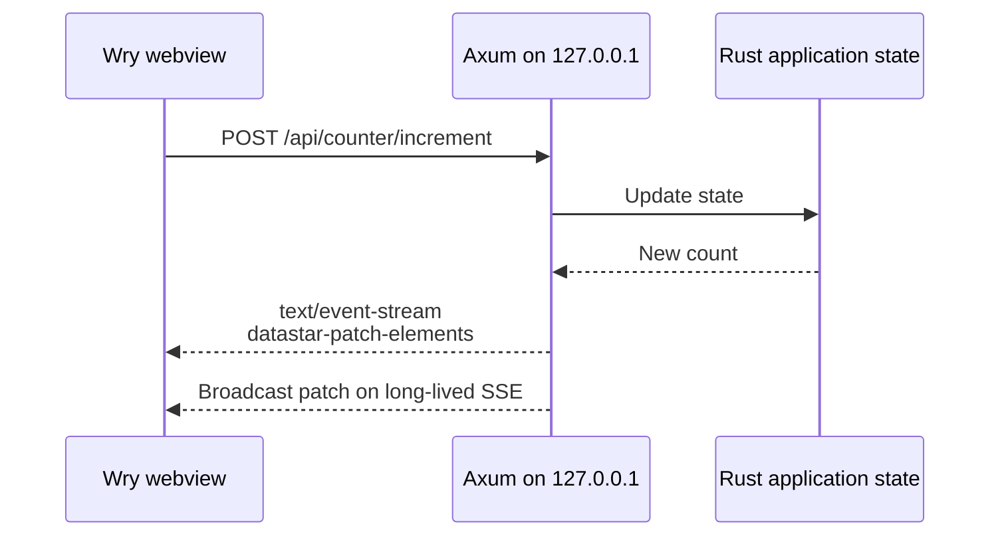

# Roc Datastar

A proof of concept for desktop web applications implemented directly with
[tao](https://github.com/tauri-apps/tao) and
[wry](https://github.com/tauri-apps/wry). Instead of a JavaScript IPC bridge,
the embedded webview talks to a loopback Rust HTTP server using the same
HTTP, HTML, and Server-Sent Events model as a web application.

The primary example uses Datastar. A second page uses htmx to demonstrate that
the runtime is compatible with other server-rendered hypermedia approaches.
The first backend implementation is Rust/Axum only. Pages and reusable SSE/HTML
fragments are rendered with compile-time checked
[Askama](https://askama.rs/) templates in the `templates/` directory.

## What the POC proves

- A native cross-platform window and system webview can be composed without
  depending on Tauri's application runtime.
- Rust handlers can return full HTML, HTML fragments, or Datastar SSE events.
- Long-lived SSE can push shared backend state to every open webview.
- The browser/backend boundary can remain ordinary HTTP rather than a custom
  command protocol exposed on `window`.
- htmx works unchanged against the same server and state.
- Frontend assets are embedded in the binary, so the demo works offline.

## Run it

Install the platform prerequisites required by Wry, then:

```sh
cargo run
```

For browser development and end-to-end testing without creating a native
window, print a bootstrap URL and keep the private server running with:

```sh
cargo run -- --serve-only
```

On macOS, `cargo run` launches the same native `NSWindow` and application menu
used by the packaged app. Build an ad-hoc-signed `.app` bundle with:

```sh
./scripts/bundle-macos.sh
open "target/release/bundle/macos/Roc Datastar.app"
```

The menu bar includes the native application, File, Edit, View, Window, and
Help menus. Standard items use AppKit behavior and keyboard shortcuts. Debug
builds also provide View → Toggle Web Inspector. Closing the last window keeps
the app alive, and clicking the Dock icon reopens it, following normal macOS
application lifecycle behavior.

On Linux, Wry requires WebKitGTK development packages. macOS and Windows use
the operating system webview. Debug builds expose the web inspector; release
builds disable it. Datastar evaluates declarative expressions using
JavaScript's `Function` constructor, so the script policy permits
`unsafe-eval`; script sources remain restricted to embedded, self-hosted
assets.

Run the backend and protocol tests without compiling native desktop libraries:

```sh
cargo test --no-default-features
```

The app binds only to `127.0.0.1` on an ephemeral port. The first navigation
contains a random capability token; the server exchanges it for an HttpOnly,
SameSite cookie and redirects to a clean URL. Protected routes also validate
the exact `Host` header, and responses carry a restrictive content security
policy. This is a useful baseline, not a completed security review.

## Request flow



There is intentionally no `invoke`, serialized command registry, or privileged
JavaScript object. A future native capability API should be presented as
authenticated HTTP resources and event streams too.

See [ROADMAP.md](ROADMAP.md) for the architecture and staged implementation
plan.
