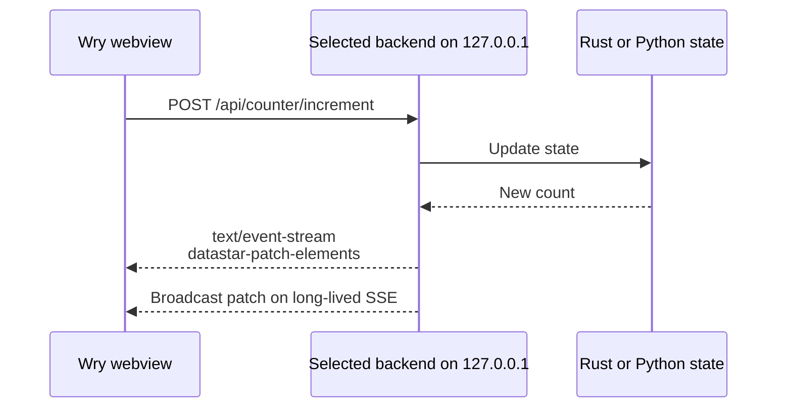

# Roc Datastar

A desktop web application runtime built directly on
[tao](https://github.com/tauri-apps/tao) and
[wry](https://github.com/tauri-apps/wry). Instead of a JavaScript IPC bridge,
the embedded webview talks to a managed loopback HTTP backend using the same
HTTP, HTML, and Server-Sent Events model as a web application.

The runtime is split into `roc-core`, `roc-http`, `roc-wry`, a `roc` facade with
a builder API, and a `roc` CLI. The bundled example uses Datastar on one window
and htmx on another against shared Rust (or Python) state.

## Run it

Install the platform prerequisites required by Wry, then:

```sh
cargo run
```

Rust is the default backend. Select Python with a CLI option or environment
variable:

```sh
cargo run -- --backend python
ROC_BACKEND=python cargo run
```

The Python reference backend has no package dependencies; it uses `python3`
from `PATH`. Set `ROC_PYTHON` to use another interpreter.

For browser development and end-to-end testing without creating a native
window, print bootstrap URLs and keep the private server running with:

```sh
cargo run -- --backend rust --serve-only
cargo run -- --backend python --serve-only
```

Validate configuration and package an unsigned (ad-hoc signed) macOS
development build:

```sh
cargo run -p roc-cli -- validate
./scripts/bundle-macos.sh
open "target/release/bundle/macos/Roc Datastar.app"
```

The application bundle contains both backends. Launch the Python backend with:

```sh
open "target/release/bundle/macos/Roc Datastar.app" --args --backend python
```

`roc.toml` describes windows, HTTP, security, assets, development, and bundle
profiles. Debug builds and `ROC_DEV=1` enable the development profile
(devtools, reload, optional `frontend_url` / `backend_url`). Release builds
embed assets and disable the inspector unless `ROC_DEV` is set.

On macOS, File → New Window opens another session of the first window
template. Closing the last window keeps the app alive, and clicking the Dock
icon reopens it. Debug builds also provide View → Toggle Web Inspector.

On Linux, Wry requires WebKitGTK development packages. macOS and Windows use
the operating system webview. Datastar evaluates declarative expressions using
JavaScript's `Function` constructor, so the script policy permits
`unsafe-eval`; script sources remain restricted to embedded, self-hosted
assets.

Run the workspace tests and the Python sidecar suite:

```sh
cargo test --workspace
python3 -m unittest discover -s backends/python -p 'test_*.py'
```

The app binds only to `127.0.0.1` on an ephemeral port. Each window receives
its own bootstrap token; the server exchanges it for an HttpOnly, SameSite
cookie and redirects to a clean URL. Protected routes also validate the exact
`Host` header, and responses carry a restrictive content security policy. This
is a useful baseline, not a completed security review.

## Application builder

```rust
use roc::{App, Config, Router};

fn main() -> roc::Result<()> {
    App::builder()
        .config(Config::load()?)
        .router(Router::new().route("/", axum::routing::get(|| async { "ok" })))
        .embed_asset("app.css", "text/css; charset=utf-8", CSS)
        .manage(MyState::default())
        .on_event(|event| tracing::debug!(?event, "shell event"))
        .run()
}
```

## Request flow



There is intentionally no `invoke`, serialized command registry, or privileged
JavaScript object. A future native capability API should be presented as
authenticated HTTP resources and event streams too.

## Backend contract

The public `Backend` trait starts an implementation and returns a
`RunningBackend`. The running instance supplies an origin, attaches
window-scoped sessions, and owns shutdown. The tao/wry shell only depends on
that interface.

- An Axum `Router` is wrapped by `roc-http`: bootstrap, per-window sessions,
  Host/Origin checks, security headers, and optional asset serving.
- `PythonBackend` in the example starts `backends/python/backend.py`, waits for
  a `ROC_BACKEND_READY <bootstrap-url>` readiness line, and terminates the
  child with the desktop app.
- A new language implements the same factory/lifecycle traits. Sidecars should
  bind only to an ephemeral `127.0.0.1` port and implement the bootstrap,
  session, Host/Origin validation, HTML, asset, and SSE endpoints.

See [ROADMAP.md](ROADMAP.md) for the architecture and staged implementation
plan.
