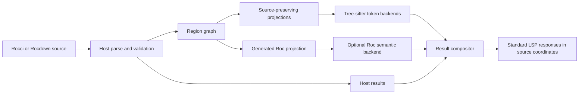
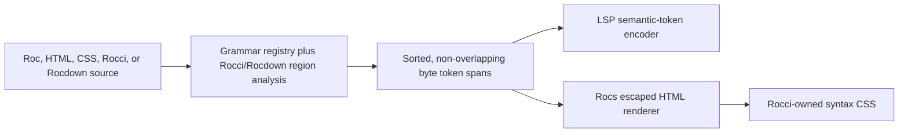

# Rocci and Rocdown language-server report and implementation plan

**Status:** proposed — research complete; implementation not started

**Date:** 2026-08-17

**Targets:** VS Code and Zed, backed by one `rocci-language-server`

## 1. Executive recommendation

Build one language server around a canonical, span-based **region graph** for
`.rocci` and `.rocdown`. The server should compose host-language analysis with
embedded-language analysis, then return ordinary LSP results in source-file
coordinates. VS Code and Zed should stay thin adapters.

For the short-term demonstrator:

1. restore the current `rocci-lsp` build after the new Rocdown `@docs` AST
   variant;
2. keep the existing Rocci/Rocdown parser as the authority for language
   boundaries;
3. integrate a pinned Roc Tree-sitter parser and adapted highlight query into
   `rocci-lsp`, not the whole `zed-roc` extension;
4. integrate CSS and HTML Tree-sitter parsers for `@css` bodies and ordinary
   display-only HTML regions;
5. continue highlighting executable Rocci HTML-shaped template structure from
   the Rocci AST, because it is not ordinary HTML and already has exact spans;
6. merge host, Roc, CSS, and HTML-shaped tokens into one non-overlapping LSP
   semantic-token stream;
7. expose that language-neutral token stream to Rocs so static sites can emit
   highlighted HTML without running an editor or a language-server process;
8. demonstrate the same server binary and token fixtures in VS Code and Zed,
   plus equivalent static HTML classes in a Rocs fixture.

Do **not** fully merge `h2000/zed-roc` into Rocci. Its Zed manifest and Rust
entry point are editor-specific and would conflict with Rocci's existing Zed
extension. Its reusable parts are the pinned `tree-sitter-roc` revision and
the MIT-licensed highlight-query work. Those should be adapted behind a
server-owned token classifier with attribution and conformance tests.

This demonstrator is deliberately lexical. It does not claim Roc type
checking, embedded completion, or cross-file rename. Those need a projection
and routing layer, described below.

## 2. Goals and non-goals

### Goals

- One server and one language-boundary model for VS Code and Zed.
- Correct highlighting of Rocci/Rocdown host syntax and embedded Roc, CSS, and
  HTML-shaped template syntax.
- Markdown highlighting in Rocdown, including display-only fenced languages,
  without treating fences as executable islands.
- Roc syntax and, later, Roc semantic features inside ordinary Roc regions,
  component parameters, interpolation expressions, directive expressions,
  handlers, `@render`, `@page`, and `@roc`.
- Useful HTML, CSS, Markdown, Rocci, and Rocdown diagnostics, navigation,
  completion, rename, formatting, and code actions.
- Exact UTF-8/UTF-16 position mapping and safe handling of generated Roc.
- Graceful operation when `roc` or an optional embedded-language backend is
  unavailable.

### Non-goals

- Replacing `rocci-template` or `rocci-rocdown` with Tree-sitter parsers.
- Interpreting Rocci templates as ordinary HTML.
- Making editor-specific injection APIs the source of semantic truth.
- Requiring Roc compilation for syntax highlighting or host-language
  diagnostics.
- Executing authored code in order to analyze it.
- Claiming that the proposed phases below already ship.

## 3. Current repository baseline

The current server is a synchronous `lsp-server` process with full-document
text synchronization and an in-memory map of open documents. On every open or
change it recompiles the complete Rocci or Rocdown source. It advertises:

- push diagnostics;
- document symbols;
- hover;
- same-file component definition;
- completion;
- full and range semantic tokens;
- the custom `rocci/embeddedRanges` request.

Current semantic tokens cover Rocci/Rocdown declarations, local components,
HTML tag names, component paths, attributes, static attribute values, directive
keywords, handler methods and paths, and Rocdown heading markers. The token
collector deliberately leaves Roc and CSS bodies empty and reports their spans
through `rocci/embeddedRanges`. Tests assert that executable Roc regions are
reported while a fenced `roc` example is not reported as executable.

Neither editor client calls `rocci/embeddedRanges`. Consequently the ranges
are an internal/debugging contract today, not an implemented nested-language
pipeline.

The VS Code extension is a thin `vscode-languageclient` adapter. It registers
both file types and enables semantic highlighting by default. It contributes
language configuration but no TextMate grammar.

The Zed extension is also a thin launcher. It has language configuration and
documents `semantic_tokens = "full"`, but contributes no grammar or queries.
Current Zed documentation says every extension language must name a registered
Tree-sitter grammar, and Zed disables semantic tokens by default unless the
user selects `combined` or `full`. This makes a current-version Zed install and
settings smoke test a demonstrator prerequisite rather than an assumption.

### Immediate build blocker

At repository commit `d4e355f5db3f398abf92961e3cfbd7fdfe47ca8c`,
`cargo test -p rocci-lsp` does not compile. Rocdown added `Item::Docs`, while
the LSP's document-symbol and token matches remain non-exhaustive. Phase 0 must
define the `@docs` symbol, Markdown-body, nested-docs, and token behavior and
add a regression test before embedded highlighting work starts.

### Current capability gap

| Area | Current state | Full target |
| --- | --- | --- |
| Text model | Full sync, full reparse, open files only | Versioned snapshots, incremental line index, cancellation, workspace index |
| Rocci/Rocdown syntax | Parser diagnostics and basic symbols | Recovery-aware editing, selection/folding, code actions, formatting |
| Roc | Ranges are known; contents intentionally untokenized | Syntax tokens, then compiler/LSP-backed semantics |
| CSS | Ranges are known; contents intentionally untokenized | Syntax, diagnostics, completion, colors, class/id navigation |
| HTML-shaped templates | Names/attributes tokenized from AST | Validation, rich completion, linked tags, references, rename |
| Markdown | Heading markers and headings in outline | Full Markdown tokens, links, references, folding, fenced-display injection |
| Workspace | Rocdown page lookup during compile only | Module/component/page/route/link/style index |
| LSP | Symbols, hover, definition, completion, tokens | References, rename, signature, code actions, folding, selection, formatting, colors, links, workspace symbols |
| Packaging | User locates the server binary | Platform binaries, compatible versioning, install/update story |

## 4. Language-boundary model

Embedded support must start from Rocci's grammar, not from regular expressions
or a generic HTML parser. A region is more than a language name.

```text
Region {
    language: Roc | Css | Markdown | RocciTemplate | HtmlLike | ...
    context: Module | Expression | Pattern | Type | Params | Stylesheet | Body | Fence
    purpose: Executable | HostStructure | DisplayOnly | Metadata
    source_span: byte range
    parent: optional region id
    priority: conflict-resolution priority
}
```

The `purpose` distinction is essential. For example, a fenced `roc` block in
Rocdown is a Roc highlighting region but remains display-only; `@roc` is an
executable Roc region; `{name}` is an executable Roc expression; and `@page`
is metadata written with a Roc-like record surface. The current custom request
cannot represent this distinction because it returns only `language` and
`range`.

The region graph should initially live in `rocci-lsp`, where its consumer and
stability requirements are known. If the CLI, formatter, or another consumer
later needs the same contract, promote a language-neutral region description
to `rocci-template` / `rocci-rocdown`; keep LSP `Range` conversion in the LSP
crate.

### Boundary ownership

| Source construct | Boundary authority | Highlight/analyzer |
| --- | --- | --- |
| Ordinary `.rocci` Roc | `rocci-template` module spans | Roc Tree-sitter; later Roc backend |
| Parameters, patterns, types, expressions | Exact Rocci AST spans and context | Roc fragment projection |
| `@css` body | Rocci AST `CssDecl.body` | CSS Tree-sitter; later CSS service |
| HTML element/component structure | Rocci template AST | Rocci host analyzer, not generic HTML grammar |
| Rocdown Markdown | Rocdown `MdNode` spans | Markdown host token collector |
| Rocdown root template island | Rocdown scanner + Rocci parser | Rocci template analyzer |
| Rocdown executable declaration | Rocdown/Rocci AST | Corresponding Roc/CSS/host analyzer |
| Fenced code | Markdown AST info string | Display-only language highlighter |
| `@docs` body | Rocdown `DocsDecl` plus nested body parse | Restricted Markdown/Rocdown analyzer |

## 5. Projection architecture

Region discovery and embedded analysis should be separate. Each backend gets a
projection appropriate to its parser and returns results in virtual offsets;
the projection maps them back to the source document.



### 5.1 Source-preserving projections

Use these for highlighting, local syntax diagnostics, folding, and other
operations where authored coordinates matter more than compiler context.

- Replace non-participating source bytes with spaces while retaining newlines
  whenever a backend can parse the resulting document.
- Use a small prefix/suffix wrapper when a fragment needs a syntactic context,
  such as an expression, type, parameter list, or pattern.
- Record synthetic wrapper spans separately so they never produce user-facing
  results.
- Keep an affine virtual-to-source segment for every copied source range.
- Permit multiple projections for one language when context-specific wrappers
  are materially more accurate than one error-heavy pseudo-file.

For CSS, a whitespace-masked stylesheet containing all `@css` bodies should
usually be enough. For Roc, ordinary module regions and fragment-shaped regions
need separate tests; Tree-sitter error recovery may make wrappers unnecessary
for some contexts, but that should be measured rather than assumed.

### 5.2 Generated Roc projection

Use the compiler-generated `.roc` module for type-aware Roc features. It has
the imports, component lowering, handler functions, and names needed for real
Roc analysis. The existing `Segment { generated, source, origin }` map is a
starting point, but the current remapper chooses a source span by overlapping
a generated line. Rich LSP routing requires a bidirectional map with:

- exact affine spans for copied Roc;
- explicit synthetic spans for scaffolding;
- deterministic policies for many-to-one and one-to-many lowering;
- origin and region IDs;
- separate mapping rules for locations, diagnostics, completion edits, rename
  edits, and related information.

Generated Roc and source-preserving Roc projections solve different problems;
neither should replace the other.

### 5.3 Result composition

All backends should return an internal result type using byte spans. A single
compositor then:

1. drops synthetic or out-of-region results;
2. maps virtual spans to authored source spans;
3. clips embedded results to their region;
4. applies precedence (`host delimiter > nested language > broad host token`);
5. removes duplicates and overlaps;
6. splits multiline semantic tokens;
7. converts bytes to the negotiated UTF-8 or UTF-16 LSP encoding.

The compositor must be shared by full, range, and later delta semantic-token
responses so those paths cannot drift.

## 6. Assessment of `h2000/zed-roc`

The repository was inspected at commit
`f6a07bfb336549724f9c5694084bfb1869614b5d` (2026-06-26). It contains:

- a Zed extension manifest;
- a Roc language configuration;
- Zed queries for highlights, locals, injections, indents, outline, tags,
  text objects, and rainbow brackets;
- a small Rust extension that launches `roc experimental-lsp --stdio`;
- an MIT license.

Its manifest pins `faldor20/tree-sitter-roc` at
`edc18052a9d7382ac9f9f5bf413db3a78d5ea12c` (2026-01-27). That grammar revision
has Rust bindings on Tree-sitter `~0.20.10` and an MIT license. Current upstream
has moved substantially and uses newer bindings, so the demonstrator must pin
and test a revision rather than depend on a moving branch.

### What to reuse

- The selected Roc grammar revision, after checking it against Rocci's pinned
  Roc syntax and `test/AllSyntax.*` fixtures.
- Highlight-query patterns, adapted to standard LSP semantic token types.
- Query corpus ideas and upstream grammar corpus tests.
- License notices for any copied query text.

### What not to merge

- `extension.toml`: Rocci already owns its Zed language and server registration.
- `src/lib.rs`: Rocci already launches `rocci-language-server`; launching the
  Roc server directly would bypass host-language routing.
- Zed-specific capture names as a server API: VS Code and LSP do not share
  Zed's theme-capture vocabulary.
- All auxiliary queries in the demonstrator: indents, text objects, tags, and
  outline belong to later editor-native or LSP features.

### Dependency decision gate

Run a short packaging spike before selecting the final revision:

| Candidate | Benefit | Cost/risk |
| --- | --- | --- |
| Exact `zed-roc` pin | Reproducible parity with known Zed queries; clear MIT metadata | Old Tree-sitter 0.20 API; awkward alongside newer CSS/HTML grammars |
| Current Roc grammar revision | Newer syntax and modern Rust binding | Must verify compatibility with Rocci's Roc toolchain; current package metadata/license file should be reconciled before release |
| Vendored generated parser/query snapshot | Fully reproducible and one chosen Tree-sitter runtime | Maintenance and explicit third-party notice burden |

Prefer one Tree-sitter runtime version for Roc, CSS, and HTML. Do not accept two major
Tree-sitter runtimes in the server merely to avoid the compatibility spike.

## 7. Short-term demonstrator

### Demonstrator promise

On the same `AllSyntax.rocci` and representative `.rocdown` fixture, VS Code
and Zed show:

- Rocci/Rocdown declaration keywords;
- HTML element names, component names, attribute names, and static values;
- Roc variables, functions, types, strings, numbers, comments, keywords, and
  operators in all executable Roc contexts;
- CSS selectors, properties, values, numbers, strings, comments, at-rules, and
  functions in file and component `@css` blocks;
- Markdown headings, emphasis, code, links, and fenced Roc/HTML/CSS examples in
  Rocdown;
- no highlighting leak across region boundaries;
- useful highlighting while the host source is incomplete.

The demonstrator does not promise embedded completion or type diagnostics.

### D0 — restore and freeze the baseline

- Add `Item::Docs` handling to Rocdown symbols and tokens.
- Add `test/EmbeddedLanguages.rocci` and
  `test/EmbeddedLanguages.rocdown` fixtures containing every region context,
  malformed host syntax, non-BMP text, and display-only fences.
- Snapshot the region graph and current host semantic tokens.
- Verify `cargo test -p rocci-lsp` before adding dependencies.
- Install the current development extensions in both target editors and record
  the exact settings/version needed to request semantic tokens.

Exit gate: the current server builds, both editors attach to it, and fixture
baselines are reproducible.

### D1 — make regions first-class

- Split region discovery out of `tokens.rs` into a typed internal module.
- Add `context`, `purpose`, and stable source byte spans.
- Include Rocdown Markdown and display-fence regions without changing their
  execution semantics.
- Keep `rocci/embeddedRanges` as a temporary inspection endpoint, extending or
  replacing it with `rocci/inspectRegions`; do not make clients depend on it.
- Add invariants: spans are in bounds, children are contained by parents, and
  executable regions never include display-only fences.

Exit gate: golden tests describe every embedded boundary independently of
semantic-token generation.

### D2 — add lexical backends

- Add one Tree-sitter runtime and pinned Roc, CSS, and HTML grammars. Use the
  HTML grammar for ordinary/display-only HTML, not executable Rocci templates.
- Adapt highlight captures to an internal standard vocabulary.
- Extend the LSP legend with standard `variable`, `number`, `comment`,
  `enumMember`, and other types actually emitted.
- Keep HTML-shaped host tokens driven by the Rocci AST; add missing punctuation,
  comments, and text tokens only when standard semantic token types/theming
  make them useful.
- Walk Rocdown `MdNode` for Markdown tokens and recognize fenced display
  languages from the code-block info string.
- Merge all streams with deterministic precedence and overlap elimination.

Exit gate: byte-span golden tests cover every token class and malformed-region
case under both UTF-8 and UTF-16 negotiation.

### D3 — prove editor parity

- VS Code: use the existing semantic-highlight default and add extension-host
  tests that open both fixtures and request semantic tokens.
- Zed: first verify whether the current grammar-less language registration is
  accepted on the supported Zed version. Current documentation requires a
  grammar, so treat failure as expected evidence, not a user setup problem.
- For the demonstrator, document and test `semantic_tokens = "full"`. If Zed
  refuses grammar-less registration, add a pinned adapter grammar as a
  temporary compatibility layer and keep `full` mode so the server remains
  the highlighting authority.
- Add `semantic_token_rules.json` only for custom token types; prefer standard
  LSP types so both editors inherit normal theme behavior.
- Compare screenshots manually across one light and one dark built-in theme;
  assertions remain token/range based rather than pixel based.

Exit gate: one server binary passes both client smoke tests and the same
fixture visibly highlights Roc, CSS, and HTML-shaped syntax.

### D4 — harden and hand off

- Measure cold start, first full token request, and single-character update on
  a small fixture and a generated large fixture.
- Target, initially, under 100 ms for full lexical tokens on a 10,000-line
  document and under 50 ms for a typical edit on development hardware; record
  actual numbers and revise budgets from evidence.
- Add fuzz/property tests for invalid UTF-8 boundaries, overlap invariants, and
  truncated constructs.
- Record grammar revisions and third-party licenses.
- Update both editor READMEs with shipped behavior and required settings.

Exit gate: no crashes or overlapping tokens, bounded performance, license
inventory complete, and both editor instructions verified.

### D5 — prove the shared Rocs renderer

- Extract the resolved byte-span token vocabulary and bundled grammar registry
  into a small library crate with no LSP or Rocs dependency.
- Keep region discovery in the owning Rocci/Rocdown parsers; expose a composite
  snippet-highlighting entry point for `.rocci` and `.rocdown` source.
- Inject the shared highlighter into Rocs' article renderer and emit escaped,
  classed `<span>` elements for Roc, HTML, CSS, Rocci, and Rocdown examples.
- Exercise ordinary fences, non-Rocdown `@docs include`, nested fences inside
  `@docs example`, unknown languages, malformed source, and hostile HTML text.
- Add light, dark, print, and forced-colors token styles to the Rocci-owned Rocs
  theme, using CSS variables rather than inline colors.

Exit gate: one token-span golden drives LSP semantic-token assertions and Rocs
HTML assertions; a Rocs build needs neither Node.js nor a running LSP server,
and unknown or malformed snippets safely fall back to escaped source.

## 8. Full language-server architecture

### 8.1 Document engine

Replace the flat open-document value with a versioned snapshot:

```text
DocumentSnapshot
├── uri, language id, version
├── text storage and line index
├── host parse/compile output
├── region graph
├── source-preserving projections
├── generated Roc projection and map
├── diagnostics by producer
└── semantic-token/result caches
```

Move from full synchronization to incremental synchronization after correctness
tests exist. An incremental text store does not require prematurely rewriting
the hand-written host parsers; an early version may apply incremental edits,
then fully reparse the new snapshot. Introduce incremental host parsing only if
profiling justifies it.

The request loop must support cancellation and avoid blocking all documents on
Roc analysis. Retaining `lsp-server` is viable if work scheduling is added;
switching frameworks is not an architectural requirement.

### 8.2 Workspace model

Build a shared workspace index from compiler-owned facts:

- `.rocci` modules, components, fixtures, handlers, styles, and imports;
- `.rocdown` pages, IDs, routes, aliases, headings, links, components, docs
  declarations, and executable regions;
- references between component calls and definitions;
- CSS selectors and literal `class`/`id` uses;
- generated Roc modules and their source-map revision;
- dependency edges so edits invalidate only affected snapshots.

Reuse Rocs catalog logic for page identity and links rather than reimplementing
route semantics inside the LSP. The LSP should consume a library snapshot, not
shell out to `rocs`.

### 8.3 Embedded backend interface

Backends should implement a narrow internal interface rather than know about
LSP wire types:

```text
analyze_syntax(projection) -> tokens + syntax diagnostics + folds
complete(projection, offset, context) -> completion candidates
hover(projection, offset) -> marked content
locate(projection, offset) -> definitions/references
rename(projection, offset, new_name) -> mapped edits or refusal
format(projection, options) -> text edits
```

Capabilities are optional per backend. Every response carries projection and
snapshot IDs so stale asynchronous results can be discarded.

### 8.4 Roc semantic backend

Treat Roc's language server/compiler as optional and versioned.

1. Probe `roc experimental-lsp` (or its successor) for the Roc version Rocci
   supports.
2. Maintain one child process per workspace, not per embedded region.
3. Present generated `.roc` modules in an isolated projection workspace.
4. Forward open/change/close and selected requests.
5. Map diagnostics, hover, completion, signature help, locations, references,
   and edits through the generated-Roc map.
6. Reject or narrow edits that touch generated scaffolding or map ambiguously.
7. Keep host parsing, syntax highlighting, and HTML/CSS features working when
   the child is absent or crashes.

Before committing to the bridge, spike actual child-server behavior for
in-memory/temporary files, workspace roots, package resolution, cancellation,
and malformed generated modules. If the process contract is too unstable,
start with `roc check` diagnostics plus Tree-sitter syntax and postpone
interactive Roc semantics.

### 8.5 HTML-shaped template intelligence

Rocci template syntax should remain owned by Rocci's AST. Implement:

- HTML element/attribute completion from a versioned web-data snapshot;
- component completion from the workspace index;
- tag and attribute hover;
- invalid nesting, void-element, duplicate-attribute, and accessibility hints
  where Rocci semantics make the rule reliable;
- linked editing for matching open/close tags;
- definitions, references, and rename for components;
- class/id cross-language navigation into CSS;
- Datastar action/attribute completion through a separately versioned data
  source rather than hard-coded ad hoc strings.

Never pass a whole Rocci template to a generic HTML server. Optional HTML
parsing is appropriate only for display-only HTML fences or truly raw HTML
regions.

### 8.6 CSS intelligence

After Tree-sitter highlighting:

- report CSS parse errors independently from Rocci errors;
- provide property/value/at-rule completion and hover from pinned web data;
- implement document colors and color presentations;
- index class, ID, custom-property, keyframe, and layer definitions;
- connect literal Rocci `class`/`id` attributes to selector references;
- format only exact CSS body spans and re-indent edits for the host document;
- treat interpolated/dynamic class names as partial information, not false
  errors.

### 8.7 Markdown and Rocdown intelligence

Build on the existing span-preserving `MdNode`, headings, and link records:

- semantic tokens for block and inline structure;
- document links and link diagnostics;
- heading definition/reference and rename for fragment links;
- folding and selection ranges;
- completion for page links, headings, `@docs` kinds/fields, and fences;
- display-only highlighting for fenced Roc, HTML, CSS, and other installed
  lexical backends;
- code actions for broken relative links and ambiguous declarations;
- formatting only after a lossless Markdown/Rocdown formatting policy exists.

The root scanner remains authoritative: code fences, list bodies, quotations,
escaped `@`, and email addresses must not become executable declarations.

## 9. LSP feature roadmap

### Phase 0 — compatibility baseline

Deliver D0 above, document supported editor versions, and make CI build every
workspace crate affected by new Rocdown variants.

### Phase 1 — common embedded highlighting demonstrator

Deliver D1–D4. This is the first externally visible milestone.

### Phase 2 — editing structure

- incremental document changes and versioned snapshots;
- folding ranges, selection ranges, document links, linked editing;
- richer host/HTML/CSS/Markdown completion and hover;
- syntax-oriented code actions;
- semantic token full/delta support with stable result IDs;
- deterministic diagnostics grouped by producer.

Exit gate: all features work without Roc installed and respond correctly on
incomplete documents.

### Phase 3 — workspace navigation

- shared component/module/page/style index;
- cross-file definition, references, workspace symbols, and rename;
- Rocdown route/heading/link navigation from Rocs catalog data;
- component and CSS class/id reference graphs;
- dependency-based invalidation and watched-file updates.

Exit gate: rename and references are atomic, version-checked, and refuse
ambiguous generated or dynamic occurrences.

### Phase 4 — Roc semantics

- child Roc backend prototype and compatibility matrix;
- generated projection workspace;
- precise bidirectional source maps;
- mapped type diagnostics, hover, completion, signature help, navigation, and
  references;
- conservative rename/edit mapping;
- process restart, crash isolation, and clear degraded-mode status.

Exit gate: a type error and a symbol lookup in every Roc region context map to
the correct authored span in both editors, including non-BMP text.

### Phase 5 — formatting and refactoring

- define a lossless Rocci/Rocdown formatter contract;
- compose host, Roc, CSS, and Markdown edits without overlap;
- range formatting by owning region;
- extraction/inline and component-generation refactors only where source maps
  prove edits are reversible;
- organize imports through the Roc backend when supported.

Exit gate: formatting is idempotent, preserves semantics, and never formats a
display fence as executable code.

### Phase 6 — productization

- signed/versioned server binaries for supported platforms;
- adapter compatibility and download/update policy;
- protocol and grammar revision reporting in `initialize`/logs;
- large-workspace performance budgets and cancellation tests;
- crash/fuzz/security hardening for untrusted source and C parsers;
- release smoke tests in supported VS Code and Zed versions.

## 10. Feature-specific routing rules

| Request | Host region | Roc region | CSS region | Markdown/display region |
| --- | --- | --- | --- | --- |
| Semantic tokens | Host AST | Tree-sitter, later refined by Roc | Tree-sitter | Markdown AST / fence backend |
| Diagnostics | Host compiler | Roc backend, mapped | CSS parser/service | Markdown/link validation |
| Completion | Directives/tags/components | Roc backend | CSS data/service | Links/docs/fence languages |
| Hover | Host docs/component signature | Roc backend | CSS data | Link/heading/docs metadata |
| Definition | Component/page/link index | Roc backend | Selector/custom-property index | Heading/page/file target |
| References | Workspace host index | Roc backend + map | HTML/CSS cross-index | Link graph |
| Rename | Host-owned symbols | Only exact mapped Roc symbols | Static selectors/properties | Heading/page IDs with validation |
| Formatting | Host formatter | Roc formatter/backend | CSS formatter | Rocdown formatter/fence delegation |
| Code action | Host recovery/validation | Mapped Roc fixes | CSS fixes | Link/docs fixes |

At boundaries, the smallest containing region wins unless the request is
explicitly cross-language. A cursor on `{` or `@css` belongs to the host; a
cursor inside the expression or body belongs to the embedded language.

## 11. Protocol and editor constraints

- Standard LSP semantic tokens carry token type and modifiers, not an embedded
  language identifier. The server therefore must map all capture vocabularies
  to standard token types; it cannot depend on language-specific theme
  selectors traveling over LSP.
- VS Code's direct semantic-token API can associate a token language, but doing
  so in client middleware would create a VS Code-only semantic path. Avoid it
  for the common baseline.
- VS Code TextMate grammars and Zed Tree-sitter grammars remain useful for
  immediate pre-LSP color, brackets, indentation, and editor-native text
  objects. They are optional adapter layers and should be generated/tested
  against the canonical region contract where possible.
- Zed supports `off`, `combined`, and `full` semantic-token modes and currently
  defaults to `off`. The Zed adapter must document this until it can ship a
  zero-configuration default through supported extension mechanisms.
- Zed native injections require a host Tree-sitter grammar. A future
  `tree-sitter-rocci` / `tree-sitter-rocdown` may be worthwhile for native
  bracket, indent, outline, and injection behavior, but it is not a
  prerequisite for common LSP semantics and must not become a second language
  specification.

## 12. Validation strategy

### Compiler-boundary tests

- Region spans for every AST construct and malformed near-miss.
- Rocdown root scanning exclusions: fences, lists, quotes, email, escaped `@`.
- `@docs` nesting and prohibited executable forms.
- Generated-Roc map coverage and origin kinds.

### Lexical backend tests

- Pin grammar/query revisions and run representative upstream corpus cases.
- Golden capture-to-token mappings for Roc and CSS.
- Error-recovery cases for incomplete strings, records, functions, tags, and
  blocks.
- Display fence versus executable region assertions.

### Mapping/compositor tests

- UTF-8 and UTF-16, including non-BMP code points.
- No token overlaps; tokens stay in bounds and on one line after encoding.
- Range tokens equal the corresponding subset of full tokens.
- Delta tokens reconstruct the next full result exactly.
- Synthetic wrapper/scaffolding spans never escape to the user.
- Mapped edits are rejected when ambiguous or stale.

### Server tests

- JSON-RPC initialization capability negotiation.
- Incremental open/change/close and version handling.
- Cancellation and stale result suppression.
- Child backend absent, mismatched, crashed, and restarted.
- Workspace changes and multi-root behavior.

### Editor tests

- VS Code extension-host tests on released minimum and current versions.
- Zed extension build plus scripted/manual fixture smoke tests on a declared
  version range.
- Same semantic-token fixture decoded from both clients.
- One light and one dark built-in theme visual check.

### Performance and reliability

- Small file latency, 10,000-line file latency, and multi-file workspace load.
- Memory after opening/changing/closing many documents.
- Fuzz host parsers, region extraction, Tree-sitter queries, and map
  composition.
- Time/size limits for pathological nesting or very large embedded blocks.

## 13. Security and operational policy

- Syntax analysis must not invoke Roc or execute authored code.
- Child compiler/LSP processes are opt-in through normal trusted-workspace
  policy and use explicit executable resolution.
- Do not download grammars or language servers at analysis time. Pin them at
  build/release time.
- Keep generated projection files outside the authored source tree and avoid
  exposing unrelated filesystem content.
- Sanitize child-server edits and locations; never apply an edit outside mapped
  authored spans without an explicit, validated workspace operation.
- Report backend failures separately from Rocci syntax diagnostics.
- Include third-party notices for copied/adapted query files and generated
  parsers.

## 14. Proposed repository shape

```text
crates/rocci-lsp/src/
├── server.rs                 # protocol lifecycle and dispatch
├── document.rs               # versioned snapshots and line index
├── workspace.rs              # cross-file index and invalidation
├── regions.rs                # canonical region graph
├── projection.rs             # virtual text and bidirectional maps
├── compose.rs                # diagnostics/tokens/edits precedence
├── host/
│   ├── rocci.rs
│   └── rocdown.rs
├── embedded/
│   ├── mod.rs
│   ├── tree_sitter.rs
│   ├── roc_syntax.rs
│   ├── roc_backend.rs
│   ├── css.rs
│   ├── html.rs
│   └── markdown.rs
└── capabilities/
    ├── tokens.rs
    ├── completion.rs
    ├── navigation.rs
    ├── rename.rs
    └── formatting.rs
```

Do not perform this reorganization in one mechanical change. Extract one
tested seam per phase so regressions remain traceable.

## 15. Open decisions and spikes

1. Which Roc Tree-sitter revision matches the Roc syntax Rocci actually pins?
2. Can one modern Tree-sitter runtime load the chosen Roc and CSS generated
   parsers cleanly, or should parsers be vendored and rebound?
3. Does the supported Zed version accept the current grammar-less Rocci and
   Rocdown language definitions? If not, what minimal adapter grammar is
   acceptable for the demonstrator?
4. Does Roc's current language server accept generated in-memory or temporary
   modules with stable workspace semantics?
5. Which generated source-map segments are exact enough for hover/completion,
   and which need a richer mapping contract?
6. Should Markdown display fences support only bundled lexical backends or all
   languages known to each editor? The former is portable; the latter is
   editor-specific.
7. What is the supported Roc/Rocci/LSP compatibility matrix and version
   handshake?

These are gated experiments, not reasons to postpone the semantic-token
demonstrator.

## 16. Definition of “fully featured”

The language server is fully featured for this plan when:

- both formats have resilient syntax diagnostics and complete host
  highlighting;
- embedded Roc, CSS, HTML-shaped templates, Markdown, and fenced display code
  are highlighted with no boundary leaks;
- components, pages, routes, links, headings, selectors, and static attributes
  participate in workspace navigation and safe rename;
- Roc regions receive mapped compiler-backed diagnostics, hover, completion,
  signatures, definitions, and references when a compatible Roc backend is
  present;
- formatting and code actions are region-aware and never emit overlapping or
  ambiguous edits;
- all core features work through standard LSP in VS Code and Zed;
- missing optional backends degrade visibly but do not remove host support;
- compatibility, latency, memory, crash behavior, licensing, and releases are
  tested and documented.

## 17. Evidence consulted

Repository implementation evidence:

- `crates/rocci-lsp/src/{lib,tokens,analysis,rocdown}.rs`
- `crates/rocci-lsp/tests/server.rs`
- `crates/rocci-template/src/{span,source_map,remap}.rs`
- `crates/rocci-rocdown/src/{ast,scan,markdown}.rs`
- `crates/rocs/src/{article,docs,site}.rs`, `crates/rocs/Cargo.toml`, and
  `Cargo.lock`
- `editors/vscode` and `editors/zed`
- `test/AllSyntax.rocci`, `test/AllSyntax.rocdown`, and current crate READMEs

External primary sources:

- [`h2000/zed-roc`](https://github.com/h2000/zed-roc), inspected at
  `f6a07bfb336549724f9c5694084bfb1869614b5d`
- [`faldor20/tree-sitter-roc`](https://github.com/faldor20/tree-sitter-roc),
  including the exact Zed pin
  `edc18052a9d7382ac9f9f5bf413db3a78d5ea12c`
- [`tree-sitter/tree-sitter-css`](https://github.com/tree-sitter/tree-sitter-css)
- [`tree-sitter/tree-sitter-html`](https://github.com/tree-sitter/tree-sitter-html)
- [Zed language-extension documentation](https://zed.dev/docs/extensions/languages)
- [Zed Roc support documentation](https://zed.dev/docs/languages/roc)
- [VS Code embedded-language guidance](https://code.visualstudio.com/api/language-extensions/embedded-languages)
- [VS Code semantic highlighting guide](https://code.visualstudio.com/api/language-extensions/semantic-highlight-guide)
- [VS Code syntax and injection grammar guide](https://code.visualstudio.com/api/language-extensions/syntax-highlight-guide)
- [Current Language Server Protocol specification](https://microsoft.github.io/language-server-protocol/specifications/specification-current/)
- [Tree-sitter syntax-highlighting documentation](https://tree-sitter.github.io/tree-sitter/3-syntax-highlighting.html)
- [`tree-sitter-highlight` Rust API](https://docs.rs/tree-sitter-highlight/latest/tree_sitter_highlight/)
- [Comrak syntax-highlighter adapter API](https://docs.rs/comrak/latest/comrak/adapters/trait.SyntaxHighlighterAdapter.html)
- [Syntect classed HTML generator](https://docs.rs/syntect/latest/syntect/html/struct.ClassedHTMLGenerator.html)
- [Shiki installation and HTML-generation guide](https://shiki.style/guide/install)

## 18. Static syntax-highlighting HTML for Rocs

### 18.1 Recommendation

Make static highlighting a second renderer over the demonstrator's shared
token-span engine:



Rocs must link the library in-process. It must not spawn
`rocci-language-server`, invoke `tree-sitter highlight`, run Node/Shiki, or ask
an editor to render code. This keeps `rocs build` deterministic, offline, and
portable while avoiding a second interpretation of Rocci's embedded-language
boundaries.

The reusable unit from `zed-roc` remains the Roc grammar/query work, not its
HTML output or Zed extension. Tree-sitter's Rust highlighting library already
provides `HighlightConfiguration`, a reusable per-thread `Highlighter`,
injection callbacks, highlight events, and an `HtmlRenderer`. The project
should use the configuration and event model but normalize events to its own
token spans before rendering. A direct `HtmlRenderer` call is sufficient for
one Tree-sitter language, but it cannot by itself merge Rocci-AST host tokens
with Roc/CSS regions or guarantee the same overlap resolution as LSP.

### 18.2 Current Rocs pipeline and exact insertion point

Current behavior is safe but unhighlighted:

- `rocci-rocdown` stores only the first whitespace-delimited fence-info token
  in `MdNode::CodeBlock.info`;
- `crates/rocs/src/article.rs::render_md` emits
  `<pre class="rd-code-block"><code class="rd-code language-…">…</code></pre>`
  and escapes the literal as text;
- a non-Rocdown `@docs include` becomes the same `MdNode::CodeBlock`, choosing
  its language from the explicit `language` field and then the file extension;
- an `@docs example` retains its test metadata separately, while code fences
  in its body flow through the same Markdown node and renderer;
- ordinary site pages, included fragments, examples, and the OKF preview all
  ultimately use the static article renderer.

Therefore highlighting should be injected at `render_md(CodeBlock)`, not into
Comrak parsing and not into the Roc build runtime. Rocs deliberately converts
Comrak's AST into a source-aware project AST and owns its HTML contract after
that point. Using Comrak's renderer plugin would create a second Markdown HTML
path and would not cover the already-converted `@docs include` nodes cleanly.

The implementation should evolve the renderer from free functions to an
explicit context, for example:

```rust
struct ArticleRenderContext<'a> {
    highlighter: &'a dyn SyntaxHighlighter,
    diagnostics: &'a mut Vec<CatalogDiagnostic>,
}

trait SyntaxHighlighter {
    fn highlight(&self, language: LanguageId, source: &str)
        -> Result<Vec<HighlightSpan>, HighlightError>;
}

struct HighlightSpan {
    bytes: std::ops::Range<usize>,
    kind: HighlightKind,
    modifiers: HighlightModifiers,
}
```

`HighlightSpan` is sorted, source-relative, UTF-8-boundary-aligned, and
non-overlapping after composition. The LSP adapter converts it to negotiated
UTF-16 or UTF-8 positions; Rocs slices the original source by byte range,
escapes every slice, and wraps only classified slices in constant class names.
Neither consumer sees Tree-sitter capture IDs or editor wire types.

### 18.3 HTML contract

Prefer semantic classes and theme CSS over inline styles. An illustrative Roc
fence could become:

```html
<pre class="rd-code-block" data-language="roc"><code class="rd-code language-roc"><span class="tok-variable tok-definition">main</span> <span class="tok-operator">=</span> <span class="tok-keyword">\</span>{} <span class="tok-operator">-&gt;</span> <span class="tok-string">&quot;Hello&quot;</span>
</code></pre>
```

This example describes the output shape, not final Roc capture choices. Exact
classification is fixed by token goldens. The contract should be:

- preserve the existing `rd-code-block`, `rd-code`, and `language-*` hooks;
- add a canonical `data-language` only for a recognized, normalized language;
- emit classes such as `tok-keyword`, `tok-string`, `tok-comment`,
  `tok-type`, `tok-function`, `tok-variable`, `tok-property`, `tok-tag`, and
  `tok-punctuation` from a fixed allowlist;
- express modifiers as additional allowlisted classes, such as
  `tok-definition`, rather than inventing language-specific CSS;
- emit no inline colors, untrusted element names, or untrusted attributes;
- leave newlines and all unclassified bytes intact;
- produce the old escaped `<pre><code>` shape when no backend is available.

The renderer must never concatenate a raw fence info string into HTML. The
parser already reduces authored fences to the first token, but the renderer
should still normalize aliases and derive the class from a safe registry key.
For example, `shell`, `bash`, and `sh` may normalize to `shell`; an unknown
token keeps escaped code but omits `data-language` and uses either no language
class or a separately sanitized display label.

### 18.4 Composite Rocci and Rocdown examples

Roc and CSS snippets can go directly to Tree-sitter. HTML snippets can use the
HTML grammar and its CSS/script injections only for languages actually bundled
and explicitly enabled. Whole Rocci and Rocdown snippets require the same
region composition as editor documents:

1. parse the host language with `rocci-template` or `rocci-rocdown`;
2. collect host tokens and the typed region graph;
3. run Roc, CSS, HTML, or display-fence backends only inside owned regions;
4. map region-relative spans to snippet bytes;
5. apply the same precedence and overlap elimination used by the LSP;
6. render the resulting flat token spans as HTML.

This is why a generic HTML highlighter must not receive a complete `.rocci`
snippet: braces, Roc expressions, component names, directives, and Rocci's
HTML-shaped template semantics are not ordinary HTML. Likewise a fenced `roc`
block inside Rocdown is display-only even though its lexical tokens look like
an executable `@roc` block.

For `@docs include`, explicit `language` should continue to win over file
extension. For `@docs example`, the fence's own language should control its
display; the example record's `language` controls test metadata. If an example
contains exactly one fence and these disagree, a future validation diagnostic
is useful, but the highlighter must not silently rewrite either contract.

### 18.5 Language pack

Use an explicit built-in registry; do not download grammars while building a
site.

| Tier | Languages | Reason |
| --- | --- | --- |
| Demonstrator | Roc, HTML, CSS, composite Rocci, composite Rocdown | Product promise and direct parity with the LSP milestone |
| Documentation core | shell, TOML, Markdown, plain text | Checked-in Rocs content uses these frequently; shell is currently the second-most common named fence |
| Optional later pack | Rust, JSON, YAML, JavaScript, TypeScript and other measured needs | Useful for general documentation, but each grammar increases compatibility, binary-size, query, and license work |

The checked-in `docs/` corpus currently contains 37 `sh`, 15 `rocci`, 6
`text`, 4 `toml`, 2 `roc`, and 2 `markdown` opening fences. Treat this as a
dated repository inventory, not a permanent language-policy decision. HTML
and CSS remain in the demonstrator because they are explicit product targets
even though current docs have no named HTML or CSS fence.

### 18.6 Theming, accessibility, and print

Rocs' Rocci theme should own color assignment. Add stable variables such as
`--syntax-keyword`, `--syntax-string`, and `--syntax-comment`, then map token
classes to them. Define both light and dark values under the existing color
scheme, retain readable unclassified text, and test WCAG contrast for the code
background. In forced-colors mode, do not depend on color alone; preserve font
weight/style sparingly and allow system colors. Print should avoid dark solid
backgrounds unless explicitly requested.

Static classes have three advantages over inline theme colors: CSP remains
simple, the existing page color scheme can switch without regenerating HTML,
and token meaning stays testable independently of presentation. A copy button,
collapsible block, or interactive line selection is a separate optional island
and is not required for highlighting.

### 18.7 Errors, security, and determinism

Highlighting is presentation, so its failure policy differs from parsing the
document:

- invalid bundled grammar/query initialization is a build/release defect and
  should fail early;
- unknown languages render escaped plain code without failing the site;
- malformed source uses Tree-sitter recovery and partial tokens, without
  turning snippet syntax errors into Rocs errors by default;
- a timeout, size limit, invalid returned span, or backend panic boundary falls
  back to fully escaped code and emits a bounded warning;
- strict checking for unknown languages or snippet parse quality can be a
  future opt-in validation mode.

The HTML renderer must verify sorted spans, bounds, UTF-8 boundaries, and
non-overlap before slicing. Every source segment, including unclassified gaps,
is escaped exactly once. Attribute and class names come only from registries.
Highlighting executes no authored code, makes no network requests, and does not
invoke Roc.

Keep configured highlighters long-lived. Cache fragments within a build by
`SHA-256(highlighter revision, normalized language, source)`; include grammar
and query revisions so upgrades invalidate the cache. A persistent cache is
optional later. Generated output must be identical across repeated builds and
independent of thread scheduling.

### 18.8 Alternatives

| Option | Strength | Why it is not the primary design |
| --- | --- | --- |
| `tree-sitter-highlight` events plus a Rocs renderer | Shares grammars and capture normalization with LSP; supports recovery and injections; in-process Rust | Requires explicit grammar/query pins and a small safe HTML renderer |
| Tree-sitter `HtmlRenderer` directly | Mature escaping/event renderer and line offsets | Best for one Tree-sitter document; does not alone compose Rocci AST tokens and embedded projections |
| Comrak `SyntaxHighlighterAdapter` plus Syntect | The dependency is already present transitively; broad TextMate syntax set; classed HTML API | Rocs no longer uses Comrak's HTML renderer, Roc/Rocci support is absent, and it creates a second token/theme taxonomy |
| Syntect called directly from Rocs | Broad conventional documentation languages; straightforward HTML generation | Still does not serve the LSP or structural Rocci/Rocdown regions; class scopes and Tree-sitter captures would drift |
| Shiki | Excellent TextMate theme compatibility and broad language ecosystem | Adds an ESM/Node or WASM toolchain and typically inline themed HTML; poor fit for the current all-Rust offline build |
| Client-side highlighting | Small build-time implementation | Adds JavaScript, layout shift, CSP/runtime cost, and produces unhighlighted non-JS/reader outputs |

Syntect remains a defensible later fallback if broad third-party language
coverage becomes more valuable than one taxonomy. If adopted, it should still
normalize scopes into `HighlightKind` and use the same safe Rocs renderer,
rather than injecting Syntect-generated HTML. Do not run Tree-sitter and
Syntect for the same language without an explicit precedence and conformance
test.

### 18.9 Implementation sequence

**R0 — freeze current output.** Add exact tests for escaped plain fences,
language aliases, hostile text, non-Rocdown includes, example-body fences,
Markdown/search projections, and repeated deterministic output.

**R1 — shared lexical core.** Create `crates/rocci-highlight` with
`LanguageId`, alias registry, `HighlightKind`, modifiers, span validation,
Tree-sitter configuration, and composition. Start with Roc, HTML, and CSS. The
crate owns no LSP types, HTML strings, theme colors, filesystem access, or
network behavior.

**R2 — static HTML demonstrator.** Inject the service into the Rocs site-load
or article-render context, render semantic classes, preserve plain fallback,
and add theme variables. Cover ordinary fences and `@docs` include/example.
Build a representative site and inspect light, dark, forced-color, print, and
no-CSS output.

**R3 — composite product snippets.** Promote region/token collection behind a
non-LSP API and add whole-file Rocci/Rocdown snippet highlighting. Assert that
the same byte-span golden maps to both LSP tokens and Rocs spans.

**R4 — documentation pack and performance.** Add shell, TOML, and Markdown
from measured demand; decide whether Rust belongs in the default pack. Measure
cold initialization, per-snippet time, binary size, and full docs-build time.
Add bounded concurrency and content-hash caching only from measured need.

**R5 — product contract.** Document supported fence identifiers, aliases,
fallback behavior, CSS class stability, grammar/query revisions, licenses, and
upgrade policy. Treat CSS class names as a public theme API only after this
phase.

For the shortest credible demo, R1 and R2 can precede the LSP reorganization:
adapt the `zed-roc` query into the shared crate, add HTML/CSS grammars, render
Rocs spans, then have `rocci-lsp` consume the same core. Do not put the code in
`rocs` first and copy it into the LSP; the shared token vocabulary is the
architectural seam that makes the demonstration valuable.
