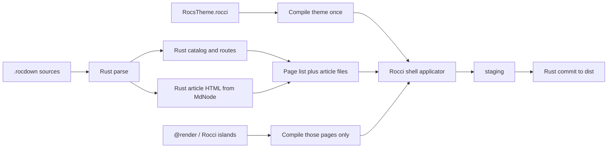

# Implementation plan for the Rocdown documentation generator

**Status:** active — Phase 0 complete; static catalog and article HTML moved to Rust

**Companion product report:** [`ROCDOWN_DOCUMENTATION_GENERATOR_REPORT.md`](ROCDOWN_DOCUMENTATION_GENERATOR_REPORT.md)

## 1. Decision summary

Implement the documentation generator as **Rust catalog + Rocci views + Roc islands**, not as a generated Roc site-compiler application.

Phase 0 proved that a generated Roc build app can wrap pages in a Rocci shell. It also showed that putting catalog, routes, and Markdown-as-Roc-constructors in Roc makes compile cost scale with prose instead of behavior. That split is the wrong default for static documentation.

The original product report’s crate boundary in section 4.4 stands: site compilation belongs in Rust. Rocci remains the implementation language for the visible documentation UI. Authored dynamic islands remain ordinary Roc/Rocci and are compiled only when a page actually contains them.

| Layer | Owner | Role |
| --- | --- | --- |
| Syntax | `rocci-rocdown`, `rocci-template` | Parse mixed Rocdown/Rocci, preserve spans, emit Roc for islands and templates |
| Catalog | `rocs` (Rust) | Identity, routes, aliases, graph, navigation, validation, artifacts |
| Static body | `rocs` (Rust) | `MdNode` → article HTML, clean Markdown, search text |
| Site chrome | Rocci theme, compiled **once** | Shell, nav, semantic components |
| Dynamic islands | Roc / Rocci | `@render`, handlers, Datastar; compile those fragments only |
| Host | `rocs` + `rocs-cli` | Invoke `roc` for the theme applicator, watch/serve, atomic `dist/` commit |

### Ownership rule

If a behavior is a deterministic transformation of parsed documentation data, it belongs in Rust. If it emits site chrome, it belongs in Rocci evaluated by Roc. If it is an authored island, it belongs in Roc/Rocci and is compiled as a program.

Rust must not grow a second HTML template language for docs layouts. Roc must not re-encode the Markdown AST as `DocNode` constructors just so a build app can walk it.

## 2. Why not Roc-first for static content

The discarded approach was: lower every page to Roc `Html` constructors (or a Roc `DocNode` IR), generate a registry of page modules, and let a Roc `basic-cli` app own routing, validation, and writes.

That is the right model for `rocci run` of an interactive page. It is the wrong model for a 100–500 page static site:

- Rust already has `MdNode`, headings, links, and `@page` metadata.
- Re-emitting that tree as Roc source forces the Roc compiler to parse and type-check prose on every content edit.
- Catalog algorithms are string/path/graph transforms. The Phase 0 `RocsRoute.roc` was hundreds of lines of missing-stdlib work.
- `docs check` and the LSP should not need a Roc compile to know a link is broken.
- SHA-256, JSON, sitemaps, CSS rewriting, and highlighters are host problems with mature Rust crates.

Dynamic islands are the exception. They are real Roc functions. They stay on the Roc path.

## 3. Current repository baseline

| Surface | Behavior now | Next evolution |
| --- | --- | --- |
| `crates/rocci-rocdown` | Span-preserving Markdown/Rocdown AST; `rocci_content` / `rocci_page` for preview | Unchanged for `rocci run`; Rocs consumes `Document` + metadata without compiling page modules |
| `crates/rocci-template` | `.rocci` → Roc `Html` | Compile first-party docs themes once per build |
| `crates/rocs` | Discovers `.rocdown`, builds a Rust catalog, renders article HTML, compiles `RocsTheme.rocci` once, writes `dist/` | Nested content roots, graph, nav, validation, island splice |
| `crates/rocs-cli` | `rocs build [ROOT] --output dist` | `check`, `dev`, `inspect` |
| `crates/rocci-lsp` | Local syntax diagnostics | Consume catalog snapshots from Rust, not a Roc checker subprocess |

Phase 0 leftover: `examples/rocs/{index,guide}.rocdown` still build through `rocs build`. Per-page Roc modules, `RocsRegistry`, `RocsModel`, and `RocsRoute` are gone.

## 4. Architecture



Build layers:

1. **Syntax, Rust:** parse Rocdown; keep spans.
2. **Catalog, Rust:** IDs, routes, collisions, later graph/nav/validation.
3. **Article, Rust:** walk `MdNode` to HTML using the same `rd-*` classes as `rocci-rocdown` lowering.
4. **Theme, Rocci:** `SiteShell` and later chrome; compiled once.
5. **Applicator, Roc:** read article HTML + title files, call the theme, write documents. Compile cost is O(theme), not O(content).
6. **Host, Rust:** stage workspace, invoke `roc`, atomically replace `dist/`.

Rendering still must not accept an unresolved catalog. The types stay phased, in Rust:

```text
Vec<SourcePage>
    -> Result<Catalog, Vec<Diagnostic>>
    -> Result<ResolvedSite, Vec<Diagnostic>>
    -> Result<BuildPlan, Vec<Diagnostic>>
    -> Result<BuildSummary, BuildFailure>
```

### How `.rocci` participates

`.rocci` is the view layer. The catalog prepares typed data in Rust; Rocci turns `PageView` into HTML.

```text
.rocdown
    -> Rust parser
    -> MdNode + SourcePage
    -> Rust resolves PageView and article HTML
    -> RocsTheme.rocci receives title/slots (later full PageView)
    -> generated Rocci functions return Html
    -> RocsBuild.roc writes static HTML
```

Do not interpret Rocci in Rust. That would fork HTML semantics from `rocci run`. The theme remains real Rocci evaluated by Roc. Article bodies are data (`dangerously_include_unescaped_html`), so content edits do not recompile Markdown as Roc.

Pages with `@render`, Rocci templates, `@roc`, `@css`, handlers, or a custom `layout` are islands. This slice rejects them with a clear error. Later they compile through the existing Roc module path and splice HTML into the same shell.

## 5. Repository layout

```text
crates/rocs/
├── runtime/
│   ├── Html.roc              # string Html matching the theme’s bindings
│   └── RocsBuild.roc         # read article files, call Rocci shell, write HTML
├── templates/
│   └── RocsTheme.rocci       # document shell
└── src/
    ├── article.rs            # MdNode → article HTML
    ├── catalog.rs            # routes, output paths, duplicates
    ├── build.rs              # discover, stage, invoke roc, commit
    └── runtime.rs

crates/rocs-cli/              # `rocs build`

examples/rocs/
├── index.rocdown
└── guide.rocdown
```

Later docs-specific Rocci components and CSS live next to `RocsTheme.rocci`. There is no `Docs*.roc` catalog runtime. There is no `rocci-docs` crate unless packaging later wants a rename; `rocs` is that crate.

Site configuration can be TOML later (`rocci.docs.toml`) parsed into the same Rust `SiteConfig`. A `site.roc` config module is not required for static sites.

## 6. Core contracts

### 6.1 Source locations

Rust already has byte spans and line/column. Catalog diagnostics use those. Codes stay in the `RDxxxx` families from the product report when validation lands.

### 6.2 Semantic document IR

The IR is `MdNode` in `rocci-rocdown`. Do not emit a parallel Roc `DocNode`. Clean Markdown, heading slugs, and search text walk `MdNode`. Opaque islands become an explicit splice hole with optional Markdown/search fallbacks when island support lands.

`rocci_content` and `rocci_page` remain for standalone preview. Rocs does not use them for static pages.

### 6.3 Page records

Site-critical metadata stays a statically extractable subset of `@page`. `SourcePage` in Rust holds id, source path, route hint, title, article HTML, headings, and links. Identity is derived from the content-root-relative path when no explicit ID exists (file stem in the current flat discovery).

### 6.4 Catalog states

Same phased types as the product report (`Catalog` → `ResolvedSite` → `BuildPlan`), implemented in Rust. Current slice: route derivation, trailing slash, output paths, duplicate detection, `..` / non-absolute rejection.

### 6.5 Theme contract

`RocsTheme.rocci` currently takes `{ title }` plus article HTML. Expand to `PageView` (site, lanes, sidebar, breadcrumbs, outline, previous/next, resources) without changing catalog ownership. The Roc applicator, not an arbitrary layout, owns final `<head>` resource injection.

## 7. Rust / Rocci / Roc budget

### Rust

- parse/lower inputs, article HTML, catalog, graph, nav, validation
- generate the tiny `RocsPages.roc` index (paths only; titles and bodies are files)
- package/stage Html + RocsBuild + compiled theme
- invoke `roc`, map theme diagnostics, atomic output commit
- later: watch, serve, Pagefind staging, LSP catalog snapshots

### Rocci

- `RocsTheme.rocci` and later `DocsComponents.rocci` / diagnostics views
- no file discovery, routing, or link resolution inside components

### Roc

- evaluate the compiled theme
- compile authored islands when present
- not: SHA-256, JSON, sitemap, CSS rewrite, search ranking, OpenAPI adapters

## 8. Command behavior

```text
rocs build [ROOT] [--output dist]
```

Later, also as `rocci docs …` if the CLI should own the user-facing name:

```text
rocci docs build [ROOT] [--output dist] [--production]
rocci docs check [ROOT] [--format terminal|json]
rocci docs dev [ROOT] [--port 8000] [--no-window]
rocci docs inspect config|catalog|page|graph|nav|artifacts [TARGET]
```

`docs check` must call the same Rust catalog as `docs build`. There is no cheaper second implementation.

`docs dev` watches in Rust and rebuilds; the Rocci theme is recompiled only when theme/island inputs change.

## 9. Phased implementation

### Phase 0 — done

Two-page site through one Rocci shell; duplicate routes fail; failed builds leave previous output; repeat builds are byte-identical.

### Phase 1 — done (this slice, replacing “DocNode in Roc”)

- Rust `MdNode` → article HTML with `rd-*` parity against `lower_md`
- Rust catalog: derived/explicit routes, trailing slash, output paths, duplicates
- Build compiles `RocsTheme.rocci` once and passes article HTML as files
- Static pages are not Roc modules
- Island pages error clearly until the splice path exists
- Catalog tests run without `roc` on `PATH`

Exit gate: HTML and plain text can be derived from `MdNode`; the Roc compiler sees only the theme plus a path index.

### Phase 2 — catalog, routing, graph, navigation, validation (Rust)

Previously specified as pure Roc. Same product rules, different language:

- stable IDs independent of routes; nested `index.rocdown`; aliases; drafts
- resolve relative, wiki, absolute, heading, and asset links
- explicit navigation plus optional directory discovery
- breadcrumbs, previous/next
- all independent diagnostics in one run
- `rocs check` / `inspect`

Exit gate: a 100-page fixture checks as one site; every internal reference is resolved before rendering.

### Phase 3 — production HTML and first-party Rocci theme

- full `PageView` passed to Rocci
- 404, alias redirects, asset hashing, CSP, canonical metadata
- Rocci wide/medium/narrow layouts, skip link, no-JS, forced-colors
- Rust plans artifacts; Rocci renders chrome; host commits `dist/`

### Phase 4 — clean Markdown, machine outputs, search, dev mode

Derive Markdown, JSON, sitemap, `llms.txt`, and search records from the Rust catalog. Pagefind remains an external post-build adapter. Search UI is Rocci. Watch/serve stay in the host.

### Phase 5 — semantic components, includes, tested examples

Rust recognizes a bounded `@docs` directive family structurally. Rocci renders the components. Validation and Markdown/search projections stay on the typed catalog, not in the parser. Example commands are opt-in host execution.

### Phase 6 — generated references and richer themes

OpenAPI/JSON Schema adapters produce catalog records in Rust (or a pinned library). Rocci renders them through the same shell.

### Phase 7 — scale and advanced interaction

Versioning, locales, remote search, explicit client islands, optional API explorer. Static HTML and the resolved graph remain the foundation.

## 10. Testing

| Test type | Where |
| --- | --- |
| Markdown parse/spans | `rocci-rocdown` |
| Article HTML parity | `rocs` article tests (no `roc`) |
| Catalog/routes/duplicates | `rocs` catalog tests (no `roc`) |
| Theme shell, escaping, determinism | `rocs` build tests (need `roc`) |
| CLI staging | `rocs-cli` |

CI lanes: `cargo test --workspace` without Roc; a pinned Roc lane for theme applicator tests; later a docs fixture lane.

## 11. Determinism, security, performance

Unchanged product rules: sorted inputs, no wall-clock in output, no implicit network, raw HTML off by default, reject `..` and unsafe schemes, atomic `dist/` replace.

Performance checkpoints: parse/lower, article render, Roc theme compile (should stay flat as page count grows), catalog time, write time. The first optimization is not a Roc compiler cache for generated page modules; those modules should not exist for static pages.

## 12. Compatibility

- `rocci build` / `rocci run` of a single `.rocdown` file are unchanged.
- Rocs is an additional product on the same crates.
- Preview may keep sibling Rust link resolution; site mode uses the Rocs catalog.
- Existing CSS themes remain for standalone pages; the docs theme is Rocci plus assets.

## 13. Risks

| Risk | Mitigation |
| --- | --- |
| Article HTML drifts from `rocci_content` | Shared `rd-*` conventions and parity tests against `lower_md` |
| Theme compile still required for every content edit | Later cache the theme binary; content-only rebuilds only re-run the applicator |
| Island pages need Roc | Compile those pages only; splice HTML into the same shell |
| Two CLIs (`rocs` vs `rocci docs`) | Keep `rocs` until the catalog is real, then optionally alias |

## 14. Stable release definition of done

Phases 0–4 of this revised plan, matching the product report’s Phase 0 acceptance target:

- page identity distinct from route
- global validation of routes, aliases, headings, assets, navigation, references
- one resolved catalog drives HTML, clean Markdown, JSON/search, sitemap, redirects, `llms.txt`
- default shell authored in Rocci
- usable at 320 CSS px, keyboard/screen reader, no JS, declared CSP
- byte-identical production rebuilds; failed builds do not partially replace output
- 100–500 page fixture meets compile/build budgets because Roc compile is O(theme + islands), not O(prose)
