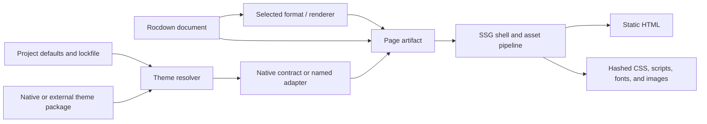

# Theming Rocdown: presentation ecosystems, static-site generators, and a compatible theme architecture

**Investigation date:** 2026-08-15  
**Status:** Architecture and implementation report. Proposed syntax and manifests are illustrative.  
**Scope:** Theming for Rocdown pages and a future Rocdown SSG, with an explicit path for using themes from popular Markdown presentation platforms.

## Executive summary

Rocdown should treat a theme as a **versioned build-time package with a declared rendering contract**, not as an arbitrary stylesheet URL. A useful theme may own more than colors: it can require a particular DOM shape, a page layout, fonts and images, syntax highlighting, print rules, light/dark behavior, configuration, and client-side code. This is the common lesson across presentation tools and static-site generators.

The recommended design has three layers:

1. **A small native Rocdown theme contract** for ordinary articles and sites. It contains a manifest, CSS, assets, design tokens, optional Roc/Rocci layouts, configuration defaults, and compatibility metadata.
2. **A deterministic SSG theme resolver**. It resolves built-in themes, local directories, and installed/vendored packages; copies and fingerprints assets; rewrites CSS URLs; records exact versions and hashes in a lockfile; and emits styles in a documented cascade order.
3. **Named compatibility adapters** for other ecosystems. An adapter owns the required DOM and CSS transformation rules. It must report a compatibility level rather than implying that every external theme is portable.

The most practical external compatibility targets are:

- **Reveal.js: high compatibility.** Reveal publishes compiled theme CSS, exposes theme values as CSS custom properties, and documents a stable `.reveal > .slides > section` hierarchy. Rocdown can generate that hierarchy and load Reveal core CSS plus a selected theme. Reveal JavaScript is needed for the full presentation runtime, but not to understand the theme contract.
- **Marp/Marpit: good compatibility through an adapter, not by blind CSS inclusion.** Marpit themes are CSS centered and identify themselves with `/* @theme name */`, but Marpit processes selectors, `:root`, imports, size metadata, directives, pagination, and slide attributes. Rocdown should either implement the relevant theme compiler contract or invoke a pinned Marpit-compatible compiler at import time. Directly linking raw theme CSS is not an accurate compatibility claim.
- **Remark: feasible but lower priority.** Its themes are ordinary CSS against Remark-specific wrapper classes and slide properties. Compatibility requires Remark-compatible DOM and class/property mapping.
- **Quarto Reveal themes: partial.** They are Sass layers over Quarto's Reveal base and sometimes rely on Quarto-specific markup. Compiled CSS can work when the dependency and DOM assumptions are satisfied; raw `.scss` requires the Quarto/Sass variable contract.
- **Slidev: not generally portable.** A Slidev theme is an npm/Vite/Vue package that may provide global styles, Vue layouts and components, UnoCSS and Shiki configuration, and default Slidev configuration. Rocdown may offer a token/CSS migration tool later, but should not claim direct Slidev theme support.

For ordinary SSG themes, the most transferable practices are:

- one active base theme, with explicit extensions or components;
- project files and document-level overrides winning over theme defaults;
- a stable layout/content interface;
- typed or schema-checked theme configuration;
- package versions and checksums committed to a lockfile;
- local override files instead of editing installed theme files;
- CSS variables for supported customization and cascade layers for predictable precedence;
- asset ownership, URL rewriting, and offline builds handled by the build system;
- separate syntax-highlighting themes from page/presentation themes;
- first-class print, dark mode, reduced motion, and accessibility requirements.

The existing Rocdown compiler is a good starting point, but theme work should not be added only to `@css`. Today it emits semantic Markdown HTML, puts file CSS into an inline `<style>` only in the default shell, wraps CSS in native `@scope`, and adds `data-rocci-css` to nearly every emitted element. A custom `@page.layout` receives only `{ meta, content }`, so it is responsible for its own head and does not automatically receive the file stylesheet. The future SSG needs a page artifact model containing head resources, styles, scripts, assets, and body attributes, not just an `Html` content value.

The proposed delivery order is:

1. formalize the generated page and style artifact contracts;
2. add native, local CSS themes and a built-in readable default;
3. add SSG asset processing, manifests, lockfiles, diagnostics, and theme inspection;
4. add a Reveal-compatible presentation renderer;
5. add Marp theme import after its CSS transformation contract is implemented and tested;
6. add package-distributed layouts/components only after Roc package and SSG layout resolution are stable.

## 1. Theme terminology and the central compatibility rule

The word “theme” is used for several materially different things:

| Kind | Typical contents | Examples | Portable as plain CSS? |
| --- | --- | --- | --- |
| Design tokens | Colors, fonts, spacing, radii | CSS custom-property file, brand file | Usually |
| Skin | CSS targeting an existing, stable DOM contract | Reveal compiled themes, many Remark themes | Only when the DOM matches |
| Renderer theme | CSS plus a required HTML structure and generated attributes | Marp/Marpit, Reveal with core CSS | No; it needs an adapter |
| Layout theme | Templates, partials, navigation, metadata, assets | Hugo, Jekyll, MkDocs | No |
| Application theme | Components, runtime code, build plugins, configuration | Slidev, VitePress, Docusaurus | No |
| Starter | A copy of an entire project intended to be modified | Many Astro and Eleventy “themes” | No ongoing package relationship |

The compatibility rule is:

> A stylesheet is portable only if the producer and consumer agree on element names, wrapper classes, generated attributes, state classes, CSS variables, core/reset CSS, asset paths, and print behavior.

Rocdown's semantic HTML—`h1`, `p`, `blockquote`, lists, tables, `pre > code`, and so on—is a strong neutral content contract. It is enough for generic article CSS such as a Markdown typography stylesheet. It is not, by itself, a Reveal, Marp, Remark, or Slidev slide contract.

This means rocdown should distinguish three user-facing verbs:

- **use** a native theme whose contract Rocdown owns;
- **adapt** a supported external theme through a named compatibility renderer;
- **migrate** an unsupported platform theme by copying tokens or selected CSS with diagnostics.

“Import” can be the convenient CLI command, but the resulting manifest must state which of those operations happened.

## 2. What popular Markdown presentation environments do

### 2.1 Reveal.js

Reveal separates its presentation engine, core CSS, and visual theme:

```html
<link rel="stylesheet" href="reveal.css">
<link rel="stylesheet" href="theme/moon.css">

<div class="reveal">
  <div class="slides">
    <section>Slide one</section>
    <section>Slide two</section>
  </div>
</div>
```

The hierarchy `.reveal > .slides > section` is a documented requirement, including nested `section` elements for vertical slides. The stock themes are separate compiled stylesheets. Current theme CSS is rooted in classes such as `.reveal`, `.reveal-viewport`, and `.reveal .slides section`, and exposes its values through `--r-*` CSS custom properties. See the official [Reveal markup contract](https://revealjs.com/markup/), [theme documentation](https://revealjs.com/themes/), [installation guide](https://revealjs.com/installation/), and [theme template source](https://github.com/hakimel/reveal.js/blob/master/css/theme/template/theme.scss).

Common Reveal practice:

- load `reveal.css` before exactly one visual theme;
- customize supported `--r-*` variables for small changes;
- compile a Sass theme for deeper changes;
- load a separate Highlight.js theme for syntax highlighting;
- add document CSS after the base theme for deck-specific overrides;
- initialize Reveal JavaScript once for navigation, state, scaling, plugins, and print behavior.

Implication for Rocdown: Reveal is the best first adapter because its distributed CSS and DOM contract are explicit. The adapter should emit the expected wrappers, `section` per slide, state/data attributes where supported, core CSS, theme CSS, optional highlight CSS, and a pinned self-hosted Reveal runtime. Loading only `moon.css` against Rocdown's current `<main>` would not work.

### 2.2 Marp and Marpit

Marpit treats CSS as the theme language. A theme has metadata and styles slide `section` elements:

```css
/* @theme acme */

@import 'default';

section {
  width: 1280px;
  height: 720px;
  background: white;
  color: #222;
}
```

The `@theme` metadata is required in normal Marpit theme registration. Themes may import another registered theme, define size metadata, use `:root` as an alias for each slide, and style generated headers, footers, pagination, backgrounds, and Marpit-specific data attributes. Marpit merges inline style into emitted theme CSS and performs CSS processing rather than shipping the input unchanged. Marp CLI accepts one theme file or a theme set/directory, while a document selects a registered theme by name. See the [Marpit theme CSS documentation](https://marpit.marp.app/theme-css), [Marpit directives](https://marpit.marp.app/directives), [Marp CLI theme options](https://github.com/marp-team/marp-cli/blob/main/README.md#theme), and [Marp Core themes](https://github.com/marp-team/marp-core/tree/main/themes).

Marp Core adds built-in `default`, `gaia`, and `uncover` themes, size presets, GFM features, and its own rendering conventions. The current default theme source builds on GitHub Markdown CSS and uses generated attributes and CSS parts in addition to ordinary Markdown elements. See the [Marp Core documentation](https://github.com/marp-team/marp-core) and [default theme source](https://github.com/marp-team/marp-core/blob/main/themes/default.scss).

Common Marp practice:

- register a set of theme CSS files at tool/workspace level;
- select one registered name in document directives;
- extend a base theme with a theme-aware `@import`;
- set slide size in theme metadata or document directives;
- use per-deck `style` for small overrides;
- run the theme through Marpit's CSS packing/selector transformation.

Implication for Rocdown: a Marp adapter should consume compiled/distributed CSS through a Marpit-compatible transformation stage, or faithfully reproduce its subset. It must map slide size, `:root`, headers/footers, pagination and background attributes. A “CSS loaded successfully” test is insufficient; reference decks must be screenshot-tested against Marp output.

### 2.3 Slidev

Slidev resolves one theme from headmatter, conventionally from `@slidev/theme-*`, `slidev-theme-*`, a scoped package, or a local directory. A theme can contribute global styles, default configuration, custom or replacement Vue layouts, Vue components, UnoCSS configuration, and Shiki configuration. It declares supported Slidev versions and color schema in `package.json`. See [using themes](https://sli.dev/guide/theme-addon), [writing themes](https://sli.dev/guide/write-theme), [writing layouts](https://sli.dev/guide/write-layout), and the [theme gallery](https://sli.dev/resources/theme-gallery).

This is an application/plugin contract, not a CSS contract. Even the official Seriph theme package contains layout and style directories and expects Slidev's `.slidev-layout` component hierarchy. Slidev also compiles Vue and TypeScript from themes through Vite.

Implication for Rocdown: direct compatibility is not a sensible near-term goal. Rocdown can eventually read a Slidev package manifest, identify plain CSS and documented theme tokens, and generate a migration report. Supporting the theme itself would require implementing Slidev layouts, components, utilities, configuration merge rules, and runtime APIs—effectively embedding Slidev.

### 2.4 Quarto Reveal

Quarto exposes built-in Reveal themes and accepts a theme name, a custom Sass file, or a list such as `[default, custom.scss]`. Theme files have defaults and rules sections, use a documented Sass variable surface, and commonly target `.reveal .slide`. Quarto also adds its own callouts, code tooling, tabsets, layout classes, and generated markup. See [Quarto Reveal themes](https://quarto.org/docs/presentations/revealjs/themes.html), the [Reveal presentation guide](https://quarto.org/docs/presentations/revealjs/), and the [Reveal format reference](https://quarto.org/docs/reference/formats/presentations/revealjs).

Implication for Rocdown: stock Reveal theme names should be supported through the Reveal adapter, not by calling them “Quarto themes.” A Quarto `.scss` file is compatible only to the extent that it uses Reveal/Quarto variables and selectors Rocdown implements. An importer can compile and inspect it, then warn on known Quarto-only selectors or facilities.

### 2.5 Remark

Remark presentations use normal CSS applied to a generated Remark DOM, with wrapper classes such as `.remark-slide-content`. Markdown extensions add slide properties, classes, templates, and content-class syntax. Remark bundles code-highlighting styles separately from arbitrary slideshow CSS. See the [Remark project documentation](https://remarkjs.com/).

Implication for Rocdown: compatibility is possible through an adapter that maps slide classes and produces Remark-compatible wrappers, but Reveal and Marp have clearer packaging contracts and larger reusable theme surfaces. Remark should follow those two.

### 2.6 Presentation comparison

| Platform | Theme distribution | Theme owns | Required adapter work | Recommended support |
| --- | --- | --- | --- | --- |
| Reveal.js | Compiled CSS/Sass in npm/repository | Visual CSS variables and selectors; core separately | Exact wrappers, core CSS, slide sections, optional runtime | First-class adapter |
| Marp/Marpit | CSS files/theme sets; Marp npm packages | Slide CSS, metadata, sizes, imports, directive styling | CSS processing plus Marp attributes and layout | First-class after Reveal |
| Remark | Usually project CSS | CSS over Remark DOM/classes | Wrapper/classes and slide-property mapping | Later adapter |
| Quarto Reveal | Built-ins plus layered Sass | Reveal plus Quarto variables and markup | Sass contract and Quarto-specific selector audit | Partial/import with warnings |
| Slidev | npm/local Vite package | CSS, Vue layouts/components, config and tool plugins | Reimplement a framework runtime | Migration only |

## 3. What static-site generators do

SSG theme systems are especially relevant because Rocdown's roadmap already calls for multi-page routes, layouts, drafts, assets, and `dist/` output.

### 3.1 Hugo: modules, mounts, and ordered overlays

Hugo themes can contain layouts, assets, data, static files, configuration, content, translations, and archetypes. Hugo Modules use Go's versioning and checksums, cache downloads, support vendoring, and mount imported directories into a unified virtual filesystem. Multiple theme components can be composed with explicit left-to-right precedence; project files win over theme files. See [using Hugo Modules](https://gohugo.io/hugo-modules/use-modules/) and [theme components](https://gohugo.io/hugo-modules/theme-components/).

Transferable lessons:

- treat themes as build dependencies, not copied snippets;
- make resolution order inspectable and deterministic;
- allow composition of a base theme and focused components;
- retain a lock/checksum and support vendoring for offline builds;
- override a file locally at the same logical path rather than editing cache contents;
- namespace theme configuration to reduce merge collisions.

### 3.2 Jekyll: packaged themes with local shadowing

Jekyll gem themes package assets, layouts, includes, Sass, plugins, and default configuration. Bundler records versions in `Gemfile.lock`. A site overrides an installed theme file by creating a file with the same path in its own `_layouts`, `_includes`, `_sass`, or asset directories. Only one theme is active, although plugins and site files extend it. See [Jekyll themes](https://jekyllrb.com/docs/themes/).

Transferable lessons:

- one selected base theme is easier to reason about than an unbounded theme stack;
- installed source can stay out of the project while remaining inspectable;
- exact-path shadowing is a simple, teachable escape hatch;
- themes need documented layouts, includes, variables, and configuration;
- upgrades are safer when overrides are small and visible.

### 3.3 MkDocs: Python packages, template inheritance, and extra assets

MkDocs selects an installed theme by name. A `custom_dir` can replace individual files from the parent theme, and Jinja blocks can extend a template while calling `super()`. Small adjustments use `extra_css` and `extra_javascript`; larger changes replace or extend templates. MkDocs explicitly warns that installing a third-party theme installs and may execute Python code. See [choosing a theme](https://www.mkdocs.org/user-guide/choosing-your-theme/), [customizing a theme](https://www.mkdocs.org/user-guide/customizing-your-theme/), and [developing themes](https://www.mkdocs.org/dev-guide/themes/).

Material for MkDocs demonstrates a mature customization ladder: configuration for common choices, CSS variables for brand colors, extra CSS for small changes, template overrides for structural changes, and source builds only for deep framework changes. See its [customization guide](https://squidfunk.github.io/mkdocs-material/customization/) and [color-variable model](https://squidfunk.github.io/mkdocs-material/setup/changing-the-colors/).

Transferable lessons:

- provide a ladder from configuration to tokens to CSS to layout override;
- structural override points are more stable than copying entire templates;
- disclose that executable theme packages are trusted build-time code;
- maintain a clear boundary between theme assets and user extra assets.

### 3.4 Astro and Eleventy-style starters: project templates rather than live themes

Astro supports scoped component styles, global styles, npm CSS imports, layouts, integrations, and full starter repositories. Its “themes” are often starters copied into a new project, after which the project owns the code; this avoids a universal runtime theme interface but gives up easy upstream upgrades. Astro bundles and splits imported CSS per page and recommends applying Markdown global styles from its layout. See [Astro styles and CSS](https://docs.astro.build/en/guides/styling/), [integrations](https://docs.astro.build/en/guides/integrations/), and [project templates](https://docs.astro.build/en/guides/migrate-to-astro/from-nextjs/#create-a-new-astro-project).

Transferable lessons:

- call a copyable project a **starter**, not a theme package;
- layout is the natural boundary for global Markdown CSS and head resources;
- imported CSS should participate in bundling, hashing, and page-level dependency analysis;
- component-local CSS and document-global CSS need distinct semantics.

### 3.5 VitePress and Docusaurus: executable theme interfaces

VitePress custom themes export a Vue theme object whose required member is a root `Layout`; a theme may extend another theme, register components, use layout slots, and import CSS. The default theme intentionally exposes root CSS variables for common customization. External themes can be npm packages but are still Vue/Vite application code. See [using a VitePress custom theme](https://vitepress.dev/guide/custom-theme) and [extending the default theme](https://vitepress.dev/guide/extending-default-theme).

Docusaurus separates content plugins from UI themes. Themes are npm packages with lifecycle hooks and React components; the classic theme accepts global custom CSS, while component “swizzling” provides structural overrides. See [Docusaurus theme design](https://docusaurus.io/docs/advanced/plugins#theme-design), [theme packages](https://docusaurus.io/docs/api/themes), and [classic theme configuration](https://docusaurus.io/docs/api/themes/%40docusaurus/theme-classic).

Transferable lessons:

- define the data/content contract separately from its UI renderer;
- allow a theme to extend a stable base and fill named layout slots;
- do not describe executable components as portable CSS;
- expose a supported token/configuration surface before asking users to replace internals.

### 3.6 SSG comparison

| Pattern | Systems | Strength | Cost | Rocdown use |
| --- | --- | --- | --- | --- |
| Versioned overlay filesystem | Hugo, Jekyll, MkDocs | Strong packaging and local overrides | File-path contracts can become API | Use for assets/layouts after SSG exists |
| Starter repository | Astro, Eleventy ecosystem | Maximum freedom, no runtime abstraction | Forks drift; upgrades are manual | Offer separately as `rocci new --template` |
| Executable theme object | VitePress, Docusaurus | Deep extension and components | Runtime/build-tool coupling and trust | Avoid as the v1 theme minimum |
| CSS plus stable layout | All of the above at the simplest level | Portable and safe | Limited structural control | Native theme v1 |

## 4. Current Rocdown theming behavior

The current implementation has several useful primitives:

- Comrak produces semantic CommonMark/GFM nodes.
- Markdown elements receive stable heading IDs and language classes on fenced code.
- File-level and component-level `@css` are returned as `StyleArtifact` values.
- CSS is wrapped in `@scope ([data-rocci-css~="id"])`.
- File and component scopes are distinct.
- A custom `@page.layout` can own an entire document shell.
- The asset server already exposes an application asset directory.

The relevant implementation is in [`crates/rocci-rocdown/src/lower.rs`](crates/rocci-rocdown/src/lower.rs), [`crates/rocci-template/src/lower.rs`](crates/rocci-template/src/lower.rs), and [`crates/rocci-core/src/config.rs`](crates/rocci-core/src/config.rs).

There are also constraints that should be resolved before building a public theme API:

1. **The default shell owns CSS injection.** File CSS is inserted as an inline `<style>` only in `emit_default_page`. When `@page.layout` is set, Rocdown calls `Layout({ meta, content })`; it does not pass styles, scripts, head nodes, document attributes, or assets.
2. **The style artifact is not yet an SSG asset.** There is no CSS extraction, content hashing, deduplication across pages, URL rewriting, or linked stylesheet generation.
3. **File scope is over-stamped.** If a file has CSS, `data-rocci-css` is attached to essentially every generated Markdown element as well as `html`, `body`, and `main`. Native `@scope` needs a boundary, not a copy of the boundary token on every descendant. Component boundaries have different needs, but file-level theming can use one stable root class/attribute.
4. **`@scope` alone sets a young browser floor.** MDN marks `@scope` as Baseline 2025 and warns that it may not work on older browsers. That can be acceptable for a pinned desktop webview, but SSG output has a broader browser audience. See [MDN `@scope`](https://developer.mozilla.org/en-US/docs/Web/CSS/Reference/At-rules/%40scope).
5. **Theme and authored CSS are conflated.** `@css` is a document override authored with content. A reusable theme needs a separate identity, configuration, assets, version, and cascade position.
6. **No slide container exists.** The present content is a flat fragment inside `<main>`. Presentation themes that target slides cannot apply correctly until a presentation renderer groups Markdown blocks into slide nodes.
7. **The page metadata contract is closed.** `@page` currently accepts only `route`, `layout`, `draft`, and `meta`; unknown fields are errors. Theme selection therefore needs an intentional syntax and LSP work.
8. **Syntax highlighting is only marked, not themed.** Fenced code receives `class="language-*"`, but no highlighter or token markup is generated. Page theme and code theme should be separate options.

These are architectural gaps, not reasons to discard the existing CSS work. Colocated `@css` remains the right author experience for document and component overrides.

## 5. Recommended Rocdown theme model

### 5.1 Keep format, layout, theme, and code theme separate

Rocdown should model four independent concepts:

| Concept | Responsibility | Example |
| --- | --- | --- |
| Format/renderer | Output DOM and behavior contract | `article`, `reveal`, `marp` |
| Layout | Page chrome and named content slots | docs article, blog post, title slide |
| Theme | Visual design and theme-owned assets | `rocdown-paper`, Reveal `moon` |
| Code theme | Highlight token colors and optional highlighter | `github-dark`, `monokai` |

This prevents a visual choice from silently changing parsing or page structure. It also lets the same brand tokens feed article and presentation themes without pretending their CSS is identical.



### 5.2 Proposed document selection

An illustrative extension to `@page` is:

```rocdown
@page {
    route: "/talks/rocdown/",
    format: "reveal",
    theme: "reveal:moon",
    code_theme: "highlightjs:monokai",
    meta: {
        title: "Rocdown theming",
    },
}
```

For an ordinary article:

```rocdown
@page {
    route: "/guides/themes/",
    format: "article",
    theme: "rocdown:paper",
    meta: { title: "Themes" },
}
```

Project defaults belong in `rocci.toml` so documents only override exceptions:

```toml
[rocdown]
format = "article"
theme = "rocdown:paper"
code_theme = "rocdown:github"
theme_paths = ["themes"]

[rocdown.theme]
accent = "#48eda4"
content_width = "68ch"
```

The compiler should require these controls to be compile-time literals. A dynamically computed theme conflicts with static dependency discovery and deterministic SSG output.

### 5.3 Native theme package

A local or vendored native theme could be:

```text
paper/
├── rocdown-theme.toml
├── styles/
│   ├── reset.css
│   ├── theme.css
│   └── print.css
├── assets/
│   └── fonts/
│       └── text.woff2
├── layouts/
│   └── article.rocci        # optional, later phase
└── LICENSE
```

Illustrative `rocdown-theme.toml`:

```toml
schema = 1
name = "paper"
version = "1.2.0"
kind = "article"
rocdown = ">=0.3,<0.4"
license = "MIT"

styles = [
  { path = "styles/reset.css", layer = "reset" },
  { path = "styles/theme.css", layer = "theme" },
  { path = "styles/print.css", layer = "theme", media = "print" },
]

[entry]
root_class = "rocdown-document"
layout = "article" # optional; resolved only when layout packages ship

[color]
schemes = ["light", "dark"]
default = "auto"

[config.accent]
type = "color"
default = "#2563eb"
css_variable = "--rd-accent"

[config.content_width]
type = "css-length"
default = "68ch"
css_variable = "--rd-content-width"
```

Important properties of the manifest:

- a schema version independent from the theme version;
- a declared theme kind/renderer compatibility;
- a supported Rocdown version range;
- ordered style entries with layer and media metadata;
- declared root classes/attributes rather than inferred selectors;
- typed configuration mapped to a bounded set of CSS variables;
- explicit assets and license metadata;
- optional layout/components in a later schema, not required for a CSS theme.

Theme packages should not be allowed to execute arbitrary code in v1. A data/CSS/assets format is easier to cache, validate, sandbox, and reproduce. Executable importers—such as invoking Sass or Marpit—should be explicit toolchain adapters with their own trust warning.

### 5.4 Theme sources and resolution

Support sources in this order:

1. built-in IDs such as `rocdown:paper`;
2. exact project aliases declared in `rocci.toml`;
3. local theme directories found in `theme_paths`;
4. vendored themes in a reserved project directory;
5. installed registry packages recorded in the lockfile.

Do not fetch a mutable URL during every build. Instead provide an explicit command:

```sh
rocci theme add reveal:moon@5.2.1
rocci theme add marp:gaia@4.2.3
rocci theme add ./themes/acme
rocci theme vendor
rocci theme inspect reveal:moon
```

`theme add` resolves and imports the dependency, records its origin, version, SHA-256, adapter version, license, and files in `rocci.lock`, and caches or vendors immutable content. Normal `rocci build` and `rocci ssg` should be offline by default once dependencies are resolved.

An illustrative lock entry:

```toml
[[theme]]
id = "reveal:moon"
version = "5.2.1"
source = "npm:reveal.js"
integrity = "sha256-..."
adapter = "reveal@1"
files = ["dist/reveal.css", "dist/theme/moon.css"]
license = "MIT"
```

The exact package transport can evolve. The invariant is that document IDs resolve through project-owned, pinned metadata rather than reaching the network from Markdown.

### 5.5 Cascade contract

Rocdown should document a low-to-high normal-precedence order:

```css
@layer rd.reset, rd.base, rd.theme, rd.document, rd.component, rd.utility;
```

| Layer | Owner |
| --- | --- |
| `rd.reset` | Rocdown or renderer normalization |
| `rd.base` | Semantic Markdown defaults and renderer core CSS |
| `rd.theme` | Selected reusable theme |
| `rd.document` | File-level `@css` and project overrides |
| `rd.component` | Component-local `@css` |
| `rd.utility` | Explicit opt-in utilities, if later supported |

Cascade layers give predictable overrides without specificity escalation. The CSS specification allows an imported stylesheet to be assigned to a layer and lets the layer order be declared up front. See [CSS Cascade Level 5](https://www.w3.org/TR/css-cascade-5/#layer-order) and [MDN cascade layers](https://developer.mozilla.org/en-US/docs/Learn_web_development/Core/Styling_basics/Cascade_layers).

There are two caveats:

1. unlayered author rules outrank normal layered rules, so Rocdown must either transform all managed CSS consistently or clearly document where raw unlayered styles sit;
2. `!important` reverses layer order. Themes should avoid `!important`, and the validator should report its use with the effective precedence.

The build should concatenate or link resources in dependency order, but cascade order must not depend accidentally on filesystem traversal or Markdown declaration order.

### 5.6 Scope contract

Use different isolation strategies for different owners:

- **Theme CSS:** root it at a stable renderer class such as `.rocdown-document`, `.reveal`, or `.marpit`; it is intentionally global within that rendered page.
- **Document `@css`:** scope to one document root. For broad browser output, compile a selector prefix fallback such as `:where([data-rd-document="id"])`; optionally emit native `@scope` for modern targets.
- **Component `@css`:** scope to the component's rendered boundary, not the whole document. Preserve low specificity with `:where(...)` and avoid stamping every descendant if a boundary selector is sufficient.
- **Raw external themes:** transform into their declared cascade layer, but do not rewrite selectors unless a named adapter owns and tests that rewrite.

The current `data-rocci-css` behavior can remain during migration, but theme work is a good point to reduce file-level attribute output. A single document boundary is smaller, easier for imported CSS to target, and closer to other SSG contracts.

### 5.7 Design tokens

Native themes should expose a stable, small namespace rather than their entire internal stylesheet:

```css
.rocdown-document {
  --rd-color-bg: Canvas;
  --rd-color-text: CanvasText;
  --rd-color-muted: #667085;
  --rd-color-accent: #2563eb;
  --rd-font-body: system-ui, sans-serif;
  --rd-font-code: ui-monospace, monospace;
  --rd-content-width: 68ch;
  --rd-space-block: 1rem;
  --rd-radius: 0.5rem;
}
```

Adapter themes keep their native variables (`--r-*` for Reveal, for example). Rocdown may provide documented bridges from generic `--rd-*` brand tokens to adapter variables, but should not rename or flatten the external platform's whole API.

Token configuration needs validation by type: color, CSS length, number, enum, font stack, URL asset, and boolean. Rejecting `</style>` is not enough; values should be serialized as CSS tokens, not string-concatenated into arbitrary rules.

## 6. External theme adapters

### 6.1 Adapter interface

Internally, an adapter should answer four questions:

```text
resolve(theme reference, lockfile) -> ThemePackage
validate(theme package, renderer version) -> diagnostics
render(document AST, theme config) -> RenderedPage
collect(rendered page) -> styles, scripts, assets, head, body attributes
```

An adapter manifest should declare:

- adapter ID and version;
- compatible upstream package/version range;
- accepted source forms (`.css`, compiled package, `.scss`);
- required core assets;
- DOM contract version;
- supported upstream directives/features;
- unsupported features with diagnostic codes;
- runtime requirement (`none`, optional, required);
- print/PDF support level.

Compatibility levels should be visible in `rocci theme inspect`:

| Level | Meaning |
| --- | --- |
| Native | Rocdown owns and tests the complete contract |
| Compatible | Reference fixtures match the upstream renderer for the supported version range |
| Partial | CSS loads, but named upstream facilities are unsupported |
| Migrated | Tokens/rules were copied into a new native theme; no upstream compatibility is promised |

### 6.2 Reveal adapter

The Reveal renderer should:

1. group Rocdown Markdown into slides using an explicit syntax/configuration;
2. emit `.reveal > .slides > section` exactly;
3. add `.reveal-viewport` behavior through the pinned Reveal runtime;
4. load `reveal.css`, then one visual theme, then code theme, then document `@css`;
5. translate supported slide metadata to Reveal `data-*` attributes;
6. provide print styles and runtime initialization as self-hosted, fingerprinted assets;
7. preserve semantic content inside each section;
8. pass through theme `--r-*` configuration without selector rewriting.

Slide boundaries should not overload CommonMark thematic breaks silently for article documents. A future presentation format can choose a well-documented rule—such as heading level, `---`, or an explicit declaration—but the renderer selection must make the interpretation unambiguous. Quarto uses level-two headings by default; Marp commonly uses `---`. Rocdown can support both as presentation options while keeping ordinary CommonMark semantics in `article` format.

The adapter can operate in two modes:

- `static`: emit the DOM and CSS without the Reveal runtime, useful for embedded or printable output;
- `interactive`: include pinned Reveal JS and selected plugins.

### 6.3 Marp adapter

The Marp adapter should have a narrower initial claim:

- accept compiled Marp/Marpit theme CSS with `@theme` metadata;
- resolve theme imports from the registered theme set, never from arbitrary network URLs;
- parse `@size` metadata and validate CSS dimensions;
- transform `:root`/slide selectors according to Marpit semantics;
- emit Marp-compatible `section` nodes and supported data attributes;
- implement pagination, header/footer, background and per-slide class mappings;
- keep Marp inline style in the document override layer;
- diagnose unsupported directives or selector constructs;
- compare screenshots and computed styles with pinned Marp output.

Two implementation choices are reasonable:

1. **Pinned external compiler during import.** `rocci theme add` invokes a declared Marpit/Marp tool, stores the resulting CSS and adapter metadata, and normal builds consume only the result. This reaches fidelity faster but introduces a Node/tool trust and installation boundary.
2. **Native Rust compatibility compiler.** Parse CSS and metadata in Rocci, implement the supported transformations, and version the adapter. This makes the final build self-contained but requires careful conformance work.

Do not use regex selector rewriting. CSS nesting, functional pseudo-classes, keyframes, imports, escaped identifiers, `@layer`, and URL tokens require a real CSS parser.

### 6.4 Slidev and SSG theme importers

For Slidev, VitePress, Docusaurus, Hugo, Jekyll, and MkDocs packages, `rocci theme import` should begin as an inspection/migration command:

```text
$ rocci theme import node_modules/@slidev/theme-seriph

Theme kind: Slidev application theme
Portable CSS files: 3
Non-portable layouts: 6 Vue components
Build integrations: UnoCSS
Result: partial migration; written to themes/seriph-migrated/
```

The output should include copied assets, extracted obvious tokens, a generated native manifest, TODO diagnostics for non-portable selectors/layouts, source attribution, and license files. It must not claim that the generated theme remains a Slidev theme.

## 7. Page and SSG artifact architecture

### 7.1 Replace the content-only layout boundary

The present conceptual call is:

```roc
Layout({ meta, content })
```

A themed SSG needs a build artifact closer to:

```text
PageArtifact {
  route,
  meta,
  format,
  content,
  headings,
  links,
  head,
  html_attributes,
  body_attributes,
  styles,
  scripts,
  assets,
}
```

The layout should render content and chrome, while the build orchestrator owns dependency collection and final head resource emission. A Roc-level illustrative contract might be:

```roc
Layout({
    meta,
    content,
    slots: { before_content, after_content },
    theme: { id, config },
})
```

Styles/scripts/assets should remain compile metadata rather than ordinary `Html`, so the SSG can deduplicate and fingerprint them. The final shell builder combines the layout's HTML with collected resource metadata.

### 7.2 Asset pipeline

For every theme and page stylesheet, the SSG should:

1. parse CSS and recursively resolve local `@import` entries;
2. reject or explicitly allow remote imports;
3. resolve `url(...)` relative to the declaring stylesheet;
4. prevent paths escaping the package root unless declared;
5. copy font/image assets to a content-addressed output path;
6. rewrite CSS URLs to the final base-aware URL;
7. optionally minify in production;
8. hash the final CSS and deduplicate identical chunks;
9. emit a dependency graph for debugging;
10. preserve source files/maps in development where practical.

Example output:

```text
dist/
├── guides/themes/index.html
└── assets/
    ├── theme.paper.8b32f2.css
    ├── code.github.2a28c1.css
    └── text.4c971d.woff2
```

Rocdown should prefer linked, fingerprinted CSS for SSG production and inline CSS for single-file export or development only. This enables caching and avoids repeating a site theme in every HTML page.

### 7.3 Project overrides and inheritance

Adopt a limited, explicit override ladder:

1. selected base theme;
2. optional theme components declared by the project;
3. `themes/<id>/overrides/` files shadowing matching logical theme paths;
4. project global CSS;
5. document `@css`;
6. component `@css`.

For v1, permit only one base theme. Theme components may add assets, styles, and later layout slots, but must not silently replace the base renderer. This combines Jekyll's simplicity with Hugo's focused composition.

Provide `rocci theme graph` or include it in `inspect`:

```text
article renderer
└── rocdown:paper@1.2.0
    ├── rd.reset  styles/reset.css
    ├── rd.theme  styles/theme.css
    └── overridden by themes/paper/overrides/styles/theme.css
document
└── rd.document  Guide.rocdown:@css (line 16)
```

### 7.4 Development behavior

Theme files and their assets must participate in the watcher. A CSS-only edit should refresh or replace the stylesheet without recompiling Roc when possible. Changes to the manifest, layout, renderer, imports, or token schema invalidate the appropriate build graph.

Diagnostics should report both the document that selected a theme and the theme source location:

```text
Guide.rocdown:5:12: theme `acme` is incompatible with format `article`
  selected here
themes/acme/rocdown-theme.toml:4:1: theme declares kind `reveal`
```

The LSP should complete installed theme IDs, format IDs, code theme IDs, and typed configuration keys from resolved manifests without reaching the network.

## 8. Best practices Rocdown should enforce or encourage

### 8.1 Predictable CSS

- Use low-specificity root selectors with `:where()` in native themes.
- Declare cascade layers once and show them in inspection output.
- Keep theme, document, and component CSS in distinct layers/artifacts.
- Avoid IDs and `!important` in reusable themes.
- Do not rewrite unknown third-party selectors outside an adapter.
- Validate CSS syntax at build time and preserve source locations.
- Treat a code-highlighting theme as a separate dependency.

### 8.2 Light, dark, and user preferences

- A native theme declares `light`, `dark`, or `both`, plus its default policy.
- Prefer `auto` via `prefers-color-scheme` and emit `<meta name="color-scheme">` before CSS to reduce incorrect initial browser chrome and flashes.
- Use a small inline bootstrap only if a persistent manual toggle is added; otherwise remain zero-JavaScript.
- Store manual choice in an explicit `data-rd-color-scheme` on `html` and let CSS variables switch beneath it.
- Never infer “dark” only from a background color.
- Theme configuration must cover both palettes when it overrides semantic colors.

See MDN on [`color-scheme`](https://developer.mozilla.org/en-US/docs/Web/CSS/Reference/Properties/color-scheme), [`prefers-color-scheme`](https://developer.mozilla.org/en-US/docs/Web/CSS/Reference/At-rules/%40media/prefers-color-scheme), and the [`color-scheme` meta value](https://developer.mozilla.org/en-US/docs/Web/HTML/Reference/Elements/meta/name/color-scheme).

### 8.3 Accessibility and output modes

Every built-in theme and every theme accepted into a Rocdown gallery should be tested for:

- keyboard-visible focus;
- contrast for text, links, code, controls, and both color schemes;
- zoom/reflow for article themes;
- overflow and minimum legible text in slide themes;
- `prefers-reduced-motion` fallbacks;
- forced-colors/high-contrast behavior;
- semantic heading order independent of visual size;
- print and PDF output;
- link affordance not communicated by color alone;
- no essential information in backgrounds or pseudo-elements only.

The `prefers-reduced-motion` feature is widely available and should be a theme requirement for non-essential transitions. See [MDN `prefers-reduced-motion`](https://developer.mozilla.org/en-US/docs/Web/CSS/Reference/At-rules/%40media/prefers-reduced-motion).

For presentations, include a “plain document” or speaker handout rendering path. A visually scaled slide deck is not a substitute for accessible linear HTML.

### 8.4 Security and reproducibility

- No mutable CDN URLs in reproducible builds.
- Pin upstream packages and adapter versions; verify integrity hashes.
- Copy assets locally and keep the existing self-only CSP by default.
- Treat executable importers and application themes as trusted build tools; show a confirmation before running them.
- Parse CSS URLs and imports; disallow `file:`, unexpected absolute paths, and network schemes unless policy enables them.
- Record license and source attribution for imported themes and their fonts/assets.
- Do not assume an upstream framework's license covers bundled fonts or images.
- Keep theme configuration as validated data, not executable Roc/JavaScript in the first version.
- Make vendoring available for audited and offline builds.

### 8.5 Performance

- Extract shared site theme CSS once and cache it with a content hash.
- Emit only the selected renderer/theme/code-theme assets per page.
- Preload only fonts actually used above the fold; prefer WOFF2 and `font-display` policies declared by the theme.
- Avoid `@import` in final browser CSS; flatten imports during the build.
- Do not inline a large site theme in every SSG page.
- Keep the native article renderer zero-JavaScript.
- Make presentation runtimes and plugins explicit dependencies rather than default payload.

## 9. Proposed implementation plan

### Phase 0: freeze the contracts

Before user-facing syntax, document and test:

- `StyleArtifact` ownership, scope, source, media, layer, and dependency fields;
- a `PageArtifact`/head-resource model;
- renderer IDs and root DOM contracts;
- the cascade order;
- asset URL resolution rules;
- the supported browser target for preview versus SSG.

Change the custom layout path so layouts cannot accidentally drop all collected styles. Either the final shell builder always injects resources, or the layout receives an explicit head/resources interface.

### Phase 1: native CSS themes

- Add `format` and `theme` to `@page` metadata extraction and LSP support.
- Add `[rocdown]` defaults and local `theme_paths` to `rocci.toml`.
- Implement a schema-versioned manifest with CSS and assets only.
- Ship one readable article theme and one minimal/reset theme.
- Separate file `@css` from theme styles in compilation output.
- Emit stable `.rocdown-document` and `data-rd-theme` root markers.
- Add typed CSS-variable configuration.
- Add `theme inspect` and theme completion.

Acceptance test: two documents share one extracted theme stylesheet, have different local `@css`, render from nested routes, and build offline with correct asset URLs.

### Phase 2: SSG asset pipeline

- Implement multi-page resource collection with hashing and deduplication.
- Parse CSS imports and URLs and copy dependent assets.
- Add a lockfile and cache/vendor model.
- Add watch invalidation and source-aware CSS diagnostics.
- Add print and code-theme artifacts.
- Add theme graph/debug output.
- Decide and implement the `@scope` compatibility strategy.

Acceptance test: a local font and background image referenced from nested imported CSS work identically in preview and `dist/`, with no network access.

### Phase 3: native layout packages and overrides

- Add theme-provided Roc/Rocci layouts only after SSG module resolution is stable.
- Define named layout slots and a versioned layout-data contract.
- Add exact-path local overrides or explicit extension declarations.
- Keep one base theme and ordered optional components.
- Validate theme/layout compatibility ranges.

Acceptance test: a docs theme supplies article and index layouts; a project overrides only its footer slot/template and can upgrade the theme without copying the rest.

### Phase 4: Reveal adapter

- Add a presentation document/slide AST or grouping pass.
- Emit the exact Reveal wrapper hierarchy.
- Resolve pinned Reveal core/theme assets.
- Map supported slide metadata and code themes.
- Add static and interactive modes.
- Test responsive scaling, print/PDF, reduced motion, and keyboard behavior.

Acceptance test: stock Reveal `black`, `white`, `moon`, `dracula`, and `simple` themes match upstream reference fixtures at desktop and print sizes.

### Phase 5: Marp adapter

- Parse Marpit metadata, imports, sizes, and selectors with a CSS parser.
- Implement the supported directive/attribute contract.
- Choose pinned import-time Marpit compilation or native transformation.
- Build a conformance suite against Marp Core's `default`, `gaia`, and `uncover` themes.
- Add explicit unsupported-feature diagnostics.

Acceptance test: computed styles, slide dimensions, pagination, headers/footers, backgrounds, and screenshots match pinned Marp output for the supported fixture set.

### Phase 6: migration tooling and gallery

- Inspect Slidev/Quarto/Remark/SSG theme packages.
- Extract portable CSS/tokens/assets with license files.
- Generate native theme skeletons and TODO diagnostics.
- Publish gallery metadata: renderer, version, color modes, JS requirement, license, accessibility checks, and screenshots.

## 10. Test strategy

Theme support needs more than compiler snapshots.

### Unit tests

- manifest parsing, unknown fields, version ranges, config value types;
- theme ID and path normalization;
- lock integrity and offline resolution;
- CSS metadata, imports, URL rewriting, and traversal rejection;
- cascade layer ordering;
- `@page` precedence over project defaults;
- adapter feature diagnostics.

### Golden tests

- final HTML shell and head-resource order;
- generated CSS and source maps;
- root classes/attributes for each renderer;
- deterministic asset names independent of traversal order;
- deduplication across pages;
- no theme resources on pages that do not select the theme.

### Browser tests

- screenshot matrices for viewport, light/dark, print, and representative content;
- computed-style assertions for tokens and override precedence;
- keyboard focus and color-scheme initialization;
- reduced-motion behavior;
- broken/missing font and image fallback;
- base-path deployments such as `/project/` rather than `/`.

### Upstream compatibility tests

Pin an upstream version for every external adapter. Render the same neutral fixture through upstream Reveal/Marp and Rocdown, then compare:

- DOM contract where intended;
- selector match coverage;
- computed styles for representative nodes;
- screenshots with a documented tolerance;
- print page size and overflow;
- known unsupported features.

An adapter version must change when its DOM or transformation contract changes, even if the user-facing theme ID stays the same.

## 11. Concrete decisions recommended now

1. **Call the v1 feature “Rocdown themes,” not presentation themes.** It should work for current article pages before slides exist.
2. **Add `format`, `theme`, and `code_theme` as separate compile-time page controls.** Do not encode format inside a theme name or layout.
3. **Make a native theme declarative and CSS-first.** Defer executable layouts/components.
4. **Make the SSG own all final head/resource injection.** Layouts render structure but cannot silently lose theme assets.
5. **Use one base theme plus explicit project/document/component overrides.** Add focused theme components only when needed.
6. **Adopt a documented cascade-layer contract.** Keep the existing `@css` authoring form as the document/component override mechanism.
7. **Replace file-wide descendant stamping with a document boundary strategy.** Keep component isolation separately designed.
8. **Do not depend exclusively on native `@scope` for public SSG compatibility without declaring the browser floor.** Offer build-time selector scoping for broader targets.
9. **Resolve and pin external themes before normal builds.** No implicit network fetch from a `.rocdown` file.
10. **Implement Reveal first, Marp second, migration-only Slidev support.** This matches the actual portability of their contracts.
11. **Treat syntax highlighting as its own theme artifact.** It has different markup, dependencies, and light/dark requirements.
12. **Publish compatibility levels and unsupported features.** “Partial” is better than a visually broken promise of universal import.

## 12. Risks and open design questions

| Question | Risk if deferred | Recommended default |
| --- | --- | --- |
| Does SSG target browsers without `@scope`? | Styles disappear on unsupported browsers | Prefix document/component CSS at build time; optionally retain native scope |
| Who owns the final `<head>`? | Layouts omit or reorder theme assets | SSG shell/resource collector owns it |
| Can themes contain executable Roc/Rocci? | Supply-chain and versioning complexity | Not in v1; declarative CSS/assets only |
| How are slides delimited? | CommonMark behavior changes unexpectedly | Interpret delimiters only under an explicit presentation format |
| Are URLs allowed as theme references? | Non-reproducible and unsafe builds | Only in explicit `theme add`; lock and cache the result |
| Which package registry is canonical? | Rocci becomes coupled to npm/Git | Keep resolver/provider-neutral IDs and lock entries |
| How are theme configs surfaced to Roc layouts? | Duplicate or untyped configuration paths | Manifest schema feeds CSS variables first; typed layout data later |
| Can more than one base theme be active? | Unpredictable file and CSS precedence | No; one base plus components/overrides |
| Will adapters execute Node/Sass? | Toolchain trust and portability | Only explicit import-time adapters, never required for normal offline builds |
| What does “compatible with Marp” mean? | Superficial CSS success hides rendering gaps | Pinned conformance fixtures and published feature matrix |

## Conclusion

Rocdown can have a strong theme ecosystem without copying the architecture of any one JavaScript or SSG framework. Its advantages are semantic Markdown HTML, a compiler-controlled page shell, explicit Roc/Rocci layout functions, extracted style artifacts, and an SSG that can make all dependencies static and reproducible.

The key is to standardize the boundary:

- native themes are declarative packages over a stable Rocdown renderer;
- project and document overrides are explicit and ordered;
- layouts and resources are separate artifacts;
- external themes enter through versioned adapters that reproduce their DOM contract;
- the build owns assets, hashes, URLs, security policy, and offline resolution.

With that model, Rocdown can support lightweight article themes immediately, grow into full site themes with its SSG, and genuinely reuse Reveal and Marp themes without presenting platform-specific application bundles as if they were interchangeable CSS.

## Primary references

### Presentation systems

- Reveal.js: [themes](https://revealjs.com/themes/), [markup](https://revealjs.com/markup/), [installation](https://revealjs.com/installation/), [theme template source](https://github.com/hakimel/reveal.js/blob/master/css/theme/template/theme.scss)
- Marpit/Marp: [theme CSS](https://marpit.marp.app/theme-css), [directives](https://marpit.marp.app/directives), [Marp CLI theme configuration](https://github.com/marp-team/marp-cli/blob/main/README.md#theme), [Marp Core](https://github.com/marp-team/marp-core), [default theme source](https://github.com/marp-team/marp-core/blob/main/themes/default.scss)
- Slidev: [using themes](https://sli.dev/guide/theme-addon), [writing themes](https://sli.dev/guide/write-theme), [writing layouts](https://sli.dev/guide/write-layout), [theme gallery](https://sli.dev/resources/theme-gallery)
- Quarto: [Reveal themes](https://quarto.org/docs/presentations/revealjs/themes.html), [Reveal guide](https://quarto.org/docs/presentations/revealjs/), [format reference](https://quarto.org/docs/reference/formats/presentations/revealjs)
- Remark: [project documentation](https://remarkjs.com/)

### Static-site generators

- Hugo: [modules](https://gohugo.io/hugo-modules/use-modules/), [theme components](https://gohugo.io/hugo-modules/theme-components/)
- Jekyll: [themes](https://jekyllrb.com/docs/themes/)
- MkDocs: [choosing](https://www.mkdocs.org/user-guide/choosing-your-theme/), [customizing](https://www.mkdocs.org/user-guide/customizing-your-theme/), [developing themes](https://www.mkdocs.org/dev-guide/themes/)
- Material for MkDocs: [customization](https://squidfunk.github.io/mkdocs-material/customization/), [colors and CSS variables](https://squidfunk.github.io/mkdocs-material/setup/changing-the-colors/)
- Astro: [styles](https://docs.astro.build/en/guides/styling/), [integrations](https://docs.astro.build/en/guides/integrations/), [starters](https://docs.astro.build/en/guides/migrate-to-astro/from-nextjs/#create-a-new-astro-project)
- VitePress: [custom themes](https://vitepress.dev/guide/custom-theme), [extending the default](https://vitepress.dev/guide/extending-default-theme)
- Docusaurus: [theme design](https://docusaurus.io/docs/advanced/plugins#theme-design), [themes](https://docusaurus.io/docs/api/themes), [classic theme](https://docusaurus.io/docs/api/themes/%40docusaurus/theme-classic)

### Web platform

- W3C: [CSS Cascading and Inheritance Level 5](https://www.w3.org/TR/css-cascade-5/)
- MDN: [`@scope`](https://developer.mozilla.org/en-US/docs/Web/CSS/Reference/At-rules/%40scope), [cascade layers](https://developer.mozilla.org/en-US/docs/Learn_web_development/Core/Styling_basics/Cascade_layers), [`color-scheme`](https://developer.mozilla.org/en-US/docs/Web/CSS/Reference/Properties/color-scheme), [`prefers-color-scheme`](https://developer.mozilla.org/en-US/docs/Web/CSS/Reference/At-rules/%40media/prefers-color-scheme), [`prefers-reduced-motion`](https://developer.mozilla.org/en-US/docs/Web/CSS/Reference/At-rules/%40media/prefers-reduced-motion)
