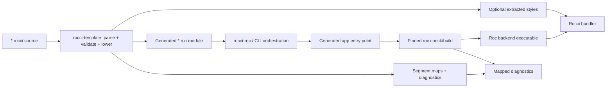
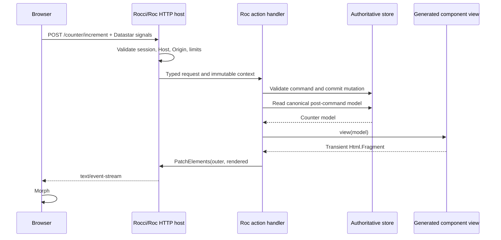
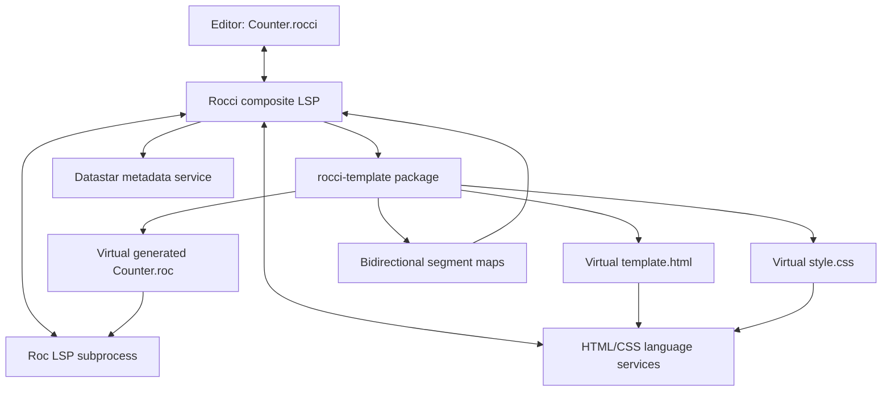

# Roc + Datastar backend component filetype

**Investigation date:** 2026-08-13  
**Repository:** Rocci  
**Status:** Architecture and feasibility report; proposed syntax and APIs are illustrative, not a committed specification.

## Executive summary

A Vue-like component file for Roc and Datastar is feasible without modifying either Datastar or the Roc language. The practical design uses a dedicated **source-to-source template compiler package** which turns `.rocci` templates into ordinary Roc plus source maps and optional extracted style artifacts. Separate orchestration then generates the application entry point and invokes the Roc toolchain. The generated Roc application runs as a backend process on a Roc web-server platform; it renders HTML and returns Datastar Server-Sent Events (SSE) for updates.

The recommended target extension is `*.rocci`. A file contains ordinary Roc plus explicit `name = component |params| { ... }` declarations. Component bodies use a bounded template grammar with HTML tags, `{...}` interpolation in HTML contexts, and concise `@if expression { ... }`, list-oriented `@for item in expression { ... }`, and Roc-pattern `@match expression { Pattern => templateValue }` directives. The first brace at Roc delimiter depth zero opens the directive body, so top-level record expressions must be parenthesized. Each match arm returns one self-delimiting template value; fragments represent multiple sibling nodes. Component calls such as `<Hello name={person.name} />` lower to ordinary Roc calls with props records. This gives predictable parsing without implementing a second full Roc parser; JSX remains a documented future alternative if Roc eventually exposes a suitable parser extension point. The detailed language design is specified in [ROC_TEMPLATE.md](ROC_TEMPLATE.md).

This is similar to a Vue Single-File Component (SFC) in colocation and build tooling, but not in runtime semantics. A Roc component would be a **server component**: there is no client-side Roc runtime, hydration, virtual DOM, or component instance. Datastar remains the small browser runtime. Roc owns authoritative application state and rendering; ordinary HTTP requests and Datastar SSE events connect the two.

The most important findings are:

1. **Roc is a credible backend target, but still a moving target.** Roc is pre-0.1 and is transitioning to a new Zig-based compiler. Its own new-compiler tutorial warns that features and documentation remain incomplete. Compiler, platform, and generated-code syntax therefore need to be pinned together.
2. **A suitable host foundation now exists.** Roc's current `basic-webserver` targets the new compiler, uses a Rust Hyper/Tokio host, exposes safe HTML construction, and supports typed SSE with host-owned admission, timers, backpressure, cancellation, and framing. It is a stronger prototype base than creating an HTTP host from scratch.
3. **Datastar needs only a thin Roc package.** Its backend protocol is HTML/JSON or a handful of textual SSE event types. There is no Roc SDK in Datastar's current official SDK list, but a useful adapter is small and can be implemented entirely in Roc on top of generic SSE primitives.
4. **The template compiler is moderate work; excellent editor tooling is the expensive part.** Parsing and generating Roc are tractable. Correct source maps, mixed-language type diagnostics, completions, navigation, rename, and formatting require a composite language server and virtual documents.
5. **Do not fork Roc for the first implementation.** Keep parsing and lowering in a dedicated `rocci-template` package, consume the normal `roc` command/LSP through separate orchestration, and only propose upstream compiler hooks after the format has proven itself.

The recommended path is a narrow vertical slice first: one page and one patch boundary composed from a few stateless render components, escaped interpolation, explicit routes, full-page and fragment rendering, one-shot Datastar patches, compiler diagnostic remapping, and backend restart on save. Defer dynamic components, rich slot APIs, scoped CSS, template-only hot replacement, and sophisticated template expressions.

One refinement is important before fixing the file format: **do not equate one file with one component**. A `.rocci` file should be a Roc module which may contain several small render components, ordinary Roc declarations, and—when useful—one page or application definition. This preserves the colocation benefit of Vue SFCs without inheriting their one-component-per-file pressure. A templ-inspired embedded HTML form is a better fit for that goal than a single top-level `<template>` block.

The default runtime rendering model should be equally simple: construct a **transient, typed HTML tree** for each render, serialize a complete component or page boundary, send it as one `datastar-patch-elements` event using the recommended `outer` morph mode, and then discard the tree. The initial GET still returns a complete HTML document. Do not retain a per-client server-side virtual DOM or calculate DOM diffs on the server in version 1; Datastar already performs the DOM morph in the browser.

## 1. What exists today

### 1.1 Rocci's current architecture

The repository is already organized around the correct boundary for this work:

| Existing part | Relevant behavior | Consequence for Roc components |
| --- | --- | --- |
| `rocci-core::Backend` / `RunningBackend` | The shell starts a backend, obtains its origin, attaches window-scoped sessions, and owns shutdown. | A compiled Roc program can be another managed backend implementation. |
| Rust/Axum backend | Serves HTML and Datastar SSE on loopback HTTP. | Defines the expected behavior and security contract. |
| Python sidecar | Prints a readiness URL and is managed as a child process. | Provides the closest lifecycle model for an initial Roc executable. |
| Wry/tao shell | Depends on HTTP rather than language-specific commands or IPC. | It should not need to know that pages were generated from components. |
| Askama templates | Full page and fragment share the same render definition. | A generated Roc `view` should preserve this property. |
| Datastar counter | Actions return `datastar-patch-elements`; a long-lived GET broadcasts patches. | Supplies an end-to-end acceptance test for the new backend. |

The component work should therefore sit above the existing backend interface, not inside `rocci-wry`.

### 1.2 Roc's relevant capabilities and constraints

Roc applications always run on exactly one platform. The platform has a Roc-facing API and a non-Roc host; the host controls program startup, I/O, allocation, and when it invokes compiled Roc functions. Conceptually, the Roc application is compiled and linked into a host-controlled executable. This is a good fit for a domain-specific Rocci backend platform. See Roc's [Platforms and Apps](https://www.roc-lang.org/platforms) explanation.

The important current caveat is compiler transition. Roc's [new-compiler tutorial](https://github.com/roc-lang/roc/blob/main/docs/mini-tutorial-new-compiler.md) explicitly describes the rewritten compiler as bleeding edge, with missing features and documentation, while the main repository still says Roc is not ready for 0.1. The same tutorial documents `roc`, `roc test`, and `roc fmt`, and notes that most published platforms historically targeted the old compiler while ports were in progress.

There is now a particularly relevant exception: [`roc-lang/basic-webserver`](https://github.com/roc-lang/basic-webserver) states that its main branch and 0.14 release candidates target the new Zig compiler. Its Rust host uses Hyper and Tokio, and the application provides `init!`, `respond!`, and `shutdown!`. It also provides:

- typed request/response handling;
- safe HTML nodes and rendering, with an explicitly named dangerous raw-HTML escape hatch;
- typed SSE sources;
- bounded concurrency and event sizes;
- host-managed timers, backpressure, disconnect cancellation, compression, and HTTP framing;
- SQLite, outbound HTTP, file, process, TCP, time, and other platform effects.

Its [typed SSE design](https://github.com/roc-lang/basic-webserver/blob/main/docs/sse.md) is almost exactly the primitive Datastar needs. A Roc transition returns `Emit`, `Wait`, or `End`; the host parks streams without consuming a Roc worker and resumes them under bounded backpressure.

Roc's compiler repository also currently contains a Zig LSP implementation and compiler-backed tests for syntax checking, completions, hover, definition, document symbols, and diagnostics (see the [`src` compiler overview](https://github.com/roc-lang/roc/tree/main/src)). This is useful but should be treated as an evolving dependency, not yet as a fixed embedded-language API.

### 1.3 Datastar's relevant capabilities

Datastar is intentionally backend-neutral. It adds browser behavior through `data-*` attributes and sends signals with requests. Backend actions accept normal HTTP responses, including HTML, JSON, JavaScript, and `text/event-stream`. See the official [Actions reference](https://data-star.dev/reference/actions) and [Backend Requests guide](https://data-star.dev/guide/backend_requests).

For the recommended SSE path, a backend emits events such as:

```text
event: datastar-patch-elements
data: elements <section id="counter">...</section>

```

Datastar morphs top-level elements by ID by default. A response can contain zero or more element patches, signal patches, and other events. The wire rules are specified in the [SSE Events reference](https://data-star.dev/reference/sse_events).

Datastar's [official SDK list](https://data-star.dev/reference/sdks) currently includes several backend languages, including Rust and Zig, but not Roc. This is not a blocker: the SDKs are optional and the protocol is textual.

### 1.4 The useful lesson from Vue

Vue SFCs colocate template, logic, and style, but are compiled into ordinary modules and CSS. Vue's documentation highlights precompilation, cross-analysis, IDE type checking, and hot updates as the benefits of the format. See the [SFC guide](https://vuejs.org/guide/scaling-up/sfc.html) and [SFC syntax specification](https://vuejs.org/api/sfc-spec.html).

The less visible lesson is tooling architecture. Vue's official language tools separate SFC parsing and virtual-code generation from the language server and TypeScript integration; [`@vue/language-core`](https://github.com/vuejs/language-tools) owns SFC parsing and virtual code. A Roc composite format needs the same conceptual separation even if it does not use Vue's implementation.

## 2. Proposed programming model

### 2.1 What a self-contained feature means

A self-contained Roc/Datastar feature may colocate:

- a pure render function generated from the template;
- a Roc model/props value accepted by that function;
- optional backend loaders and action handlers;
- route metadata connecting HTTP requests to those handlers;
- optional extracted CSS;
- a stable component ID used for diagnostics and development updates.

These declarations may all live in one `.rocci` module, but they are not fused into one runtime component abstraction. The render component itself remains only a pure function. A page/program value explicitly connects loaders, handlers, routes, and patch policy. It is not a browser object. Rendering produces either a full HTML response or a fragment suitable for `datastar-patch-elements`. Every independently patchable boundary has one stable root element ID. Datastar expressions in attributes continue to execute in the browser; Roc expressions in template delimiters execute only on the backend during rendering.

### 2.2 Template language

The `.rocci` grammar, examples, escaping rules, component-call lowering, control-flow options, parser design, source maps, and experimental block-format spike are specified separately in [ROC_TEMPLATE.md](ROC_TEMPLATE.md). This report treats the template compiler as an input to the Roc backend architecture rather than owning its language definition.

### 2.3 Separate the render component from the application architecture

“Component” can refer to three different things, and the design becomes much clearer if they are not collapsed into one abstraction:

1. A **render component** is a pure function from props to `Html`. It has no identity, lifecycle, mutable state, route, or effect API.
2. A **patch boundary** is a rendered element with a stable DOM ID which an HTTP action or SSE stream may replace. Not every render component needs to be a patch boundary.
3. A **page/program** owns loading, messages/actions, effects, persistence, authorization, and the choice of patch boundary.

The primitive should therefore remain approximately:

```text
Component props = props -> Html
```

Composition is then normal function composition. State architecture sits one level above it. This avoids the Vue/React tendency to make every small visual extraction participate in a runtime component-instance model.

Colocation does not weaken this separation. `Counter.rocci` may contain `Msg`, `update`, handlers, two small templates, a page template, and `counterProgram`. `rocci-template` lowers only the templates; the flow declarations remain ordinary Roc and are interpreted only by the explicitly selected Elm, reducer, request-handler, or server-program library. Side-by-side single-file examples and the precise compiler boundary are specified in [Separate template syntax from the component flow model](ROC_TEMPLATE.md#separate-template-syntax-from-the-component-flow-model).

For example, `iconButton` and `counterCard` can be render components in the same file. Only `counterPage` may be registered as a route and only `#counter` may be patchable. The compiler does not need to allocate or remember instances of the two smaller components.

### 2.4 Component/application model alternatives

| Model | Shape | Strengths | Problems in a Roc + Datastar backend | Position |
| --- | --- | --- | --- | --- |
| Pure views plus explicit request handlers | `Props -> Html`; handlers load/mutate, then call a view | Smallest runtime; persistence and HTTP boundaries are visible; works naturally with fat morphs | Some repeated handler/load/render wiring without library helpers | **Recommended default** |
| Elm Architecture / MVU | `init`, `update : Model, Msg -> Model`, `view : Model -> Html` | Exhaustive messages, highly testable transitions, easy time-travel in a pure program | A server request is not a local event; durable state, auth, failures, multiple windows, and effects do not fit a pure per-component `Model` without more machinery | Useful optional page/program layer, not the component primitive |
| MVU with explicit effects | `update : Model, Msg -> (Model, List Effect)` | Keeps decisions pure while describing DB, HTTP, timer, and navigation effects | Needs an effect interpreter, correlation/cancellation rules, persistence semantics, and a policy for concurrent messages | Promising later for complex applications |
| Request-driven server MVU | `load!`, typed `Msg`, `handle!`, `view`; state reloaded from an authoritative store | Keeps Elm's typed message vocabulary but matches HTTP/SSE and durable state | Transitions are less purely replayable; each action may involve I/O | **Best Elm-inspired option for Rocci** |
| LiveView-style process per page/session | Long-lived component process with mailbox and socket | Natural subscriptions and server-pushed UI; local state is convenient | Per-window memory, reconnect/resume, supervision, deployment, and stale process state conflict with the simple sidecar model | Do not make foundational; possible specialized runtime later |
| Actor model per component | Each component owns state and receives messages | Isolation and concurrency can be explicit | Visual composition does not align with state ownership; large numbers of actors and cross-component consistency become expensive | Reject as the default component model |
| Fine-grained signals / reactive graph | Values track dependencies and rerender affected nodes | Efficient local updates and familiar reactive authoring | Requires a retained dependency graph and server-side identity; duplicates Datastar's browser behavior and complicates restart/reconnect | Not initially |
| React-style function components and hooks | Function body plus ordered runtime hooks | Familiar and concise for client-local lifecycle state | Hooks depend on retained call order, component identity, lifecycle phases, and a scheduler; all are artificial for pure server rendering | Do not copy |

The key architectural conclusion is that **Elm is valuable as an application organization pattern, not as the definition of a render component**. Roc's pure functions and tag unions already provide most of the attractive part of Elm. Rocci should add only the server-specific pieces that Elm does not have: typed request decoding, effects, durable state, authorization, and patch selection.

### 2.5 Architecture recommendation for v1

The best fit for Roc is a **functional core with explicit request effects**:

```text
decode request/message
    -> authorize
    -> load canonical state
    -> pure decision/update where useful
    -> execute explicit effects
    -> reload canonical state
    -> pure view
    -> explicit patch response
```

This combines Roc's strongest properties—pure functions, inferred structural types, tag-union pattern matching, and visible effectful names—with the realities of a server: authentication, persistence, concurrent windows, failures, and request cancellation. It does not require retained component instances or a second effect system.

V1 should support two authoring levels over one runtime pipeline:

1. **Explicit request handlers are the semantic foundation and POC default.** They expose every important server boundary and are the easiest architecture to debug while the platform, generated code, source maps, and Datastar transport are still being proven.
2. **Request-driven MVU is a thin optional organization layer.** A typed `Msg`, `load!`, `handle!`, `view`, and patch target should compile or adapt to the same request-handler primitives. It must not introduce an in-memory per-component model, a separate scheduler, or a general effect interpreter.

These are not two competing runtimes. An application can start with explicit handlers and factor repeated decode/load/handle/reload/render/patch wiring into `Server.mvu` without changing its templates or persistence model.

Do not put a pure retained Elm loop, MVU effect interpreter, LiveView process model, actors, hooks, or fine-grained reactive graph in the first POC. A pure reducer such as `decide : State, Msg -> List(Command)` remains useful inside either selected architecture, but it is application code rather than another Rocci runtime.

### 2.6 A request-driven MVU option

An optional higher-level API could make messages exhaustive without pretending that the component is a persistent browser object:

```roc
CounterMsg : [Increment, Reset]

load! = |context|
    Counter.read!(context.db)

handle! = |msg, context|
    match msg {
        Increment => Counter.increment!(context.db)
        Reset => Counter.reset!(context.db)
    }

counterProgram = Server.program({
    path: "/counter",
    decodeMsg: counterMsgDecoder,
    load!,
    handle!,
    view: counterPage,
    patch: "#counter",
})
```

Conceptually, each message follows:

```text
HTTP message -> authorize -> handle effect -> reload canonical model -> view -> patch
```

This is deliberately not `update : Model, Msg -> Model`. The database or service remains authoritative, so two windows and background events cannot silently diverge into separate in-memory component models. A future pure reducer can still be used inside `handle!` for domain logic:

```roc
decide : State, Msg -> Result (List Command) DomainErr
evolve : State, Event -> State
```

That functional-core/event-sourcing shape gives stronger replay and testing properties than hiding effects in component lifecycle methods.

## 3. Compilation architecture

The composite format should be implemented as a separate compiler front end which emits normal inputs for the Roc compiler. The package-level boundary is as important as the process flow: `rocci-template` owns only template parsing and compilation-to-Roc, while callers own discovery, toolchain invocation, runtime generation, caching, and packaging.



### 3.1 Compiler stages

1. **Discover source modules (CLI/orchestration).** Read configured roots, apply deterministic naming, and reject case/path collisions across operating systems.
2. **Parse, validate, and lower (`rocci-template`).** Accept source text and return generated Roc, structured diagnostics, component metadata, bidirectional segment maps, and optional extracted styles. The package does not read or write project files.
3. **Generate the application entry point (`rocci-roc` or CLI).** Combine explicit page/program values into the platform's `init!`, `respond!`, and `shutdown!` contract. Routing and runtime scaffolding are not template lowering.
4. **Check and build (`rocci-roc` or CLI).** Invoke a pinned `roc` toolchain. Never treat successful template parsing as successful Roc type checking.
5. **Map diagnostics (CLI/LSP).** Apply the segment maps returned by `rocci-template`. Errors in caller-owned scaffolding should point to the relevant module or page definition and include a generated-file debug link.
6. **Package (bundler/CLI).** Bundle the compiled backend executable, Datastar asset, CSS, route manifest, and compiler/platform version metadata.

### 3.2 Generated code and source maps

`rocci-template` owns bidirectional segment-map generation as part of lowering; the detailed mapping contract is specified in [ROC_TEMPLATE.md](ROC_TEMPLATE.md). Consumers may use those maps but must not reconstruct them independently.

The CLI stores debug artifacts under a deterministic ignored directory such as `target/rocci/templates/`, keyed by source content, Roc compiler version, platform version, and template-compiler version. The template package returns data and never owns this filesystem policy. A clean build and an editor session must generate byte-identical virtual Roc for the same input.

### 3.3 Build commands

The CLI eventually needs a consistent set of commands:

```text
rocci check       parse, generate, roc-check, and remap diagnostics
rocci dev         watch, rebuild/restart backend, and reload windows
rocci build       generate and compile a release backend
rocci fmt         format each language block without changing semantics
rocci inspect     print generated files, route manifest, and source maps
```

`inspect` is important. Generated-code systems are much easier to trust and debug when their output is intentionally visible.

## 4. Backend and platform integration

### 4.1 Prototype versus long-term host

There are three plausible approaches:

| Approach | Advantages | Costs / risks | Recommendation |
| --- | --- | --- | --- |
| Use `basic-webserver` and adapt its application contract | New-compiler support, Rust host, safe HTML, typed SSE, resource limits, cross-platform CI | Rocci bootstrap/session/security and readiness behavior must be layered on; platform release cadence is external | Best prototype route |
| Build a Rocci-specific Roc platform host, borrowing `basic-webserver` patterns | Exact lifecycle/security contract; can share Rust crates and native capability model | Largest maintenance burden; Roc host ABI and compiler changes become Rocci's responsibility | Long-term only if adaptation proves insufficient |
| Compile Roc as a library loaded by the existing Axum process | Maximum reuse of `rocci-http`; potentially one process | Linking and Roc ABI/lifetime integration are more complex; dynamic replacement is hard; host still has to be a Roc platform | Research spike, not MVP |

The first implementation should produce a **managed Roc sidecar executable**. This mirrors the existing Python backend and keeps compiler/linker failures outside the shell process.

### 4.2 Required Rocci lifecycle contract

The Roc backend needs to:

1. bind only to an ephemeral `127.0.0.1` port;
2. generate bootstrap/session capability material;
3. print a versioned readiness record containing its origin and bootstrap URL;
4. implement exact Host and mutation-Origin checks;
5. exchange the bootstrap capability for an HttpOnly, SameSite cookie;
6. serve the generated pages, assets, actions, and SSE routes;
7. notice parent shutdown and terminate gracefully;
8. bound request bodies, concurrent Roc handlers, queued work, SSE streams, and event sizes.

The current plain `ROCCI_BACKEND_READY <url>` line works for a spike. Before supporting a third backend, replace it with a versioned, length-bounded JSON record so future health, protocol, and capability metadata can evolve without parsing ad hoc text.

### 4.3 State and concurrency

`basic-webserver` deliberately gives handlers an immutable application context and recommends SQLite or an external service for durable mutable state. This is compatible with Roc's semantics and is a good default for components. A desktop counter can use SQLite, a platform-provided synchronized store, or request-carried Datastar signals; it should not imply a mutable per-component object.

Long-lived Datastar subscriptions should use typed SSE sources. The host must own scheduling, backpressure, disconnect cancellation, and output limits. Roc transitions should own only small logical state such as a user/window ID and revision cursor, then query durable state on each transition. This follows `basic-webserver`'s typed SSE guidance and avoids retaining request-scoped capabilities.

### 4.4 How a component is processed on the server

The compiled template should behave like a pure function:

```text
view : Model -> Html.Fragment
```

`Html.Fragment` may internally be a typed tree of elements, attributes, and text nodes. That is useful for composition, contextual escaping, validation, and testability, but it is **not a retained VDOM**. It exists only while one request or stream transition is rendering and is discarded after serialization.

For an ordinary action, the server flow is:



The detailed steps are:

1. **Dispatch and authorize.** Match the generated route and enforce Rocci's session, Host, Origin, body-size, and concurrency rules before invoking application Roc.
2. **Decode input.** Decode path/query/form data and Datastar signals into typed Roc values. Treat signals as request input, not trusted state.
3. **Run the command.** Validate domain rules and update SQLite or another authoritative store. A failed command renders an error boundary or patches validation HTML; it does not optimistically confirm success.
4. **Read the canonical model.** Query state again after the write instead of manually predicting the new view from the command. This avoids rendering stale or incomplete derived state.
5. **Render a boundary.** Call the generated pure `view(model)` for the largest coherent region affected by the change. Compose child render functions normally on the server.
6. **Serialize safely.** Turn the transient `Html.Fragment` into bounded UTF-8 HTML, escaping dynamic text and attributes by construction.
7. **Emit one logical patch where practical.** Send `datastar-patch-elements` in `outer` mode. The top-level rendered element's ID identifies the existing target; an explicit selector is only needed for exceptional cases.
8. **Discard render data.** Release the request model and HTML tree after the event has moved into host-owned frames. Keep durable domain state, not a shadow copy of the browser DOM.

For the initial navigation, compose the layout and page components into a complete `<!doctype html>...` response with `Content-Type: text/html`. Normal links should remain normal links. Datastar's current guidance recommends anchor navigation and browser history rather than inventing client routing. For subsequent backend actions, use SSE even for a single event; SSE allows zero-to-many patches and gives one response model for short and long-lived operations.

### 4.5 Recommended update granularity: fat morph by default

Datastar's [Tao guide](https://data-star.dev/guide/the_tao_of_datastar) explicitly recommends keeping most state in the backend, using signals sparingly, and trusting morphing. The backend may send a large DOM region—even the `html` element—and Datastar updates only the changed DOM. This is commonly called a **fat morph**.

For Roc components, the practical default is not necessarily the whole document on every action. Use the largest stable, coherent boundary whose model was just read:

- `#counter` for an isolated counter card;
- `#todo-list` when counts, filters, rows, and empty state must stay consistent;
- `#main` when an action affects several page regions derived from one model;
- the full `html` element only when global document state genuinely changed.

This shifts complexity to the place with the best information: Roc renders a complete truthful state, while Datastar's browser morph decides which actual DOM nodes changed. It avoids a server diff algorithm and avoids hand-maintaining a web of tiny patch dependencies.

The byte cost is often less serious than the uncompressed HTML size suggests. Repeated HTML compresses well, and `basic-webserver` already owns streaming Brotli for SSE. The real costs to measure are server render time, compressed event size, browser parse/morph time, and update frequency—not the source HTML length alone.

Narrow fragments remain useful when measurement shows a real hotspot. For example, a high-frequency telemetry value can patch one output element, while a low-frequency settings action can morph `#main`. Granularity is an endpoint decision, not a permanent property of the component file.

### 4.6 DOM identity and browser-owned state

The success of fat morphing depends on stable identity:

- Every top-level patch target must have a stable, unique `id`.
- Give stable IDs to important descendants whose identity, event listeners, CSS transitions, focus, or third-party state must survive a morph. Datastar's [SSE reference](https://data-star.dev/reference/sse_events) specifically recommends IDs for top-level morph targets and stateful descendants.
- Repeated records should derive IDs from durable database/entity keys, never list positions or render counters.
- Do not change an element's ID as a side effect of changing its label or position.
- Use the default/recommended `outer` mode so the server can update the boundary element's own attributes as well as its children.

Browser-owned state should be exceptional and explicit:

- `data-preserve-attr="open"` can preserve attributes such as the open state of a `<details>` element during morphing.
- `data-ignore-morph` can exclude a third-party widget or another subtree Datastar must not touch.
- Local underscore-prefixed signals can represent ephemeral interaction state that should not be sent to the server by default.

These are escape hatches, not substitutes for stable IDs. Overusing `data-ignore-morph` can leave stale server-derived UI inside an otherwise current page. Similarly, preserving an attribute makes the browser authoritative for that attribute until the preservation rule is removed.

### 4.7 Direct action patches versus a CQRS update stream

There are two sound request patterns. An application should choose one per state flow to avoid duplicate or out-of-order renders.

**Direct response pattern**

1. A POST validates and commits a command.
2. The same handler reads the new model.
3. The POST response contains the rendered patch.

This is simplest for forms, validation, and single-window interactions. The user receives a causally direct result or error.

**CQRS/event-stream pattern**

1. A long-lived GET is the sole read/update channel for a page or session.
2. Short POST/PUT/DELETE requests commit commands and may return an empty SSE response or command-status patch.
3. Store notifications wake the GET stream, which reads the canonical model and sends the DOM patch to every authorized subscriber.

This is preferable for multi-window, collaborative, or background-driven state because every subscriber uses the same render path. Datastar's Tao guide presents this separation of long-lived reads from short-lived writes as a useful CQRS pattern. The design needs revision/event IDs, authorization on both channels, bounded fan-out, and a policy for reconnect/resync.

Do not have both the command response and the subscription independently patch the same boundary unless events are versioned and duplicates are deliberately suppressed. Otherwise a slower response can overwrite a newer streamed state.

### 4.8 Alternatives and tradeoffs

| Update model | Best use | Advantages | Costs and failure modes | Position |
| --- | --- | --- | --- | --- |
| Full HTML document via normal navigation | Initial load, page/resource navigation | Native browser semantics, accessibility, history, simple recovery | Reloads document and connections; not suited to frequent local updates | Required baseline |
| Fat morph of `#main` or a coherent component root | Normal Datastar actions and server-driven updates | Simple and correct; browser preserves unchanged nodes; little patch orchestration; compresses well | More render/parse bytes; requires stable identity and bounded output | Recommended default |
| Small targeted HTML fragment | Proven high-frequency or very large-region hotspot | Lower render and wire cost for isolated updates | Couples handlers to DOM layout; easy to miss related UI and create inconsistent page state | Optimize selectively |
| `append`/`prepend`/`before`/`after` patch modes | Logs, feeds, incremental result streams | Avoids rerendering an ever-growing collection | Deduplication, removal, ordering, reconnect, and bounded DOM growth become application responsibilities | Specialized tool |
| Signals-only patches | Ephemeral interaction state or values used by several client expressions | Very small payload; useful for inputs and local behavior | Moves view/state logic to the client; risks duplicating backend domain state and overusing signals | Use sparingly |
| Retained server-side VDOM and server-calculated diff | Extremely large, very high-rate personalized views after profiling | Can minimize HTML generation and wire data | Per-client memory; invalidation and identity complexity; diff protocol; version/replay/resync; restart recovery; overlaps Datastar's browser morph | Do not use initially |
| Client VDOM or Roc/Wasm application | Offline-heavy tools, canvas/graphics, rich local computation | Maximum client autonomy and local latency | Different architecture, hydration/state duplication, larger client runtime, weaker backend-driven simplicity | Out of scope |

### 4.9 Why not retain a server-side VDOM initially?

A retained server VDOM changes the system from stateless rendering to a synchronized distributed-state protocol. The server must keep the previous render tree per user/window/subscription, diff it, sequence deltas, detect missed events, recover after process restart, expire abandoned sessions, and send a full snapshot whenever versions diverge. Long-lived streams also need backpressure rules for whether to queue every diff, coalesce them, or skip directly to the newest snapshot.

That complexity duplicates work Datastar already performs: Datastar receives HTML and morphs the live DOM while preserving unchanged nodes. A server-side diff also cannot perfectly know browser-only state such as focus, selection, active media, upgraded custom elements, or mutations made by third-party code. The browser is the authoritative location for the actual DOM.

A typed `Html.Node` used during one render is still valuable and may look VDOM-like in code. The important distinction is lifetime and responsibility:

| Transient typed HTML tree | Retained server VDOM |
| --- | --- |
| Created from the canonical model for one render | Stored as the server's remembered client DOM state |
| Used for escaping, composition, validation, and serialization | Used to calculate incremental DOM operations |
| Discarded after the response/event is framed | Retained across requests and tied to a client/version |
| Full HTML snapshot is always available | Correctness depends on delta ordering and resynchronization |

Only revisit retained diffing after production measurements show that fat morphs and selectively narrower component boundaries cannot meet explicit budgets. Before doing so, measure p50/p95 render time, compressed bytes per update, event rate, browser morph duration, retained heap per subscriber, and reconnect frequency. Any future diff protocol must retain a versioned full-snapshot escape hatch.

## 5. Roc package for Datastar

Create a small, framework-independent Roc package rather than baking Datastar behavior into template lowering or generated runtime scaffolding. A possible public surface is:

```text
Datastar.read_signals!       : Request, Decoder(a) => Try(a, ...)
Datastar.patch_elements      : Html.Fragment -> Sse.Event
Datastar.patch_elements_with : Html.Fragment, PatchOptions -> Sse.Event
Datastar.patch_signals       : Encoder(a), a -> Sse.Event
Datastar.remove_elements     : Str -> Sse.Event
Datastar.execute_script      : TrustedScript -> Sse.Event
```

On `basic-webserver`, `patch_elements` can be implemented in terms of its generic keyed SSE constructor: event name `datastar-patch-elements`, key `elements`, and the rendered fragment as the value. This keeps the transport package small and testable against Datastar's published wire examples.

The package should also provide:

- JSON/query decoding for Datastar's `{datastar: ...}` signals payload;
- correct multiline SSE encoding through the platform's constructors;
- selector, patch mode, view-transition, event ID, and retry options;
- golden tests copied from the protocol specification, not from a browser implementation;
- warnings or helpers requiring stable IDs on top-level morph targets.

`rocci-template` preserves `data-*` attributes as normal HTML and does not depend on Datastar metadata. The composite language server may layer current Datastar completions and spelling diagnostics over the package AST. Applications must remain able to use new Datastar attributes without waiting for a template-compiler release.

## 6. Language server and editor implications

### 6.1 Two products, not one

Supporting a new filetype requires both:

1. an editor package which registers the extension/language ID, supplies baseline syntax highlighting, starts the server, and handles embedded-language configuration; and
2. a composite language server which understands component structure and coordinates Roc, HTML, CSS, and Datastar features.

Only shipping a TextMate or tree-sitter grammar gives colorful text, not trustworthy component tooling.

### 6.2 Recommended LSP architecture

Build a thin `rocci-language-server` which owns the real `*.rocci` document and creates virtual documents for specialist engines.



The wrapper should reuse the upstream Roc LSP rather than duplicating Roc parsing and type inference. However, it must be prepared to materialize virtual `.roc` files in the build cache because the Roc server may require ordinary paths for imports and project discovery. Virtual URIs alone should not be assumed to work until tested against the pinned server.

### 6.3 Capability plan

| Feature | Initial implementation | Hard part |
| --- | --- | --- |
| Syntax highlighting | Composite grammar with embedded Roc, HTML, CSS, and Datastar attribute scopes | Correct recovery while markup or an expression is temporarily incomplete |
| Diagnostics | Outer/template validation plus mapped Roc diagnostics | Generated scaffolding and multi-segment ranges |
| Completion | HTML tags/attrs, component names, Datastar metadata, and Roc LSP in Roc-backed ranges | Supplying component props and template locals to virtual Roc |
| Hover | Delegate by source region and map result ranges | Mixing generated inference with source-facing names |
| Go to definition | Map generated Roc targets back to declarations or component tags | Cross-file virtual-to-real URI mapping |
| References/rename | Start only where `rocci-template` reports unambiguous source-backed symbols | Component tags and Roc values use related but differently cased names |
| Document symbols/folding | Derived from the package AST | Stable nested ranges during syntax errors |
| Formatting | Use package syntax boundaries plus Roc/HTML/CSS formatters | Reindent without corrupting expressions or Datastar attribute spelling |
| Semantic tokens | Merge non-overlapping token streams | LSP delta updates and precedence at interpolation boundaries |
| Code actions | Map only edits wholly contained in source-backed segments | Never apply an edit to generated scaffolding as if it were user text |

### 6.4 Template type checking

`rocci-template` supplies the generated virtual Roc and segment maps; the Roc LSP supplies type inference and diagnostics; the composite server maps results back to `.rocci`. Structural markup diagnostics come directly from the package. The language server must not maintain a second lowering implementation. Detailed expression and source-map semantics are defined in [ROC_TEMPLATE.md](ROC_TEMPLATE.md).

### 6.5 Formatting rules

Formatting should use syntax regions and recovery information returned by `rocci-template`, then delegate only well-formed, precisely mapped regions to specialist formatters. The detailed formatting constraints belong to [ROC_TEMPLATE.md](ROC_TEMPLATE.md).

An early VS Code extension can provide the best integrated experience, but the language server must remain editor-neutral. Neovim, Zed, Helix, and other clients should only need filetype registration and an LSP command.

## 7. Development workflow and hot reload

The development loop should start simple:

1. watch component, Roc, configuration, and asset files;
2. parse and generate incrementally;
3. run `roc check` and retain the last good backend while errors exist;
4. build a new backend when checks succeed;
5. gracefully replace the managed Roc process;
6. reconnect/re-bootstrap windows and reload the page;
7. reconnect Datastar event streams automatically.

This is process restart, not true HMR. It is reliable and matches a compiled backend. Template-only hot replacement can come later by compiling templates into separately loadable data or by asking the running backend to broadcast a full component patch, but both approaches complicate type/version consistency. State that must survive restarts should live in SQLite or another durable store from the beginning.

CSS can be extracted to content-hashed assets for production. During development, a stable URL with no-cache headers is enough; the shell can reload it with the page.

## 8. Security and correctness requirements

The new syntax crosses several trust boundaries and must preserve Rocci's existing security posture.

### 8.1 Output encoding

- Interpolation is escaped in its HTML context by default.
- Attribute names cannot be dynamically generated in v1.
- URL attributes should have dedicated constructors or validation where possible.
- Raw HTML requires an explicit trusted type/API and should be searchable in review.
- Datastar expression attributes are executable browser input. Never interpolate untrusted strings directly into them.

### 8.2 HTTP and session security

Generated routes must remain behind exact Host, Origin-on-mutation, and window-session checks. The compiler must not generate an alternate unprotected listener for convenience. Bootstrap tokens, cookies, route parameters, and Datastar signals are untrusted input.

The current CSP allows `unsafe-eval` because Datastar evaluates declarative expressions with `Function`. Component compilation does not remove that requirement. It should continue to restrict script sources to embedded/self-hosted assets and avoid generating inline scripts.

### 8.3 Resource bounds

Apply bounds before data reaches Roc where practical:

- request target/header/body sizes;
- handler and queue concurrency;
- number of active SSE streams;
- size and frequency of Datastar events;
- template render output size;
- process restart rate after repeated compiler/backend crashes.

Datastar's “fat morph” style can generate large fragments. The renderer and SSE adapter need explicit output limits rather than assuming components remain small.

### 8.4 Reproducibility and supply chain

Record and verify:

- exact Roc compiler build/nightly;
- exact Roc platform archive and content hash;
- template compiler version and format version;
- Datastar asset version and digest;
- generated route manifest and backend binary digest.

A project lock file is preferable to silently using the newest Roc nightly. Production bundles should contain the compiled backend, not a compiler or writable source cache.

## 9. Repository changes implied by the design

A likely end state is:

```text
crates/
  rocci-template/         .rocci parser, template AST, validation, lowering, source maps
  rocci-cli/              check/dev/build/inspect integration
  rocci-core/             versioned backend readiness contract
  rocci-roc/              Roc toolchain, generated app entry, backend launcher/lifecycle
backends/
  roc/                    platform/package sources or adapter assets
packages/
  datastar-roc/           pure Roc Datastar event/signal helpers
editors/
  vscode/                 language registration, grammar, LSP client
examples/
  roc-counter/            component-based acceptance application
```

The Wry/tao layer should remain unchanged apart from consuming any generalized backend readiness metadata. The first end-to-end example should port the existing counter and assert identical observable behavior for Rust and Roc backends:

- authenticated bootstrap;
- full initial page;
- increment/reset actions;
- correct `datastar-patch-elements` framing;
- shared updates over a long-lived event stream;
- disconnect cleanup;
- app shutdown cleanup.

Configuration could eventually add an explicit backend section:

```toml
[backend.roc]
entry = "components/App.rocci"
toolchain = ".roc-version"
generated = "target/rocci/templates"
```

The exact shape should follow the existing configuration model and remain optional for Rust/Python applications.

## 10. File-format and compilation alternatives

| Design | Result |
| --- | --- |
| Keep `.roc` logic and HTML templates in separate files | Lowest tooling cost, but loses colocation and requires a second template typing story. Good fallback, not the requested experience. |
| Write all HTML as Roc constructors | Strong types and simple LSP, but verbose authoring and poor HTML/CSS tooling. Useful escape hatch and codegen target. |
| Interpret templates at runtime | Fast template iteration, but weaker type checking, later failures, and more production runtime surface. |
| Compile composite files to normal Roc | Best balance: familiar HTML, backend types, build-time safety, and no custom production interpreter. Recommended. |
| Add the format directly to the Roc compiler | Potentially excellent integration, but prematurely couples an experimental format to a compiler rewrite. Not recommended initially. |
| Run Roc in WebAssembly in the browser | Changes the architecture into a client framework, duplicates state, and is unnecessary for Datastar. Out of scope. |

## 11. Delivery plan and rough effort

Estimates below are order-of-magnitude for engineers already comfortable with compilers/LSP and Rust or Zig. Roc compiler churn can materially change them.

### Phase 0 — compatibility spike (2–4 engineer-weeks)

- Pin a Roc nightly and `basic-webserver` release.
- Compile a handwritten Roc counter backend.
- Emit a valid Datastar one-shot patch. Exercise the typed SSE primitive independently, but defer a production subscription architecture.
- Implement Rocci readiness/bootstrap behavior in the sidecar.
- Confirm macOS ARM64 plus one CI target.

**Exit criterion:** the existing shell can run the counter on a managed Roc backend without a composite format.

### Phase 1 — template compiler vertical slice (4–8 engineer-weeks)

- Create `rocci-template` with no runtime, HTTP, process, or filesystem-policy dependencies.
- Parse a narrow `.rocci` module containing ordinary Roc, multiple pure component declarations, and explicit route values as described in [ROC_TEMPLATE.md](ROC_TEMPLATE.md).
- Return generated Roc, segment maps, optional styles, and structured diagnostics as data.
- Generate the application entry point outside `rocci-template`.
- Render a complete initial document and an `outer` fat morph for one stable-ID component boundary.
- Consume the package's segment maps to remap `roc check` diagnostics.
- Add `rocci check`, `build`, and `inspect`.

**Exit criterion:** a single-file `Counter.rocci` using explicit request handlers builds and runs, preserves unchanged DOM state across a fat morph, and reports a wrong model field at the template location.

### Phase 2 — usable backend framework (6–10 engineer-weeks)

- Implement the stable `.rocci` parser/lowering contract specified in [ROC_TEMPLATE.md](ROC_TEMPLATE.md) inside `rocci-template`.
- Keep render components pure and register deterministic routes through separate page/program values.
- Datastar Roc package with golden protocol tests.
- Direct-response and long-lived CQRS stream examples with no duplicate boundary updates.
- Dev watcher, last-good build, restart, and browser reload.
- Packaging, version lock, security and resource-limit tests.

**Exit criterion:** a small multi-page CRUD application works in browser development and a packaged Rocci app.

### Phase 3 — language tooling alpha (6–12 engineer-weeks)

- VS Code language registration and composite grammar.
- Composite LSP with virtual Roc/HTML/CSS documents.
- Diagnostics, completion, hover, definition, symbols, folding, and formatting.
- Source-mapped edits and cross-file URI handling.
- Editor-neutral startup documentation and protocol tests.

**Exit criterion:** normal component editing does not require opening generated files, and all compiler diagnostics point to source documents.

### Phase 4 — production hardening and richer composition (8–16+ engineer-weeks)

- Platform/version migration strategy and multi-platform builds.
- Crash supervision, graceful replacement, replay/reconnect behavior.
- Named nested-content sugar and richer control-flow syntax if ordinary `Html`/render-function props prove insufficient.
- Performance budgets and incremental compilation measurements.
- Security review of generated HTML, routes, and sidecar lifecycle.

For one engineer working mostly sequentially, a credible public alpha is roughly a **five-to-nine month** project. Two or three engineers can parallelize compiler, platform, and editor work, but the initial runtime contract and generated-code shape remain serial design dependencies.

## 12. Decisions to make before freezing a specification

Template-language decisions are tracked in [ROC_TEMPLATE.md](ROC_TEMPLATE.md). The remaining runtime and application-architecture decisions are:

1. Will the prototype depend directly on `basic-webserver`, vendor/fork it temporarily, or implement only a compatibility adapter?
2. Are routes always explicit Roc page/program values? This report recommends yes; a render component should never become a route because of its filename or tag.
3. What minimum `Server.mvu` adapter proves useful typed-message organization without hiding authorization, transaction, and reload semantics? The architecture choice itself is resolved: explicit handlers are foundational and request-driven MVU is optional sugar over them.
4. How is authoritative state scoped: application, authenticated session, window, or request? This must be explicit in the platform API.
5. What is the supported Roc compiler/platform matrix, and how long is a combination supported?

## 13. Recommended proof of concept

The first implementation should answer the riskiest questions with the smallest surface:

1. Use the new-compiler `basic-webserver` as the host foundation.
2. Add a pure Roc `Datastar.patch_elements` helper using typed SSE.
3. Adapt the backend to Rocci's readiness, bootstrap, Host, Origin, and session contract.
4. Handwrite a normal `.roc` counter first to validate runtime and packaging.
5. Implement one `Counter.rocci` containing at least two pure render components plus ordinary Roc loader, explicit GET/POST handlers, route registration, and a stable `#counter` patch boundary.
6. In the explicit POST handler, require the full server sequence: decode, authorize, mutate durable state, reload canonical state, render, and return one `outer` patch. Open two windows in the integration test so a hidden per-component model cannot accidentally pass.
7. Add a minimal `Server.mvu` adapter using `Msg := [Increment, Reset]`, `load!`, `handle!`, `view`, and `patch`. Run the same counter behavior through it, but implement it on the explicit handler pipeline rather than adding another scheduler or state store.
8. Keep the same `counterPanel` template callable from both flows. This is the acceptance test that template compilation is independent of application architecture.
9. Generate page/program entry points outside `rocci-template`; it must neither recognize handlers nor depend on the chosen flow package.
10. Make a deliberate Roc type error in a generated template expression and require the CLI to map it through the package-provided segment map.
11. Unit-test the view without HTTP, test any pure decision function without HTML, and integration-test each selected flow through HTTP and Datastar patch output.
12. Add a minimal editor grammar and diagnostic-only composite LSP which consumes the same package output.

Do not start with named-slot syntax, recursive mixed Roc/markup control flow, a pure retained Elm runtime, a general effect interpreter, long-lived page processes, or full IDE rename. If the runtime spike fails, no file format can repair it; if diagnostic remapping fails, the format will be frustrating even if it runs.

## Conclusion

The concept fits both Roc and Datastar unusually well. Roc's platform model gives a principled place for HTTP, persistence, security, and native capabilities. Datastar requires only server-rendered HTML and standard SSE, so it does not force Roc into the browser. Rocci's existing backend abstraction and Python sidecar already establish most of the process lifecycle.

The sound architecture is therefore:

> **Composite source → generated safe Roc views and route modules → pinned Roc web-server platform → ordinary HTML/SSE → Datastar in the webview.**

The project should be framed as a template compiler plus separate orchestration and tooling layers, not a new Roc runtime or client framework. A `.rocci` file should be a module, not a component instance: it may contain many pure `props -> Html` render declarations and separate page/program declarations for state and effects. Explicit request handlers are the v1 semantic foundation. Elm-style typed messages are a useful optional adapter when applied to the same request-driven, durable-state pipeline; React hooks, actors-per-view, retained Elm loops, and retained reactive graphs are poor defaults here.

At runtime, Rocci should generate truthful HTML snapshots of coherent patch boundaries and let Datastar morph them in the browser, without retaining a synchronized server VDOM. `rocci-template` lowers composition to direct typed Roc calls, so it adds no runtime registry or lifecycle. The package boundary keeps parsing and lowering independently testable and reusable by both the CLI and LSP, while toolchain selection, generated application entry points, process management, and packaging remain elsewhere. The detailed language recommendation is in [ROC_TEMPLATE.md](ROC_TEMPLATE.md).

## Primary sources

- Roc, [Platforms and Apps](https://www.roc-lang.org/platforms)
- Roc compiler, [new-compiler mini tutorial](https://github.com/roc-lang/roc/blob/main/docs/mini-tutorial-new-compiler.md)
- Roc compiler repository, [`src` overview and LSP test notes](https://github.com/roc-lang/roc/tree/main/src)
- Roc, [`basic-webserver`](https://github.com/roc-lang/basic-webserver)
- Roc `basic-webserver`, [Typed SSE design](https://github.com/roc-lang/basic-webserver/blob/main/docs/sse.md)
- Roc `basic-webserver`, [generated API documentation](https://roc-lang.github.io/basic-webserver/main/)
- Datastar, [Getting Started](https://data-star.dev/guide/getting_started)
- Datastar, [Backend Requests](https://data-star.dev/guide/backend_requests)
- Datastar, [The Tao of Datastar](https://data-star.dev/guide/the_tao_of_datastar)
- Datastar, [Attributes reference](https://data-star.dev/reference/attributes)
- Datastar, [Actions reference](https://data-star.dev/reference/actions)
- Datastar, [SSE Events reference](https://data-star.dev/reference/sse_events)
- Datastar, [backend SDK list](https://data-star.dev/reference/sdks)
- Vue, [Single-File Components](https://vuejs.org/guide/scaling-up/sfc.html)
- Vue, [SFC Syntax Specification](https://vuejs.org/api/sfc-spec.html)
- Vue, [official language tools](https://github.com/vuejs/language-tools)
