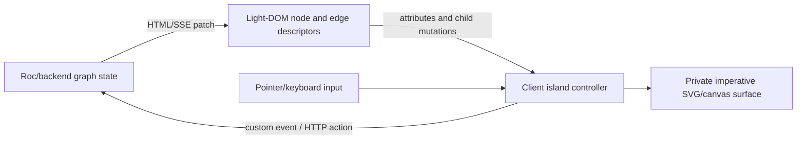

# Rocket-style client components inside Rocci

**Investigation date:** 2026-08-14
**Status:** Historical architecture report. All proposed syntax is illustrative.
**Current research:** `knowledge/research/rocci/datastar-rocket.md` (2026-08-28 restatement). Plan blockers: `knowledge/research/rocci/client-behavior-islands.md`.
**Do not treat as current:** `flowCanvas = island` / `component |{…}|` sketches, `crates/rocci-http`, “no in-repo client JS”, compile-has-no-CSS, or site `script-src 'none'`. Snake now ships `examples/rocci/custom/snake/assets/snake-input.js` (document-level, not a custom element).
**Primary references:** [Datastar Rocket reference](https://data-star.dev/reference/rocket), [Rocket Flow example](https://data-star.dev/examples/rocket_flow), and [Datastar Pro licensing](https://data-star.dev/pro).

## Executive summary

Rocci can support the useful part of Datastar Rocket directly, but it should not turn every existing Rocci component into a browser component and it should not copy or bundle Rocket itself.

Today, a Rocci `component` is a pure server-side Roc function. It accepts Roc values, produces `Html`, and disappears after rendering. Rocket is a browser-side custom-element runtime: each element has an identity, decoded string attributes, local state, lifecycle hooks, refs, cleanup, rendering, and optional shadow DOM. They solve different problems and should remain different constructs.

The recommended design is an opt-in **Rocci island**:

- Roc and the backend remain authoritative for durable application state and HTML/SSE patches.
- An island is a native custom element used only where browser-owned behavior is necessary: canvas, drag and drop, keyboard input, maps, charts, editors, media, observers, and third-party libraries.
- A declaration produces two artifacts: a typed Roc render wrapper and a generated JavaScript custom-element module.
- The first release should be behavior-only and light-DOM-first. The server renders the host and its meaningful children; JavaScript attaches behavior, observes server changes, emits events, and owns only explicitly private DOM.
- Small browser hooks may be colocated in `.rocci`; large code such as the roughly thousand-line Flow component should stay in an explicit `*.client.js` module referenced by the declaration.
- Existing `component` syntax and semantics do not change.

This is enough to reproduce the architecture of Rocket Flow: server-rendered node and edge descriptors, an imperative SVG/canvas surface, optimistic drag feedback, custom events sent back to the server, and an authoritative server patch that reconciles the result.

There are two reasons not to integrate Datastar Rocket itself as Rocci's built-in implementation:

1. Rocket is currently beta and part of Datastar Pro. The published license forbids redistribution outside an end product, making the software available to third parties for development, adding it to an open-source project, or publishing it in a public repository. A framework/toolchain integration would need explicit written licensing terms from Star Federation. See [Datastar Pro licensing](https://data-star.dev/pro).
2. Full Rocket parity is much broader than Rocci's demonstrated need. It includes codecs, prop reflection, three DOM modes, a render/morph engine, light-DOM projection, local Datastar signal rewriting, local actions, refs, effects, structural client conditionals and loops, manifests, and several escape hatches. Reimplementing all of that before validating an island use case would create a second framework inside Rocci.

The practical path is therefore:

1. prove the model now with ordinary lowercase custom-element tags and an external module;
2. add first-class island declarations, typed prop serialization, asset generation, events, cleanup, and tooling;
3. add private templates or shadow DOM only when real components require them;
4. optionally support licensed Rocket as a bring-your-own provider, never as a redistributed Rocci dependency.

## 1. What Rocket actually provides

Rocket is not server-side component syntax. It is Datastar Pro's API over the browser custom-elements model. A definition created with `rocket(tagName, definition)` has these principal parts:

| Rocket facility | Meaning |
| --- | --- |
| `mode` | Renders into light DOM, an open shadow root, or a closed shadow root. Open shadow DOM is the default. |
| `props` | Declares observed attributes, codecs, defaults, normalization, element property accessors, and property-to-attribute reflection. |
| `setup` | Runs once for each connected instance before initial Datastar application; creates state, effects, local actions, observers, timers, host APIs, and cleanup. |
| `onFirstRender` | Runs after initial render, Datastar application, and ref collection. |
| `render` | Returns safe HTML/SVG fragments, nodes, primitives, or iterables. |
| `renderOnPropChange` | Controls or filters queued rerenders following prop changes. |
| `manifest` | Adds slot and custom-event metadata to the prop metadata inferred from codecs. |

The browser receives every custom-element attribute as a string. Rocket's codecs turn those strings into normalized `string`, `number`, `bool`, `date`, `json`, `js`, binary, array, object, or union values, and encode property writes back to attributes. The authoritative details and codec table are in the [Rocket reference](https://data-star.dev/reference/rocket#props-and-codecs).

Rocket also gives each instance a local Datastar signal namespace. An authored expression such as `$$count` is rewritten under `$._rocket.<component>.<instance>`, using a normalized host ID or a generated instance ID. Local actions and refs are similarly instance-scoped. This avoids collisions but makes Rocket more than a thin `customElements.define` helper. See [Rocket scope rewriting](https://data-star.dev/reference/rocket#rocket-scope-rewriting).

Its render path parses the tagged template, composes DOM nodes safely, rewrites local scopes, morphs the mounted subtree, and applies Datastar behavior. In light DOM, Rocket implements its own `<slot>` projection because native slotting only operates in shadow DOM. It also supplies client-side structural `<template data-if>` and `<template data-for>` behavior. See [Rendering and Scoping](https://data-star.dev/reference/rocket#rendering-and-scoping).

These facilities are coherent for a general web-component library. They are not all prerequisites for Rocci to support a graph editor, canvas, or keyboard adapter.

## 2. What Rocket Flow demonstrates

Rocket Flow is a particularly useful example because it does not move authority into the browser. The documentation describes the server as the graph source of truth; each client subscribes to an update endpoint, local dragging shows an optimistic position, and the server broadcasts snapped authoritative coordinates. See the [Rocket Flow explanation](https://data-star.dev/examples/rocket_flow#explanation).

The example defines three browser elements:

- `flow-container` owns the live SVG surface, pan/zoom state, node dragging, edge drawing and selection, resize handling, and reconciliation.
- `flow-node` is a hidden light-DOM descriptor. It decodes coordinates and dimensions, observes its authored content, and emits register/update/remove events to the container.
- `flow-edge` is another descriptor which emits register/update/remove events.

The container does not treat the light-DOM children as the displayed graph. It watches them as server-morphable descriptors, clones node content into SVG, and maintains the imperative visual surface separately. Browser interactions dispatch bubbling, composed custom events. On drag completion it writes the optimistic coordinates back to the node attributes and emits an update request. A changed server timestamp clears pending state.

That split is the important design lesson:



It is a client island, not a client-owned application. Rocci should model that boundary directly.

## 3. Rocci's current fit and gaps

### 3.1 What already works

Rocci already has most of the server half:

- [`crates/rocci-template/src/parser.rs`](../../crates/rocci-template/src/parser.rs) recognizes lowercase tags as HTML elements. A tag such as `<flow-container>` therefore lowers today without any grammar change.
- Attribute names already accept hyphens, colons, underscores, and dots. Datastar attributes and custom-event handlers such as `data-on:flow-node-drag-end` are representable.
- [`crates/rocci-template/src/lower.rs`](../../crates/rocci-template/src/lower.rs) lowers server components to ordinary `Html.element` calls and keeps Roc expressions on the server.
- Datastar patches and long-lived SSE already exist in the counter and Snake examples.
- [`crates/rocci-http/src/assets.rs`](../../crates/rocci-http/src/assets.rs) serves `.js` and `.mjs` assets, and Rocci's default CSP permits self-hosted module scripts. Datastar already requires `unsafe-eval` for its expressions, so an external self-hosted island module does not introduce a new script origin.

A no-syntax prototype can therefore be built immediately:

```rocci
flowView = component |{ graph }| {
    <rocci-flow
        id="main-flow"
        grid="32"
        server-revision={graph.revisionStr}
        data-on:flow-node-commit="@post('/api/flow/node')"
    >
        @for node in graph.nodes {
            <rocci-flow-node
                id={node.id}
                x={node.xStr}
                y={node.yStr}
                label={node.label}
            >
                <span>{node.label}</span>
            </rocci-flow-node>
        }
        @for edge in graph.edges {
            <rocci-flow-edge
                id={edge.id}
                source={edge.source}
                target={edge.target}
            />
        }
    </rocci-flow>
}
```

An ordinary `/assets/flow.client.js` can define those elements with the native custom-elements API. This spike would test the server/morph/browser ownership contract before changing the compiler.

### 3.2 What is missing

Rocci has no client artifact model today:

- The AST has only opaque Roc and server `Component` module items.
- Compilation returns generated Roc, source-map segments, diagnostics, and component metadata, but no JavaScript, CSS, or manifest artifacts.
- The CLI scans only top-level `.rocci` files and writes adjacent `.roc` files. It has no client module graph, bundle entry, content hashes, or automatic script inclusion.
- The LSP exposes Roc embedded ranges but has no JavaScript regions or island prop/event completions.
- Uppercase tags always mean calls to Roc render functions. There is no generated typed Roc wrapper for a browser custom element.
- The bundled [`assets/datastar.js`](../../examples/datastar/assets/datastar.js) is Datastar 1.0.2 and contains no Rocket definition. It is the free runtime, not a Datastar Pro bundle.

These gaps are mostly build and language-boundary work. They do not require changes to `rocci-core`, `rocci-http`, or `rocci-wry` beyond serving generated assets and including them in packages.

## 4. Recommended programming model

Rocci should use three explicit terms:

1. A **server component** is today's `component`: a pure Roc function from props to transient `Html`.
2. An **island host** is a server-rendered custom element with typed attribute serialization and optional server-rendered children.
3. An **island controller** is browser JavaScript attached to that host. It owns ephemeral browser behavior and explicitly private DOM, not durable domain state.

The distinction keeps the default path simple. A label, card, page, table row, or patch boundary remains a server component. Only a chart, editor, flow canvas, map, media controller, or similar browser surface becomes an island.

### 4.1 Illustrative declaration

The following syntax shows the intended semantics, not a final grammar:

```rocci
flowCanvas = island "rocci-flow" {
    mode = Light

    props {
        grid = Number(min: 1, default: 32)
        serverRevision = Number(default: 0)
        viewport = Json(default: [0, 0, 1])
    }

    events {
        nodeCommit { bubbles: Bool.true, composed: Bool.true }
        edgeDelete { bubbles: Bool.true, composed: Bool.true }
    }

    controller = client_module("./Flow.client.js")
}
```

This declaration would generate:

- a Roc function named `flowCanvas`, so `<FlowCanvas ...>...</FlowCanvas>` remains an ordinary typed server-component call after lowering;
- a custom tag name, here `<rocci-flow>`;
- canonical prop encoders and HTML attribute names (`serverRevision` to `server-revision`);
- a browser registration module which imports `Flow.client.js` and defines the custom element;
- component metadata for LSP completion, documentation, tests, and an optional manifest.

Usage stays in the server template:

```rocci
graphView = component |{ graph }| {
    <FlowCanvas
        id="main-flow"
        grid={32}
        serverRevision={graph.revision}
        viewport={graph.viewport}
        ds:on:node-commit={Ds.post("/api/flow/node")}
        ds:on:edge-delete={Ds.post("/api/flow/edge/delete")}
    >
        @for node in graph.nodes {
            <FlowNode node={node} />
        }
        @for edge in graph.edges {
            <FlowEdge edge={edge} />
        }
    </FlowCanvas>
}
```

The `ds:*` attributes shown above align with the typed Datastar attribute proposal in [`SNAKE_DATASTAR_ARCHITECTURE_REPORT.md`](SNAKE_DATASTAR_ARCHITECTURE_REPORT.md). They are complementary, not required for islands; ordinary `data-on:*` attributes remain valid.

### 4.2 Inline browser behavior

Small controllers could be colocated:

```rocci
copyButton = island "rocci-copy-button" {
    mode = Light
    props {
        text = String(default: "")
    }

    connect = client """
        const button = host.querySelector('button')
        const onClick = () => navigator.clipboard.writeText(props.text)
        button?.addEventListener('click', onClick)
        cleanup(() => button?.removeEventListener('click', onClick))
    """
}
```

The `client """..."""` region is deliberately JavaScript, not Roc. The compiler should preserve it as an embedded-language region and never imply Roc type safety within it. A raw string/fenced region is preferable to a balanced-brace scanner because JavaScript template strings, regex literals, comments, and nested braces otherwise require a real JavaScript lexer.

Large controllers should use `client_module`. Rocket Flow's component code is far too large to improve by placing it inside a `.rocci` file. “Directly inside Rocci” should mean that the public contract, generated wrapper, use site, build dependency, and diagnostics are first-class—not that every line of imperative browser code must be in one file.

### 4.3 Prop and event contract

Island props should be narrower than arbitrary Roc values:

| Declared prop | Roc input | HTML representation | Browser value |
| --- | --- | --- | --- |
| `String` | `Str` | escaped attribute text | string |
| `Number` | numeric type accepted by encoder | canonical decimal text | finite number with optional clamp/step |
| `Bool` | `Bool` | explicit `"true"` / `"false"` initially | boolean |
| `Json` | JSON-encodable Roc value | canonical JSON text | parsed value |
| `DateTime` | timestamp type/string | RFC 3339 text | `Date` or retained string |
| `OneOf` | tag/string mapping | stable literal | constrained string |

Avoid Rocket's `js` codec in the first version. Executing JavaScript-like values from server-authored attributes widens the security and debugging surface. Avoid binary props until there is a demonstrated need.

Large or frequently changing collections should normally be server-rendered child descriptors rather than one enormous JSON attribute. Datastar can then morph individual keyed children and the island can observe local mutations. That is exactly the useful pattern in Rocket Flow.

Events should have declared names and optional metadata. The client controller emits `CustomEvent`; the generated helper should default to `{ bubbles: true, composed: true }`, so a `data-on:<event>` handler on the host can see the event. Event payloads are browser data and must be validated again by the backend. For mutation commands, use stable IDs and a client sequence or server revision when ordering matters.

### 4.4 Ownership rule

Every DOM node must have one owner:

- **Server-owned:** island host attributes and server-rendered descriptor children. Datastar may morph these.
- **Island-owned:** canvas pixels, a shadow tree, or an explicitly ignored/preserved private subtree.
- **Shared only through a contract:** attributes, observed child descriptors, and custom events.

Do not let both Datastar's server morph and an island render loop rewrite the same light-DOM subtree. That creates lost event handlers, duplicate work, stale refs, and reconciliation races.

The initial runtime should require a stable custom-element tag and stable `id` across patches. If the host is removed or replaced, cleanup runs and ephemeral state is intentionally lost. If the host survives and only attributes/children change, the controller observes and reconciles them.

For Flow, use a monotonically increasing `server-revision` instead of a wall-clock `server-update-time`. Revisions make stale-response detection and optimistic reconciliation deterministic.

## 5. Runtime design

### 5.1 Minimal built-in runtime

The first `rocci-islands.js` can be small and independent of Rocket. It needs:

- `customElements.define` registration with duplicate-definition protection;
- declared observed attributes and codecs;
- normalized immutable prop snapshots plus a `changes` record;
- `connect`, prop-change, and disconnect hooks;
- a cleanup registry;
- host access and an event-emission helper;
- optional query/ref helpers over server-rendered light DOM;
- useful development errors containing component, instance, prop, and hook names.

It does not initially need:

- a client render/morph engine;
- shadow DOM;
- local Datastar `$$` scope rewriting;
- local action registration;
- client-side conditionals or loops;
- light-DOM slot projection;
- reflected JavaScript property setters;
- custom codecs or manifest publication over HTTP.

Those omissions are intentional. A behavior island with server-rendered markup already covers Flow, charts, maps, canvas, keyboard/gamepad input, resize/intersection observers, and many third-party widgets.

### 5.2 Templates and shadow DOM later

Private client templates are justified when a component must render before any server round trip, encapsulate internal styles, or use native slots. A later island form could add a static `view { ... }` block using Rocci's existing HTML parser. It should initially forbid Roc interpolation because the template runs in the browser. Dynamic behavior can use Datastar attributes or the controller.

Shadow DOM introduces an integration requirement: Datastar's document-level mutation observer does not automatically initialize attributes inside a shadow root. The island runtime therefore needs a supported Datastar `apply(root)` integration before shadow templates containing Datastar behavior are enabled. Rocket already provides this; Rocci's free 1.0.2 bundle does not expose a Rocci-owned compatibility contract for it. Light-DOM behavior islands avoid this issue in the MVP.

If later requirements converge on most of Rocket—especially local signal rewriting, render/morph, light-DOM projection, and structural rendering—Rocci should reconsider a licensed provider rather than grow a subtly incompatible clone.

### 5.3 Optional Rocket provider

An adapter could let a licensed application select Rocket as its island engine:

```toml
[client.islands]
provider = "datastar-rocket"
bundle = "vendor/datastar-pro.js"
```

Rocci must not download, cache globally, embed, publish, or redistribute that bundle. The application developer supplies it under their own license. Even this model should be reviewed with Star Federation because Rocci is a developer tool and the published terms distinguish end products from software that enables third parties to build. Written permission is safer than relying on an interpretation of the website FAQ.

The provider boundary should be semantic, not a promise that every Rocket API is portable. A Rocci island contract can map props, lifecycle, cleanup, host, refs, and events. Rocket-specific local actions, scope rewriting, custom codecs, or render helpers should require an explicit provider escape hatch.

## 6. Compiler and tooling changes

### 6.1 AST and parser

Add a distinct top-level module item rather than overloading `ComponentDecl`:

```text
ModuleItem = Roc | Component | Island

IslandDecl =
    rocName
    tagName
    mode
    props[]
    events[]
    controller: InlineClient | ClientModule
    optionalStaticView
    span
```

Validation should enforce:

- a custom-element tag contains a hyphen and uses lowercase ASCII;
- tag names and generated Roc names are unique across the build graph;
- codec/default combinations are valid;
- serialized HTML attribute names do not collide;
- event names are valid and do not collide after normalization;
- client module paths stay inside configured source roots;
- an island does not claim server-owned and island-owned light DOM simultaneously.

### 6.2 Lowering and artifacts

Change compilation from one primary output to an artifact set:

```text
CompileOutput {
    roc
    sourceMap
    diagnostics
    components
    islands
    assets[]   # JS modules, optional CSS, manifest fragments
}
```

For each island, Roc lowering should generate a normal render wrapper. This is the key to keeping call sites typed. The wrapper uses a small Roc `IslandProp` package to serialize declared values safely and then calls `Html.element` with the custom tag.

Client lowering generates one ES module per source module plus a deterministic application entry module. Production files should be content-hashed; development URLs may remain stable and use no-store responses, which Rocci already sets.

### 6.3 CLI and packaging

The current CLI writes only adjacent `.roc` files. Island support requires the build layer to:

1. discover `.rocci` modules through the Roc application/import graph or an explicit source list, not only one directory;
2. write generated client modules into a build directory rather than beside source files;
3. resolve and copy referenced `*.client.js` modules;
4. generate one client entry module;
5. make that entry available to the backend asset server and desktop bundle;
6. provide an explicit or generated `<script type="module">` inclusion point;
7. watch client dependencies and reload or reconnect in development;
8. print the generated contract through `rocci inspect`.

Automatic script injection into arbitrary component output is undesirable. Prefer an explicit `<RocciClient />` server component or a page-shell helper which lowers to the one generated module script. It keeps CSP, load order, and full-document ownership visible.

### 6.4 LSP

The LSP should add:

- island declarations and custom tags to symbols, completion, hover, and go-to-definition;
- prop and event completion on generated island component tags;
- diagnostics for prop names, missing required props, invalid tag names, and codec/default errors;
- `javascript` embedded ranges for inline `client` blocks;
- go-to-definition from `client_module` to the external file;
- manifest-based completion for literal lowercase custom-element tags;
- source-map routing from generated wrapper/module diagnostics back to `.rocci`.

Roc type checking remains responsible for the generated wrapper call. JavaScript checking should come from a JavaScript/TypeScript language service, not a home-grown partial checker.

## 7. Morphing, lifecycle, and failure cases

These are the acceptance rules that matter more than surface syntax:

1. **Stable host identity.** A patch retaining the same tag and ID must retain the custom-element instance and its private ephemeral state.
2. **Attribute batching.** Several attributes changed by one morph should produce one controller notification in a microtask, similar to Rocket's queued rerender behavior.
3. **Descriptor observation.** Added, removed, reordered, or changed child descriptors must update the private surface exactly once.
4. **Cleanup.** Removing a host must cancel observers, timers, animation frames, pointer capture listeners, subscriptions, and third-party instances.
5. **Reconnect.** A disconnected then reconnected host must not duplicate listeners or reuse invalid refs.
6. **Pending reconciliation.** Optimistic UI is cleared only by a matching/newer authoritative revision, not merely any patch.
7. **Multiple instances.** IDs, refs, local controller state, events, and private DOM must not collide.
8. **Failed decode.** Invalid server attributes normalize to declared defaults and report a development warning rather than crashing the entire page.
9. **No-JavaScript baseline.** When reasonable, server-rendered children still expose meaningful content or a fallback. Canvas-heavy islands should provide an explicit fallback message.
10. **Untrusted payloads.** No attribute or event payload becomes executable code; all server commands are authenticated and validated exactly like ordinary Datastar requests.

Rocci should add browser integration tests for these cases. Rust unit tests are sufficient for parsing, lowering, normalization, artifact naming, and source maps, but not for custom-element upgrade, DOM morph behavior, focus, pointer events, shadow DOM, or cleanup.

## 8. Options considered

| Option | Advantages | Problems | Recommendation |
| --- | --- | --- | --- |
| External native custom elements, no syntax | Works immediately; no compiler/runtime coupling; validates the architecture | String props, manual assets, no generated typing or tooling | **Build the first Flow spike this way** |
| Rocci-native behavior islands | Preserves server ownership; small runtime; typed Roc wrapper; first-class assets and tooling | Requires compiler/build/LSP work; intentionally less capable than Rocket | **Recommended product direction** |
| Bundle Datastar Rocket | Mature coherent API; closest to referenced example; avoids reimplementation | Pro licensing conflicts with redistribution/open source; beta dependency; larger semantic surface | **Do not bundle** |
| Bring-your-own licensed Rocket provider | Lets licensed applications opt into full Rocket | License interpretation and version coupling; provider-specific semantics | Consider only after written licensing clarity |
| Full Rocket-compatible clone | No commercial runtime dependency; exact conceptual target | Rebuilds a substantial client framework and risks incompatibility | Reject unless multiple production cases demand parity |
| Compile arbitrary Roc to JavaScript | One apparent language across server and client | New compiler/runtime/effect model, split ownership, hard debugging and packaging | Reject |

## 9. Staged implementation plan

### Stage 0: Flow-shaped spike, no language changes

Estimated effort: several days.

- Implement a small native `rocci-flow` element in `examples/roc-flow/Flow.client.js`.
- Render node/edge descriptors from an ordinary `.rocci` server component.
- Send drag-end as a bubbling custom event handled by a Datastar `data-on` expression or a direct authenticated request.
- Broadcast the authoritative graph as an SSE element patch with a monotonic revision.
- Verify host preservation, attribute/child mutations, cleanup, two windows, and reconnect behavior.

This stage answers the highest-risk question: whether Datastar's morphing and the chosen webview preserve the intended custom-element ownership boundary.

### Stage 1: First-class external-module islands

Estimated effort: roughly two to four engineer-weeks, depending on Roc package and build integration.

- Add `IslandDecl`, prop/event schemas, validation, and metadata.
- Generate typed Roc wrappers and a client registration entry.
- Support only `Light` behavior islands and `client_module`.
- Add canonical String/Number/Bool/Json/OneOf codecs.
- Add cleanup, batched prop observation, event helpers, and development diagnostics.
- Include generated modules in serving and packaging.
- Add parser/lowering tests and browser lifecycle/morph tests.

### Stage 2: Colocation and editor support

Estimated effort: roughly two to four additional engineer-weeks.

- Add fenced inline `client` regions.
- Add embedded JavaScript ranges and external-module navigation.
- Add island prop/event completions and diagnostics.
- Generate inspectable island manifests.
- Add development rebuild/reload behavior for controller modules.

### Stage 3: Private views, shadow DOM, and Datastar integration

No schedule should be committed before real usage.

- Add optional static private `view` blocks.
- Establish a versioned Datastar `apply(root)` adapter.
- Add open shadow DOM and native slots.
- Consider reactive local state and scoped expressions only after measuring demand.
- Evaluate a licensed Rocket provider if the requested feature set is converging on Rocket proper.

## 10. Decision

Adopt **Rocci-native behavior islands** as the design target, while keeping ordinary Rocci components purely server-side.

The first implementation should be a Flow-shaped example using plain custom elements and no new syntax. If that proves the morph/lifecycle boundary, add an `island` declaration which generates a typed Roc host wrapper plus a JavaScript registration module. Keep complex behavior in explicit `*.client.js` files; add inline fenced client blocks only for small controllers.

Do not bundle or copy Datastar Rocket into Rocci. Its current Pro license is incompatible with an open-source or redistributable framework integration without separate permission, and its full runtime surface is larger than Rocci needs to solve the demonstrated problem. An optional bring-your-own provider can be revisited after both licensing and the Rocci island contract are stable.

The durable architectural rule is simple: **Roc owns application truth and server-rendered descriptors; an island owns latency-sensitive browser behavior and a private visual surface; attributes, observed children, custom events, HTTP, and SSE connect the two.**
