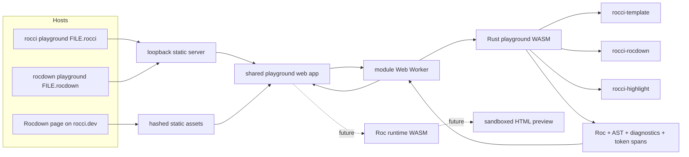

# Rocci and Rocdown client-side playground implementation plan

> [!NOTE]
> **Product-Boundary Rebase:** This plan is aligned with the completed Rocdown product-boundary refactor ([`knowledge/decisions/consolidate-rocdown-product-boundary.md`](../../knowledge/decisions/consolidate-rocdown-product-boundary.md) and [`knowledge/audits/rocdown-boundary-refactor-review.md`](../../knowledge/audits/rocdown-boundary-refactor-review.md)). Crate identities, CLI command ownership (`rocci` vs `rocdown`), desktop window hosting (`rocci-desktop`), static site generation and themes (`rocci-rocdown`), shared UI primitives (`rocci-ui`), and workspace dependency constraints (`tools/rocci-ops/src/rocci_ops/workspace_deps.py`) reflect the current post-split architecture.

**Status:** in progress — Phase 0 complete; desktop `--mode local` HTML snapshots are implemented

**Date:** 2026-08-18

**First delivery target:** `rocci playground Foo.rocci` or `rocdown playground Guide.rocdown` opens the shared
playground in a desktop window. Default `--mode wasm` performs parsing, lowering, AST formatting, and
syntax highlighting in browser-loaded WebAssembly. `--mode local` compiles on the loopback host and can
snapshot component HTML through native `roc` (`Html.render` of the first fixture or a defaultable component).
The public site remains WASM-only; it cannot dynamically `roc build`.

## 1. Executive recommendation

Build one reusable playground application with three hosts:

1. a Rust/WASM compiler package that exposes the existing `.rocci` and
   `.rocdown` parsers, lowerers, AST formatters, diagnostics, and highlighting;
2. a browser UI with an editable source pane and a read-only output pane;
3. thin host adapters for the local `rocci playground` (for `.rocci`) and
   `rocdown playground` (for `.rocdown`) commands and the static `rocci.dev`
   documentation site.

The output selector has exactly these user-visible choices:

- `roc` — generated Roc from the Rust/WASM lowerer;
- `AST` — the existing LISPy `format_ast` representation;
- `html` — WASM mode shows an honest unavailable-state panel because the browser cannot dynamically compile generated Roc. Desktop `--mode local` snapshots `Html.render` output for a fixture or defaultable component.

Default `--mode wasm` must not compile on the native side and send results into
the webview. The CLI may read the initial file, package a virtual workspace, and
serve assets, but an edit must travel from the editor to a Web Worker and then
to Rust/WASM. That keeps local webview behavior identical to the public site.
Desktop `--mode local` is the exception: edits `POST` to `/api/compile` on the
loopback host, and successful `.rocci` compiles can include a static
`Html.render` snapshot.

Use a loopback HTTP origin for the local host rather than `file://` or a
webview-only IPC compiler. It gives WASM, module workers, MIME types, CSP, caching,
and browser-based testing the same shape as production.

## 2. Product contract

### 2.1 Local commands

```text
rocci playground Foo.rocci
rocdown playground Guide.rocdown
```

The command behavior mirrors the product boundary:

1. `rocci playground` validates that the input is a readable `.rocci` file (and
   provides a friendly diagnostic hint if given `.rocdown` or `.md`);
   `rocdown playground` validates that the input is a readable `.rocdown`,
   `.md`, or `.markdown` file;
2. reads the target file as the initial in-memory document without modifying it;
3. starts a loopback-only server on an allocated free port;
4. serves the playground shell, module worker, JS/CSS, WASM, and bootstrap
   document data with correct MIME types and CSP headers;
5. opens the URL with the existing `rocci-desktop` preview window;
6. stops the server when the window closes.

Add `--no-window` and `--port` through the existing `ServeOptions` / `PortArg`
shape so the same command is testable in an ordinary browser. Editing is
in-memory in the first release: no autosave, file watcher, or filesystem write
is implied.

### 2.2 Browser layout

The playground is a two-pane workbench:

```text
+----------------------------------+----------------------------------+
| Counter.rocci                    | Output                 [roc  v]  |
|                                  |                                  |
| editable, highlighted source     | highlighted generated Roc        |
| inline diagnostic ranges         | or AST / HTML availability card  |
|                                  |                                  |
+----------------------------------+----------------------------------+
| status: WASM ready · 0 errors · compile time                         |
+---------------------------------------------------------------------+
```

- Desktop: resizable left/right panes, initially 50/50.
- Narrow viewport: source above output, with independent scroll regions.
- The source pane is a real code editor, not a highlighted `<pre>` or a
  textarea overlaid on colored HTML.
- The output pane is selectable and copyable but read-only.
- Diagnostics appear as editor marks and in a keyboard-navigable summary.
- Compiles are debounced; stale worker responses never replace newer output.
- The selected output mode and divider position survive source edits.
- A site instance can provide multiple example documents, allowing file tabs
  such as `Counter.rocci` and `Guide.rocdown` without changing the compiler API.

### 2.3 Output behavior

`roc` and `AST` are produced from the same parse/compile request. Switching
between them must not recompile.

The `html` choice remains selectable. For the initial release it renders:

> HTML preview is not available yet. Rocci can parse and lower this file in
> Rust/WASM, but rendering the generated Roc also requires a Roc runtime in
> WebAssembly.

Represent this as a capability in the compile response rather than hard-code
it only in the view. A future Roc runtime module can turn the capability on
without changing the dropdown or Rust compiler contract.

When source has errors, show diagnostics for the current revision and any
best-effort current Roc/AST produced by the compiler. Never silently retain an
older successful output under a newer broken source. If the worker itself
fails, clear the output and identify the failed revision.

## 3. Goals and non-goals

### Goals

- Live `.rocci` and `.rocdown` editing in `rocci-desktop` and on `rocci.dev`.
- Parser/lowerer parity with native library entry points.
- Generated Roc, formatted AST, structured diagnostics, and syntax tokens
  from Rust/WASM.
- The same web bundle and bootstrap contract in local and site hosts.
- Self-hosted, content-addressed assets with no runtime CDN dependency.
- A responsive, keyboard-usable, screen-reader-labelled interface.
- Graceful initialization, compile-error, worker-crash, and unsupported-HTML
  states.
- An explicit seam for a future Roc-in-WASM HTML renderer.

### Non-goals for the first delivery

- Running or type-checking generated Roc.
- Native-side compilation through desktop IPC.
- Editing multiple arbitrary workspace files at once.
- Saving changes back to the input file.
- Server actions, network access, Datastar execution, or native capabilities.
- A general browser IDE, LSP client, formatter, or debugger.
- Replacing `rocci-highlight`, `rocci-template`, or `rocci-rocdown` with a
  JavaScript parser.

## 4. Repository baseline and constraints

The plan relies on shipped code, not on older exploratory reports:

- [`rocci-template`](crates/rocci-template) already exposes pure `parse`,
  `lower`, `compile`, and `format_ast` entry points. It does not invoke Roc or
  start a server.
- [`rocci-rocdown`](crates/rocci-rocdown) exposes the equivalent single-file
  compile and AST APIs. Filesystem-dependent link, include, asset, and local
  theme work is controlled separately and must not leak into the browser
  compile path.
- [`rocci-highlight`](crates/rocci-highlight) owns canonical, sorted,
  non-overlapping token spans for Roc, CSS, HTML, Rocci, and Rocdown. Its
  Tree-sitter grammars are currently compiled from C by `build.rs`, so browser
  target compatibility is a Phase 0 gate rather than an assumption.
- `comrak` currently uses default features, which pull CLI and native Syntect/
  Oniguruma dependencies that are inappropriate for a browser WASM package.
- [`rocci-desktop`](crates/rocci-desktop) (renamed from `rocci-wry`) already
  opens a URL in a preview window and supports lifecycle, navigation, reload,
  and developer tools. The MVP uses this URL boundary without adding a compiler
  IPC protocol.
- [`rocci-ui`](crates/rocci-ui) provides domain-neutral shared view records
  (`PageView`, `SiteView`, `NavConfig`, `ResourceView`) and string escaping.
- [`rocci-rocdown`](crates/rocci-rocdown) already hashes static assets and owns
  final page resources and CSP. Its default production CSP intentionally has
  `script-src 'none'`, so an interactive playground needs typed, page-scoped
  resource planning rather than a global relaxation.
- The first-party Rocdown theme (`templates/RocdownTheme.rocci`) already defines
  syntax-token colors. Reuse those token roles so static code blocks and the
  editor look related.

Canonical architecture consulted for this proposal:

- [`knowledge/architecture/system-overview.md`](../../knowledge/architecture/system-overview.md)
- [`knowledge/architecture/language-tooling.md`](../../knowledge/architecture/language-tooling.md)
- [`knowledge/architecture/rocdown-format.md`](../../knowledge/architecture/rocdown-format.md)
- [`knowledge/architecture/rocdown-documentation-compiler.md`](../../knowledge/architecture/rocdown-documentation-compiler.md)
- [`knowledge/decisions/consolidate-rocdown-product-boundary.md`](../../knowledge/decisions/consolidate-rocdown-product-boundary.md)
- [`knowledge/status/known-limitations.md`](../../knowledge/status/known-limitations.md)

## 5. Architecture



### 5.1 Ownership

| Concern | Owner | Rule |
| --- | --- | --- |
| Rocci grammar and lowering | `rocci-template` | WASM adapter calls the same public compiler API as native callers |
| Rocdown grammar and lowering | `rocci-rocdown` | Browser options must make filesystem capabilities explicit |
| Token classification | `rocci-highlight` | One token vocabulary across LSP, Rocdown, and playground |
| Serializable playground contract | new `rocci-playground` crate | Target-neutral Rust; no desktop, HTTP, or DOM types |
| WASM exports | new `rocci-playground-wasm` crate | Thin `wasm-bindgen` adapter only |
| Editor and worker | new `playground/` web package | CodeMirror UI, scheduling, decorations, state |
| Local CLI hosting (`.rocci`) | `rocci-cli` | Read input, serve bundle, open desktop window, shut down |
| Local CLI hosting (`.rocdown`) | `rocci-rocdown-cli` | Read input, serve bundle, open desktop window, shut down |
| Reusable loopback server | `rocci-cli` / `rocci-core` | Shared static loopback host consumed by both CLIs |
| Window | `rocci-desktop::preview` | URL host; no compilation IPC |
| Site catalog/assets/CSP | `rocci-rocdown` | Detect playground nodes, fingerprint resources, keep default pages script-free |
| Site markup/chrome | `RocdownTheme.rocci` and `DocsComponents.rocci` | Render mount point and resource tags from typed data |
| Shared UI view records | `rocci-ui` | Shared neutral page and resource view structures where applicable |
| Future HTML execution | separate Roc runtime WASM adapter | Never folded into the Rust parser/lowerer module |

### 5.2 Proposed layout

```text
crates/
├── rocci-playground/              # target-neutral request/response facade
│   ├── src/lib.rs
│   └── tests/parity.rs
├── rocci-playground-wasm/         # cdylib + wasm-bindgen exports
│   ├── src/lib.rs
│   └── tests/web.rs
├── rocci-cli/src/playground.rs    # loopback host and `rocci playground` CLI command
├── rocci-rocdown-cli/             # `rocdown playground` CLI command
└── rocci-rocdown/                 # typed playground node/resources in catalog/theme

playground/
├── package.json
├── src/app.ts
├── src/compiler-worker.ts
├── src/editor.ts
├── src/protocol.ts
├── src/styles.css
├── tests/
└── dist/                          # derived; never hand-edited

docs/
└── playground.rocdown             # or an embedded home-page section

tools/rocci-ops/
└── src/rocci_ops/workspace_deps.py  # package classification; `uv run rocci-ops build-playground` for the WASM/web bundle
```

Do not check `playground/dist` in as the source of truth unless packaging
constraints later require release artifacts. Rust, TypeScript, CSS, example
manifest, and lockfiles are authoritative.

Classify `rocci-playground` and `rocci-playground-wasm` in
`tools/rocci-ops/src/rocci_ops/workspace_deps.py` under the appropriate class so CI dependency
checks enforce one-way layering: base Rocci packages (`rocci-core`,
`rocci-template`, `rocci-cli`, etc.) have zero dependencies on Rocdown packages.
Because `rocci-playground` compiles both `.rocci` and `.rocdown`, it is classified
in the `rocdown` or specialized playground tier, and base `rocci-cli` interacts
with it only through static assets served over HTTP at runtime.

## 6. Core contracts

### 6.1 Compile request

Use a versioned JSON-shaped contract across JS and WASM even if the first
binding passes a `JsValue`:

```text
CompileRequest {
    protocol_version: 1,
    revision: u64,
    filename: String,
    language: "rocci" | "rocdown",
    source: String,
    workspace: optional VirtualWorkspace,
}
```

The host determines language from a validated extension. Do not guess from
source contents after edits.

### 6.2 Compile response

```text
CompileResponse {
    protocol_version: 1,
    revision: u64,
    language: "rocci" | "rocdown",
    roc: String,
    ast: String,
    diagnostics: Diagnostic[],
    highlights: {
        source: HighlightSpan[],
        roc: HighlightSpan[],
        ast: HighlightSpan[],
    },
    capabilities: {
        roc: { available: true },
        ast: { available: true },
        html: { available: false, reason: String },
    },
}
```

The initial AST contract is the existing S-expression returned by
`format_ast`, not a newly serialized internal Rust AST. That avoids exposing
every private AST shape as a browser compatibility promise.

Diagnostics contain severity, message, and both byte and UTF-16 offsets.
CodeMirror positions are JavaScript UTF-16 code-unit offsets; conversion
belongs at the WASM boundary and requires non-BMP regression tests. Highlight
spans carry UTF-16 `from`/`to`, token kind, and modifier bits. Every response
must satisfy `0 <= from <= to <= document.length` in its coordinate system.

### 6.3 Browser-safe Rocdown options

Introduce an explicit browser profile in `rocci-rocdown` rather than relying
on defaults:

- raw HTML disabled;
- built-in theme only;
- no environment or home-directory theme discovery;
- no direct filesystem reads;
- no implicit network;
- link resolution from supplied `PageRef` data only;
- includes and asset existence checks from `VirtualWorkspace` only;
- deterministic output for identical request bytes.

For the first self-contained example milestone, `VirtualWorkspace` may be
empty and filesystem-dependent features must return precise capability
diagnostics. Before declaring the arbitrary local-file command stable, add a
read-only virtual workspace assembled by the CLI so sibling links and includes
can work without granting the WASM module native filesystem access.

### 6.4 Bootstrap contract

Both hosts produce the same configuration:

```text
PlaygroundBootstrap {
    protocol_version: 1,
    documents: [{ id, filename, language, source }],
    selected_document: String,
    compiler_wasm_url: String,
    worker_url: String,
    mode: "wasm" | "local",
    compile_url: String, // "/api/compile" in local mode, empty in wasm
    html_runtime: { available: bool, reason: String },
}
```

The local host serves this as session JSON. `rocci-rocdown` emits a hashed
manifest URL and a semantic mount element. Keep source out of executable inline
scripts; serve JSON or escaped text and retain a CSP without `unsafe-inline`.

## 7. Web application decisions

Use CodeMirror 6 as the editor substrate. It provides a real accessible edit
surface, selections, history, line numbers, decorations, lint ranges, and a
read-only output view without committing the project to a full IDE.

The compiler/highlighter runs in a module Web Worker:

- load and initialize WASM once;
- debounce edits around 120 ms, configurable in tests;
- attach a monotonically increasing revision;
- drop responses older than the newest submitted revision;
- terminate and recreate the worker after a fatal error or timeout;
- keep dropdown changes local because all three mode results/capabilities are
  returned by one compile;
- measure latency in JS, outside the deterministic Rust response.

Convert `HighlightSpan` values into CodeMirror decorations. Source uses the
Rocci/Rocdown language token stream; `roc` uses Roc tokens; AST can start with
a small S-expression highlighter but must retain the same `tok-*` CSS roles.
Do not render tokenized strings with `innerHTML` in the editor. For static
fallback HTML, escape source first and insert only known span tags.

## 8. Phased implementation

Each phase is intended to be independently reviewable. A capable coding model
should finish the exit gate, update the plan/status, and run the named checks
before starting the next phase.

### Phase 0 — WASM feasibility and dependency gate [Complete]

- [x] Add the browser target (`wasm32-unknown-unknown`) and a minimal, non-published spike crate (`crates/rocci-playground-spike`).
- [x] Compile `rocci-template` for `wasm32-unknown-unknown`.
- [x] Change `comrak` to `default-features = false` in `rocci-rocdown` and `okf`; run the complete Rocdown and OKF test suites to prove behavior.
- [x] Compile `rocci-rocdown` with a built-in theme and all filesystem operations disabled at runtime.
- [x] Attempt `rocci-highlight` on the browser target, including its C-generated Tree-sitter parsers.
- [x] Record release WASM sizes: raw release WASM **861.4 KB** (882,085 bytes), gzipped **258.9 KB** (265,065 bytes).

Highlighting decision gate outcome:

- **Selected: Option 2 (`web-tree-sitter` sidecar)**. Native C Tree-sitter parsers require C standard library headers (`<stdio.h>`) that are not present on bare `wasm32-unknown-unknown`. `rocci-highlight` and `rocci-lsp` have been target-gated so the pure Rust types (`LanguageId`, `HighlightSpan`, `HighlightKind`, `regions`) compile cleanly for WASM while C Tree-sitter remains native-only. Highlighting in the browser will be driven by `web-tree-sitter` in Phase 3, mapping to the exact canonical `HighlightSpan` schema without blocking parser/lowerer WASM delivery.

Exit gate: `test/wasm/test-phase0-wasm.mjs` verifies that compiled browser-target WASM executes in Node.js and returns valid generated Roc, formatted AST, and diagnostics for `.rocci` and `.rocdown` fixtures (`Counter.rocci`, `AllSyntax.rocci`, `Guide.rocdown`, `AllSyntax.rocdown`); all workspace tests pass 100%.

### Phase 1 — target-neutral playground facade

- Create `rocci-playground` with serde request/response types.
- Add language dispatch without duplicating CLI extension checks.
- Compile Roc and AST in one call.
- Normalize diagnostics and UTF-16 offsets.
- Add the explicit HTML unavailable capability and canonical message.
- Add browser-safe Rocdown compile options.
- Keep the crate free of `wasm-bindgen`, Wry, HTTP, Node, and DOM types.

Exit gate: native unit tests snapshot complete responses for valid, invalid,
incomplete, Unicode, Rocci, and Rocdown inputs.

### Phase 2 — WASM adapter

- Create `rocci-playground-wasm` as `cdylib`/`rlib`.
- Export initialization metadata and one compile function.
- Convert Rust failures into structured fatal errors; do not panic across the
  JS boundary.
- Add `console_error_panic_hook` only in development builds if useful.
- Produce deterministic JS glue and `.wasm` through a pinned `wasm-bindgen`
  or `wasm-pack` toolchain.
- Run `wasm-opt` in release packaging, not during every edit/test cycle.

Exit gate: a browser/Node harness proves byte-for-byte Roc/AST and field-level
diagnostic parity with the native facade on the shared fixture corpus.

### Phase 3 — highlight bridge

- Implement the Phase 0-selected highlighting path.
- Return source and generated-Roc spans in the compile response.
- Serialize token kinds using the existing `tok-*` semantic vocabulary.
- Add bounds, ordering, non-overlap, multiline, malformed-input, and Unicode
  invariants.
- Add native/WASM/Rocdown token parity fixtures for representative files.

Exit gate: browser-rendered source and generated Roc contain the same semantic
token classes as `rocci-highlight` on native Rust.

### Phase 4 — worker protocol and concurrency

- Define matching Rust and TypeScript protocol types.
- Initialize WASM inside a module worker.
- Add revision ordering, debounce, cancellation-by-obsolescence, timeout, and
  worker restart.
- Ensure an old slow response cannot replace a newer quick response.
- Report initialization and fatal errors to the UI without leaving a spinner.

Exit gate: deterministic worker tests cover out-of-order responses, rapid
typing, crash recovery, and WASM initialization failure.

### Phase 5 — editor shell

- Build the responsive two-pane layout.
- Instantiate an editable source CodeMirror view and a read-only output view.
- Apply WASM token decorations and shared Rocci syntax colors.
- Add file tabs for multi-example site bootstrap data.
- Add keyboard-accessible resizing plus a no-drag fallback.
- Preserve selection, scroll, dropdown mode, and divider position across
  compile responses.

Exit gate: a user can type in both language examples and see highlighted,
current generated Roc without any native compiler endpoint.

### Phase 6 — diagnostics and incomplete-source behavior

- Map compiler diagnostics to CodeMirror lint decorations.
- Add a compact, keyboard-navigable diagnostic list and status summary.
- Move focus/cursor to a diagnostic when activated.
- Distinguish compile diagnostics from worker/host failures.
- Define current-output behavior for invalid source; never label stale output
  as current.
- Add `aria-live` updates that announce state without speaking on every
  keystroke.

Exit gate: malformed and half-typed syntax stays editable, compilation always
terminates, and diagnostics point to correct ranges after emoji/non-BMP text.

### Phase 7 — output selector and unavailable HTML state

- Add the `roc`, `AST`, `html` selector with the exact display casing.
- Switch `roc`/`AST` locally without a new worker request.
- Render HTML capability information from the response.
- Explain the Rust-WASM versus Roc-runtime-WASM boundary in one short panel.
- Add copy-output for text modes; hide it for unavailable HTML.

Exit gate: all three choices are reachable with keyboard and pointer; `html`
never shows an empty panel or attempts native/server rendering.

### Phase 8 — reproducible web asset build

- Pin Node package manager and dependencies.
- Bundle CodeMirror and application code without runtime CDN imports.
- Produce standalone app and worker entry points; avoid arbitrary split chunks.
- Emit a machine-readable asset manifest containing app JS, worker JS, CSS,
  compiler WASM, sizes, and content digests.
- Pass worker/WASM URLs through bootstrap data so a second hashing layer does
  not break internal imports.
- Add license/notice output for web dependencies and vendored grammars.

Exit gate: a clean checkout builds the same logical manifest, all referenced
assets exist, and the bundle runs from a simple static HTTP server.

### Phase 9 — local loopback host

- Add a reusable playground server module in `rocci-cli` (or `rocci-core`),
  consumable by both `rocci-cli` and `rocci-rocdown-cli`.
- Bind only `127.0.0.1` on an allocated port.
- Serve exact MIME types for HTML, JS modules, CSS, JSON, and
  `application/wasm`.
- Add cache policy: session/bootstrap data is `no-store`; content-addressed
  code and WASM are immutable.
- Add security headers and a minimal CSP for self-hosted modules, workers, and
  WASM. Test whether each desktop engine (macOS WKWebView, Windows WebView2,
  Linux WebKitGTK) accepts `wasm-unsafe-eval`; do not add broad `unsafe-eval`
  unless a target proves it is required.
- Reject traversal, unknown methods, and unknown session IDs.
- Shut down via an atomic stop signal when the `rocci-desktop` window closes.

Exit gate: `--no-window` serves a fully functional playground that passes HTTP
route, MIME, CSP, and traversal tests.

### Phase 10 — `rocci playground` and `rocdown playground` CLI delivery

- Add `Commands::Playground` to `rocci-cli` (for `.rocci` files) and
  `rocci-rocdown-cli` (for `.rocdown` files) with flattened `ServeOptions` /
  `PortArg`.
- Validate extension (`.rocci` for `rocci`, `.rocdown`/`.md`/`.markdown` for
  `rocdown`), UTF-8, and file size before opening a window.
- Reject `.rocdown` in `rocci playground` with a friendly hint to run `rocdown playground`.
- Seed bootstrap data with filename, language, and source.
- Open the URL through `rocci_desktop::preview` with an appropriate title/size.
- Keep developer tools consistent with other development previews.
- Confirm closing the window stops the loopback server and releases the port.
- Add help text that states edits are in-memory.

Exit gate: both commands below work without invoking `roc` and every edit is
compiled in browser WASM:

```sh
rocci playground examples/rocci/standalone/counter/Counter.rocci
rocdown playground examples/rocdown/pages/Guide.rocdown
```

### Phase 11 — native/WASM behavior parity suite

- Use `test/AllSyntax.rocci`, `test/AllSyntax.rocdown`, representative examples,
  invalid fixtures, and mutation cases.
- Compare generated Roc, AST text, diagnostic severity/message/range, and
  token spans.
- Normalize only intentionally host-specific fields such as a bootstrap URL.
- Prove the WASM path does not call Roc, the filesystem, or the network during
  compile.
- Add a regression for every browser-specific compatibility change made in
  Phases 0–10.

Exit gate: parity failures are release-blocking and produce a readable diff.

### Phase 12 — typed Rocdown playground component

- Add a bounded `@docs playground` kind or an equivalently typed static
  document node. Do not permit raw HTML or arbitrary scripts in Rocdown.
- Validate example IDs and accepted language extensions in Rust (`rocci-rocdown`).
- Render a semantic mount/fallback through `DocsComponents.rocci`.
- Have the Rocdown planner detect pages that use the component and attach a typed
  playground resource set.
- Extend `ResourceView` (from `rocci-ui`) with optional module script, worker,
  WASM, CSS, and manifest URLs rather than concatenating tags in Rust.
- Make `RocdownTheme.rocci` emit those resources only when present.
- Keep every non-playground page on the existing `script-src 'none'` CSP.

Exit gate: a static page without a playground is byte-for-byte unchanged in
resource policy; a playground page receives only the declared self-hosted
assets.

### Phase 13 — Rocdown asset and CSP integration

- Consume the playground asset manifest during site planning in `rocci-rocdown`.
- Add every output to the deterministic artifact plan and atomic build.
- Content-address assets once or pass their final URLs explicitly; never let
  Rocdown rename an imported worker/WASM file behind the application's back.
- Generate page-scoped CSP with `script-src 'self'`, `worker-src 'self'`, and
  only the minimal WASM directive confirmed by browser tests.
- Keep `connect-src` limited to self if bootstrap/example JSON uses `fetch`.
- Ensure live-reload CSP rewriting in `rocdown run` composes with the playground
  policy rather than broadening it twice.

Exit gate: `rocdown build docs` produces an atomic, internally consistent site;
artifact inspection lists every playground file; no external request is made.

### Phase 14 — main-site examples

- Define an example manifest that references canonical repository files rather
  than copying their contents into TypeScript.
- Package at least one `.rocci` example and one `.rocdown` example at build
  time.
- Add the playground to `docs/playground.rocdown`, the home page, or both. If
  both are used, keep the home instance compact and link to the full route.
- Add file tabs in the left pane and choose a clear default.
- Render a useful no-JS fallback: escaped, statically highlighted source plus
  a short message that live lowering needs JavaScript/WASM.
- Update navigation and page metadata.

Exit gate: the published site visibly demonstrates both formats, edits lower
locally in the browser, and loading ordinary documentation does not download
playground assets.

### Phase 15 — virtual workspace for local Rocdown files

- Introduce a read-only `VirtualWorkspace` abstraction at the Rocdown boundary
  for sibling page metadata, includes, and asset existence.
- Preserve existing filesystem-backed native behavior as one adapter.
- Have `rocdown playground FILE` snapshot only allowed files under an explicit
  root and pass normalized logical paths to the browser.
- Reject traversal and symlink escape before data enters bootstrap JSON.
- Bound total files and bytes; report omitted capabilities explicitly.
- Keep the site example bundle on the same virtual-workspace format.

Exit gate: a local Rocdown file with sibling links and an include produces the
same Roc/diagnostics in native and WASM paths without browser filesystem APIs.

### Phase 16 — accessibility, responsive, and browser hardening

- Test keyboard-only editing, output selection, file tabs, diagnostics,
  resizing, and mode switching.
- Label both editor views and the output selector; preserve visible focus.
- Verify 320 CSS px, 200% zoom, forced colors, light/dark schemes, and reduced
  motion.
- Test Chromium, Firefox, and WebKit in browser automation.
- Smoke-test macOS WKWebView, Windows WebView2, and Linux WebKitGTK in
  `rocci-desktop` where CI or maintainers have the platform.
- Verify IME composition, paste, undo/redo, non-ASCII filenames, and large
  selections.

Exit gate: no critical WCAG 2.2 AA issue in the core flow and no desktop window
rendering or worker failure on supported desktop targets.

### Phase 17 — performance and failure budgets

- Lazy-load site assets only when a playground mount exists; optionally wait
  until it nears the viewport.
- Record compressed app, worker, and WASM sizes in CI.
- Use release LTO/strip and `wasm-opt`; inspect large sections with `twiggy`.
- Benchmark initialization and edit-to-output latency on the two canonical
  examples plus `AllSyntax` fixtures.
- Enforce a source-size limit and recoverable timeout.
- Ensure repeated edits do not grow worker memory without bound.

Initial budgets to validate and then tighten:

| Metric | Budget |
| --- | --- |
| Warm compile, canonical example | p95 under 50 ms on a current laptop |
| Edit-to-output after debounce | p95 under 200 ms |
| `AllSyntax` compile | under 250 ms |
| Worker recovery after fatal error | under 1 s |
| Ordinary documentation JS/WASM transfer | 0 bytes |

Exit gate: budgets are measured in CI or a reproducible benchmark command and
regressions fail with the measured values.

### Phase 18 — packaging, documentation, and release gate

- Add one top-level build command for Rust/WASM/web assets.
- Pin tool versions and document prerequisites.
- Add CI lanes for Rust tests, WASM build/parity, web unit tests, browser E2E,
  Rocdown docs build, dependency direction checks (`uv run rocci-ops check-deps`),
  and `cargo fmt --all -- --check`.
- Update the root README, `rocci` CLI reference, `rocdown` CLI reference,
  project status, and owning crate READMEs.
- Classify `rocci-playground` and `rocci-playground-wasm` in
  `tools/rocci-ops/src/rocci_ops/workspace_deps.py` under the appropriate dependency rules.
- Mark HTML rendering as unavailable everywhere it is described.
- Add third-party notices and verify license compatibility.
- Add the built asset manifest to release packaging for the `rocci` and `rocdown` binaries.

Exit gate: a clean release build can run the local commands and build the site
without hand-copied assets, undeclared global tools, or network access at
runtime.

### Phase 19 — future Roc-in-WASM HTML renderer (blocked)

Do not implement this phase until the selected Roc runtime/compiler path is
supported and versioned for browser WASM.

- Add a second worker/module behind an `HtmlRenderer` interface.
- Compile or load the generated Roc module and its `Html` runtime entirely in
  the browser.
- Enforce CPU, memory, and output-size limits.
- Render output into a sandboxed iframe with a separate CSP and no ambient
  same-origin privileges.
- Disable server actions, filesystem, network, and native effects unless a
  later product contract explicitly grants them.
- Convert runtime/type errors into a fourth diagnostic source without
  confusing them with Rocci parse/lower diagnostics.
- Change `capabilities.html.available` to true only after initialization
  succeeds for that session.

Exit gate: a pure fixture renders deterministically in supported browsers;
unsupported browsers continue to show the Phase 7 availability panel.

## 9. Testing matrix

| Layer | Required tests |
| --- | --- |
| `rocci-template` / `rocci-rocdown` | Existing parser/lowerer suites; browser-profile and virtual-workspace additions |
| `rocci-playground` | Response snapshots, language dispatch, HTML capability, UTF-16 conversion |
| WASM adapter | Native/WASM parity, panic conversion, initialization metadata |
| Highlighting | Span bounds/order/non-overlap, native/WASM/Rocdown parity, malformed input |
| Worker | Debounce, revision races, crash/restart, timeouts |
| Web UI | Editor state, mode switch, diagnostics, tabs, copy, unavailable HTML |
| CLI hosts | Routes, MIME, CSP, traversal, lifecycle, `--no-window` in `rocci-cli` and `rocci-rocdown-cli` |
| Desktop window (`rocci-desktop`) | Manual/platform smoke with actual WASM worker |
| Rocdown site | Typed component validation, asset planning, CSP isolation, atomic output |
| Browser E2E | Chromium/Firefox/WebKit live edit of both languages |
| Accessibility | Automated audit plus keyboard, zoom, forced-colors, screen-reader smoke |

Run narrow tests while iterating, then before handoff:

```sh
cargo test -p rocci-template
cargo test -p rocci-rocdown
cargo test -p rocci-highlight
cargo test -p rocci-playground
cargo test -p rocci-playground-wasm
cargo test -p rocci-cli
cargo test -p rocci-rocdown-cli
cargo fmt --all -- --check
uv run rocci-ops check-deps
cargo test --workspace
cargo run -q -p rocci-rocdown-cli -- build docs
```

The final two commands are required once site integration begins. Inspect the
generated playground page and asset/CSP plan, not merely process exit status.

## 10. Security and privacy

- Compilation is local to the browser worker. Source is not uploaded.
- The local server listens on loopback only and exposes only one bounded
  session plus immutable application assets.
- No compilation route accepts arbitrary source over HTTP; source changes stay
  inside the browser after bootstrap.
- Raw HTML remains disabled in Rocdown.
- Source, filenames, diagnostics, and generated text are inserted through DOM
  text APIs or escaped rendering, never trusted `innerHTML`.
- Site pages without an interactive component retain `script-src 'none'`.
- Playground scripts, worker, and WASM are same-origin and content-addressed.
- The Rust WASM compiler receives no filesystem or network imports.
- Future rendered HTML is untrusted authored output and belongs in a sandboxed
  frame, separate from the documentation origin's privileges.

## 11. Main risks and mitigations

| Risk | Mitigation |
| --- | --- |
| Comrak native/default features prevent WASM | Disable defaults, enable only parser features, run full Rocdown parity suite |
| Tree-sitter C grammars complicate browser target | Time-box Phase 0; fall back to `web-tree-sitter` sidecar with identical span schema |
| JS bundler and Rocdown both rename assets | Pass final worker/WASM URLs in a typed manifest; avoid hidden relative imports |
| Site CSP is weakened globally | Page-scoped resource capability; retain `script-src 'none'` elsewhere |
| Rapid edits reorder results | Monotonic revisions and stale-response discard in worker client |
| Byte offsets point at wrong JS characters | Serialize tested UTF-16 offsets, including non-BMP fixtures |
| Browser output diverges from CLI | Shared target-neutral facade and native/WASM golden parity |
| Filesystem features fail mysteriously | Explicit browser profile, then bounded virtual workspace |
| WASM download hurts main-site performance | Self-host, content-hash, compress, lazy-load, and never load on ordinary pages |
| HTML placeholder becomes mistaken for shipped rendering | Capability flag, explicit message, status/reference docs, separate future phase |
| Future authored HTML compromises docs origin | Separate runtime worker plus sandboxed iframe and narrow CSP |

## 12. Recommended delivery slices

For the shortest path to a convincing local result:

1. **Compiler proof:** Phases 0–3.
2. **Interactive local MVP:** Phases 4–10.
3. **Trustworthy local beta:** Phases 11, 15–18.
4. **Main-site launch:** Phases 12–14 plus the relevant 16–18 gates.
5. **Actual HTML preview:** Phase 19 only after Roc WASM support exists.

Do not start Rocdown site integration before the local browser bundle is functional.
Do not wait for Roc-in-WASM to ship the useful `roc` and `AST` playground.

## 13. Definition of done for the current goal

The current goal is complete when:

- `rocci playground Foo.rocci` and `rocdown playground Guide.rocdown` open in
  `rocci-desktop` preview windows;
- editing occurs in a highlighted code editor and triggers browser-WASM
  compilation without invoking Roc;
- the right panel switches among `roc`, `AST`, and HTML: WASM mode shows the
  truthful unavailable state, while desktop `--mode local` can snapshot
  `Html.render` output for a fixture or defaultable `.rocci` component;
- diagnostics track the current edit and Unicode ranges correctly;
- the same bundle is embedded on `rocci.dev` with canonical `.rocci` and
  `.rocdown` examples;
- only playground pages load scripts/WASM and ordinary Rocdown pages keep the
  strict no-script policy;
- native/WASM parity, browser E2E, desktop window smoke, workspace tests,
  dependency direction checks, formatting, and a full docs build pass;
- public documentation distinguishes shipped Rust-WASM lowering from the
  still-unavailable Roc-runtime-WASM HTML renderer.
