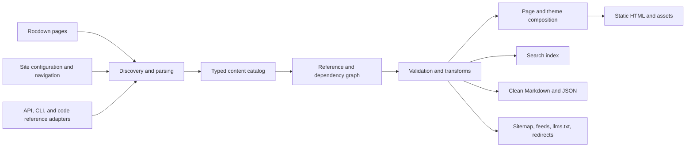

# Rocdown documentation generator: state of the art and recommended architecture

**Investigation date:** 2026-08-15  
**Scope:** technical-documentation generators, modern documentation products, exemplary developer-documentation sites, content architecture, responsive site behavior, and a concrete generator design for Rocdown  
**Deliverable:** research and design report only; no implementation is included

## Executive recommendation

Rocdown should become a **documentation compiler**, not merely a Markdown static-site generator.

The winning design is a combination of ideas rather than a clone of one product:

- Take the **semantic document model, cross-reference discipline, validation, and multiple outputs** from Sphinx.
- Take the **content catalog, stable identities, multi-component model, and navigation assembly** from Antora.
- Take the **small, deterministic, Rust-native build and preprocessor/backend separation** from mdBook.
- Take the **static-first, component-island performance model** from Astro and Starlight.
- Take the **default page layout, responsive navigation, low visual noise, and clear content lanes** from Oxide, Starlight, and VitePress.
- Take **tested, synchronized language examples and schema-generated references** from Stripe, OpenAI, Google, Fern, and Mintlify.
- Take the **explicit content types, article contracts, and editorial validation** from Diátaxis, The Good Docs Project, and GitHub Docs.
- Take **plain Markdown mirrors, `llms.txt`, and structured content exports** from the newest AI-oriented documentation systems, while treating `llms.txt` as an evolving proposal rather than a web standard.

The key product decision is this:

> Parse every `.rocdown` file once into a span-preserving semantic AST, normalize all pages and generated references into a typed site catalog, validate the complete content graph, and derive HTML, navigation, search, machine-readable Markdown, sitemaps, and other artifacts from that graph.

This fits the current repository. `rocci-rocdown` already parses a single document into Markdown and Rocci/Roc nodes, preserves source spans, extracts headings and links, and emits page metadata. The SSG should be a new orchestration layer above that compiler core. It should not push site-wide concerns into the single-file parser and should not make themes responsible for discovering or interpreting content.

The default output should be pre-rendered HTML and CSS with no application-wide hydration. JavaScript should be limited to small, replaceable features—search, navigation drawers, copy buttons, persisted tab choices, and explicit Rocdown islands. A page must remain readable, navigable, linkable, printable, and indexable when JavaScript fails.

The initial product should deliberately prioritize:

1. multi-page builds and a typed site catalog;
2. excellent default navigation and responsive behavior;
3. strict links, assets, headings, metadata, and accessibility validation;
4. local static search;
5. semantic documentation components;
6. HTML, clean Markdown, `sitemap.xml`, and `llms.txt` outputs;
7. deterministic, incremental builds.

Versioning, localization, multi-repository aggregation, interactive API explorers, arbitrary third-party plugins, and an AI answer box should be designed into the model but added only after the foundation is reliable.

## 1. What “state of the art” means in 2026

Modern technical documentation is no longer defined by syntax highlighting and a sidebar. Strong systems solve six connected problems.

### 1.1 Authoring

Writers need readable source, reusable examples, semantic components, reliable preview, precise diagnostics, and a way to express content intent without embedding an entire frontend framework. MDX is powerful, but its arbitrary component execution also couples content to a JavaScript runtime and makes portability, analysis, and non-HTML output harder.

Rocdown already has a useful alternative: ordinary prose stays Markdown, while executable or structural regions are explicit `@` declarations. The documentation generator should preserve that boundary. Add a small set of semantic documentation constructs, not arbitrary JSX-equivalent execution throughout prose.

### 1.2 Information architecture

Users arrive with different intents: learn, complete a task, look up a fact, understand a concept, or recover from a failure. [Diátaxis](https://diataxis.fr/) separates tutorials, how-to guides, reference, and explanation because those modes serve different needs. [The Good Docs Project](https://gitlab.com/tgdp/templates/-/tree/main/) adds practical templates such as quickstarts, concepts, references, and READMEs. GitHub extends this with troubleshooting and known-issue content.

A good generator helps authors maintain those distinctions through metadata, templates, linting, and navigation. It cannot make weak content good through visual styling alone.

### 1.3 Compilation and integrity

A documentation build is a graph compilation problem:

- pages have stable identities, routes, headings, aliases, versions, locales, owners, and relationships;
- links target pages, symbols, headings, downloads, and external resources;
- examples can depend on source files or generated API descriptions;
- navigation is a curated projection of the page graph;
- changes invalidate dependent pages and indexes.

Sphinx and Antora are especially important here. Sphinx provides semantic cross-references, domains, extensions, link checking, and many builders, not just HTML. Antora first classifies source files into a content catalog, then builds navigation and composes pages from that catalog. Its pipeline explicitly separates aggregation, classification, conversion, navigation, UI loading, composition, and publication ([Antora pipeline](https://docs.antora.org/antora/latest/how-antora-works/)).

### 1.4 Delivery

The best default remains static HTML at stable URLs. It is cheap to host, cacheable, resilient, indexable, and easy to archive. Interactivity should enhance that document rather than constitute it. Astro describes this as islands: components render to HTML and CSS by default, and only explicitly interactive components ship client code ([Astro islands](https://v4.docs.astro.build/en/concepts/islands/)). This is unusually compatible with Rocdown’s existing “static unless explicit” design.

### 1.5 Discovery for humans and agents

Human discovery needs global navigation, contextual navigation, table of contents, strong link trails, and search that understands identifiers. Agent discovery now also matters. OpenAI’s current developer docs expose a documentation index, clean Markdown variants, “Copy Page,” and an optional docs agent. Stripe, GitHub, Cloudflare, Supabase, Fern, and Mintlify similarly expose Markdown or agent-oriented actions.

The August 2026 revision of the [`llms.txt` proposal](https://llmstxt.org/) recommends a small curated Markdown index plus clean Markdown page variants and standard alternate-link relations. It is useful and increasingly deployed, but it remains a community proposal. Rocdown should generate it because the marginal cost is low when the semantic graph already exists, while retaining normal sitemaps, canonical links, and structured exports.

### 1.6 Operations and governance

Documentation needs ownership, review, deprecation policy, redirects, release integration, broken-link checks, example tests, accessibility checks, search-quality evaluation, and feedback loops. A generator should make correct practice the easiest path and expose content debt in CI.

## 2. Generator landscape

No existing generator is the complete Rocdown model. Each is strongest in a different dimension.

| System | Core model | Major strengths | Important limitations for Rocdown | Lesson to adopt |
| --- | --- | --- | --- | --- |
| **Sphinx** | Semantic document tree plus domains, roles, directives, builders | Best-in-class cross-references, code/API domains, autodoc ecosystem, link checker, many outputs, i18n | Python/reStructuredText heritage; themes often feel less modern; extension freedom can fragment authoring | Stable object identities, typed references, builder abstraction, inventory export |
| **Antora** | Git sources → virtual content catalog → navigation → UI composition | Multi-repo and multi-version architecture, component/version identity, contextual xrefs, content/UI separation | Heavy structure for small sites; AsciiDoc-specific authoring | Build a catalog before rendering; separate identity from URL; navigation is compiled content |
| **mdBook** | Ordered Markdown book with preprocessors and render backends | Rust-native, small, fast, deterministic, built-in search, testable Rust examples, simple mental model | Primarily linear books; weak multi-product IA and versioning | Keep the core small; use explicit preprocessing/backend contracts; test examples |
| **Zola** | General Rust SSG with pages, sections, taxonomies, Tera templates | Rust-native speed, link checking, Sass, feeds, sitemap, search index, multilingual support | General publishing model rather than documentation semantics | Borrow build mechanics and deterministic static publication, not the content model |
| **MkDocs + Material** | Markdown pages, YAML navigation, Jinja theme, Python plugins | Excellent polished default, strong navigation/search, approachable setup, large extension ecosystem | Python plugin trust and dependency surface; semantics often live in theme/plugin conventions | Provide a strong configuration → tokens → CSS → layout customization ladder |
| **Docusaurus** | Plugins collect data; React themes render route modules; static HTML is hydrated | Built-in versioning/i18n, MDX, mature plugins, strong project-doc workflows | React runtime and hydration complexity; version snapshots add maintenance/build cost | Preserve plugin/theme separation and explicit route data; do not copy whole-app hydration |
| **VitePress** | File-routed Markdown compiled through Vite/Vue | Fast preview, polished default theme, components in Markdown, local or Algolia search | Vue-specific content coupling; fewer enterprise content-graph features | Excellent baseline layout and author experience; simple file routes and local search |
| **Astro Starlight** | Astro content collections plus static-first components | Accessible-by-default orientation, i18n, Pagefind, rich doc components, framework-agnostic UI islands | JavaScript build ecosystem; versioning is not its central strength | Closest visual/interaction benchmark; adopt static-first page behavior and component set |
| **Hugo/Eleventy** | General-purpose content collections and templates | Very fast, flexible, mature deployment ecosystem | Documentation semantics, API references, and versions mostly assembled by themes/plugins | Generic SSG flexibility is useful below the surface, but insufficient as the product definition |
| **Nextra** | Next.js + MDX | Deep React/Next integration and interactive components | Application framework coupling and larger runtime surface | Useful evidence for component-rich authoring, but not a good core model for Rocdown |

Supporting sources: [mdBook features](https://rust-lang.github.io/mdBook/), [Zola overview](https://www.getzola.org/documentation/getting-started/overview/), [MkDocs configuration](https://www.mkdocs.org/user-guide/configuration/), [Docusaurus architecture](https://docusaurus.io/docs/advanced/architecture), [Docusaurus versioning caveat](https://docusaurus.io/docs/versioning), [VitePress routing and build](https://vitepress.dev/guide/getting-started.html), [VitePress local search](https://vitepress.dev/reference/default-theme-search.html), [Starlight authoring](https://starlight.astro.build/guides/authoring-content/), and [Starlight search](https://starlight.astro.build/guides/site-search/).

### 2.1 Managed and API-first documentation platforms

Managed platforms show where documentation UX is heading, even when Rocdown should not copy their hosting or lock-in model.

| Platform family | Distinctive capability | Rocdown implication |
| --- | --- | --- |
| **Mintlify** | MDX authoring, OpenAPI/AsyncAPI-generated endpoint pages, API playgrounds, navigation config, agent search, Markdown/LLM outputs | Treat API descriptions as imported sources that become normal catalog nodes; keep generated reference overridable with authored context |
| **Fern** | One project can generate documentation, API references, SDKs, and synchronized dynamic SDK snippets from specs | Model code samples as typed example groups tied to API operations and SDK versions, not copied text |
| **GitBook** | Git sync plus visual editor, AI search, translations, authenticated and adaptive content | Separate source storage from editing experience; keep audience metadata in the catalog even if adaptive delivery is deferred |
| **ReadMe** | Hosted guides/reference, interactive API explorer, changelogs, metrics/personalization | Feedback and API interaction can be optional services over a static core |
| **Redocly/Scalar** | High-quality OpenAPI reference and interactive clients | Define a reference adapter contract rather than hard-code one API presentation |

Mintlify recommends OpenAPI-generated references for maintainability while allowing per-operation MDX pages for editorial control ([OpenAPI setup](https://mintlify.com/docs/api-playground/openapi-setup)). Fern’s project model separates documentation content, reusable snippets, navigation/theme configuration, API definitions, and SDK generator configuration ([Fern project structure](https://buildwithfern.com/learn/docs/getting-started/project-structure)); it can render snippets using the actual generated SDKs ([SDK snippets](https://buildwithfern.com/learn/docs/api-references/sdk-snippets/)). These are strong precedents for keeping prose, schemas, and executable examples related but not conflated.

### 2.2 Framework conclusion

Rocdown should not depend on a JavaScript SSG or wrap one as its primary generator. That would duplicate parsing, undermine source mapping, and subordinate Roc/Rocci integration to another framework’s component model. It should build its own Rust orchestration layer and can reuse focused tools where their contracts are clean—for example, Pagefind as a post-build search indexer in the first release.

## 3. Prominent documentation sites and what they teach

### 3.1 Oxide

[Oxide Docs](https://docs.oxide.computer/) is a particularly relevant example because it joins manually authored operational guidance with generated API and CLI reference under one coherent interface.

Its top-level lanes are explicit: API, CLI, Guides, Release Notes, and Security. The Guides sidebar is then grouped by user need and audience: Getting Started, User Guides, Operator Guides, Integrations, Use Cases, Metrics, Alerts, Facilities, System Setup, and Architecture. API and CLI have their own generated hierarchies and visible version strings. This avoids forcing a single tree to represent fundamentally different kinds of material.

The rendered layout uses:

- a fixed global header;
- a persistent left navigation at wide widths;
- a bounded reading column;
- a separate on-page outline at larger widths;
- a keyboard-visible global search entry;
- a mobile menu and a compact, sticky “Table of Contents” control;
- one visual system across authored guides and generated references.

Its [web quickstart](https://docs.oxide.computer/guides/quickstart) starts with a concrete outcome (“provision a virtual machine … in just a few minutes”), then follows the product workflow, uses screenshots at decision points, puts important environmental caveats near the affected step, verifies connectivity, cleans up the created resource, and relegates optional depth to an appendix. Its [API introduction](https://docs.oxide.computer/api) links back to task-oriented quickstarts instead of attempting to teach everything inside the reference.

What Rocdown should adopt:

- distinct global content lanes;
- audience-aware sidebar groups;
- one theme contract across prose and generated references;
- explicit product/API/CLI versions;
- excellent mobile TOC behavior;
- restrained interaction and minimal chrome.

What Rocdown should improve:

- enforce one semantic H1 per page and keep navigation section labels out of the document heading outline;
- add visible prerequisites, verification, and next-step blocks as consistent page semantics;
- expose clean Markdown and content metadata for agent use;
- provide stronger built-in code-language grouping and tested snippets where appropriate.

### 3.2 OpenAI

The current [OpenAI developer quickstart](https://developers.openai.com/api/docs/quickstart) combines a global product header, API-area tabs, a local sidebar, a page outline, and a focused reading column. It supports search, dark mode, “Copy Page,” Markdown page variants, `llms.txt`, an optional docs agent, copyable code, platform switchers, programming-language switchers, direct dashboard actions, and card-based next steps.

The content is progressive: create a key, make one request, then branch into images/files, tools, streaming, and agents. Examples across languages occupy the same semantic slot, which lets the page avoid duplicating the surrounding explanation.

Transferable lessons:

- persist a user’s chosen language across compatible example groups;
- make code copying and section-link copying first-class but nonessential;
- let a quickstart establish success early, then offer capability branches;
- serve clean Markdown from the same source graph;
- keep “ask documentation” downstream of high-quality structured source and search.

Risk to avoid: feature-rich quickstarts can become product tours. Rocdown’s authoring guidance should distinguish a minimal quickstart from an overview of every capability.

### 3.3 Anthropic, Google Gemini, and Mistral

The [Claude Platform quickstart](https://platform.claude.com/docs/en/get-started) uses the now-common product-header + collapsible local sidebar + article pattern, with search, theme, language, API reference, and console access always nearby. Its large product surface demonstrates the need for collapsible groups, careful default expansion, and cross-product navigation that does not overload the article.

The [Gemini API reference](https://ai.google.dev/api) makes the distinction between conceptual/get-started material, REST resources, and language SDK references explicit. The [Gemini cookbook](https://ai.google.dev/gemini-api/cookbook) provides task/use-case recipes rather than bloating the reference.

The [Mistral developer landing page](https://docs.mistral.ai/developers) exposes API reference, SDKs, cookbooks, changelogs, and small time-bounded quickstarts. Its [first request quickstart](https://docs.mistral.ai/getting-started/quickstarts/developer/first-api-request) explicitly states prerequisites, learning outcomes, estimated time, numbered steps, verification, a compact error/cause/fix table, and next steps. That is an excellent reusable quickstart contract.

Transferable lessons:

- give every quickstart an outcome and estimated time;
- include verification and likely errors before “next steps”;
- separate recipes/cookbooks from normative reference;
- distinguish SDK reference from protocol reference;
- make version, model, and feature-status badges structured metadata rather than prose conventions.

### 3.4 Stripe

Stripe remains a leading example of documentation as an executable product surface. Its [quickstart directory](https://docs.stripe.com/quickstarts) describes end-to-end samples with multiple language/framework options, step-linked code, and downloadable or launchable projects. Its [API reference](https://docs.stripe.com/api?lang=curl) keeps concepts such as authentication, errors, idempotency, pagination, and versioning ahead of resource listings, synchronizes examples across official client libraries, and can personalize examples to a signed-in test account.

Transferable lessons:

- generated reference still needs a hand-authored conceptual prelude;
- operation examples should be connected to real SDK signatures and API versions;
- a “try it” panel is valuable only when authentication, environment, side effects, and error states are exceptionally clear;
- downloadable complete examples often teach better than oversized inline code blocks.

Rocdown should postpone an authenticated API explorer until static reference, examples, and safe secret handling are excellent.

### 3.5 GitHub Docs

GitHub Docs is especially valuable as a public content-engineering system. Its content model explicitly distinguishes concepts, reference, how-to, troubleshooting, quickstarts, and tutorials. Its [article contract](https://docs.github.com/en/contributing/style-guide-and-content-model/contents-of-a-github-docs-article) standardizes title, intro, permission statements, conditional callouts, tool switching, generated TOC, prerequisites, procedural and troubleshooting content, next steps, and further reading. The intro is also treated as search/SEO text.

GitHub’s [quickstart guidance](https://docs.github.com/en/contributing/style-guide-and-content-model/quickstart-content-type) requires audience, prerequisites, a promised outcome, visual cues, optional troubleshooting, a recap, and two or three actionable next steps. Its [troubleshooting guidance](https://docs.github.com/en/contributing/style-guide-and-content-model/troubleshooting-content-type) recommends placing known errors near the relevant procedure. Frontmatter is schema-validated in tests ([frontmatter guidance](https://docs.github.com/en/contributing/writing-for-github-docs/using-yaml-frontmatter)).

GitHub also demonstrates the costs of complex single-source version conditionals. Its system can target products and release ranges inside one file, but authors must reason carefully about conditionals and test every rendering ([versioning documentation](https://docs.github.com/en/contributing/writing-for-github-docs/versioning-documentation)). Rocdown should support conditional content eventually, but prefer whole-page/product availability and shared semantic snippets before arbitrary conditionals inside prose.

### 3.6 Supabase and Cloudflare

[Supabase Docs](https://supabase.com/docs) is strong at routing users by framework, backend capability, client library, migration source, and operational resource. Pages expose “Edit,” feedback, “Copy as Markdown,” and agent handoffs. This is a useful example of faceted discovery: the same platform can be entered by task, language, framework, or product.

[Cloudflare Developer Docs](https://developers.cloudflare.com/) handles an enormous product surface by using strong product landing pages plus tutorials, learning paths, resources, API material, architecture documents, release updates, and copy-as-Markdown/agent actions. Its [reference architecture collection](https://developers.cloudflare.com/reference-architecture/) explicitly states audience and intended learning outcome and provides multiple ways to browse the same corpus.

Transferable lesson: folders alone cannot express all useful discovery paths. Rocdown needs typed metadata and generated collection pages, while keeping one canonical page URL.

### 3.7 Starlight, VitePress, Material for MkDocs, and Rust’s books

These are useful reference implementations for the default theme rather than just generator internals.

- Starlight ships a disciplined component vocabulary—cards, asides, badges, code, file trees, steps, and tabs—and uses Pagefind by default. It recommends a generated page title/H1, introductory prose, then H2/H3 headings for the outline ([authoring guidance](https://starlight.astro.build/guides/authoring-content/)).
- VitePress demonstrates an exceptionally compact docs layout, file routing, fast preview, strong code blocks, and a lightweight in-browser search option.
- Material for MkDocs demonstrates how configurable navigation can remain coherent, including instant internal navigation, section/tab modes, keyboard shortcuts, and a mature customization ladder ([navigation documentation](https://squidfunk.github.io/mkdocs-material/setup/setting-up-navigation/)).
- mdBook and *The Rust Programming Language* demonstrate that a simple linear hierarchy, excellent search, predictable previous/next navigation, and tested code can outperform richer interfaces for book-shaped content.

## 4. Recommended Rocdown product model

### 4.1 Goals

The generator should:

1. Build documentation sites from one or more Rocdown content roots.
2. Preserve Rocdown’s Markdown-first, explicit-execution grammar.
3. Produce static, accessible, responsive HTML by default.
4. Give pages stable semantic identities independent of output routes.
5. Resolve and validate links, headings, assets, navigation, versions, and generated references across the whole site.
6. Support hand-authored guides and generated API/CLI/code reference in the same content graph and theme.
7. Generate human, search-engine, and agent-oriented outputs from the same source of truth.
8. Keep build results deterministic and suitable for CI, archives, offline use, and ordinary static hosting.
9. Make the default theme excellent without preventing branded themes or custom layouts.
10. Expose precise source spans and diagnostics through the existing LSP pipeline.

### 4.2 Non-goals for the first release

- A general CMS or hosted editing service.
- A React/MDX-compatible runtime.
- Arbitrary JavaScript components embedded in Markdown.
- Dynamic authenticated documentation.
- An AI answer service in the core generator.
- Full Antora-style remote Git aggregation.
- Every possible documentation output such as PDF/ePub on day one.
- A compatibility promise for arbitrary MkDocs, Docusaurus, or Starlight themes.

### 4.3 Conceptual architecture



The content catalog is the architectural center. Parsing must finish before site-wide resolution, and site-wide resolution must finish before rendering. Themes receive normalized page data; they do not discover files, infer routes, resolve references, or parse directives.

### 4.4 Crate boundaries

Recommended boundaries:

| Crate/module | Responsibility |
| --- | --- |
| `rocci-rocdown` | Parse and validate one source document; expose AST, spans, extracted metadata, headings, links, components, styles, and generated Roc. Keep this mostly as it is. |
| `rocs` (was `rocci-docs`) | Discover sources, normalize metadata, build the catalog and graph, resolve references/navigation/routes, orchestrate transforms and outputs. Rust, not a generated Roc app. |
| `rocci-docs-render` or an internal renderer module | Compose semantic page data with a versioned theme contract and write static HTML/Markdown/JSON. Split into a crate only when alternate renderers justify it. |
| `rocci-docs-theme` or packaged assets | First-party default layout, tokens, components, CSS, and small enhancement scripts. |
| `rocci-cli` | Expose `docs dev`, `docs build`, `docs check`, and inspection commands; manage preview and atomic output. |
| `rocci-lsp` | Site-aware metadata/directive completion and diagnostics, ideally using an incremental catalog snapshot. |

Do not make the existing `compile()` return type carry the whole site. Add a site compiler that consumes per-file parse/compile outputs.

**Implementation (2026-08-16):** that site compiler is the `rocs` crate, not a generated Roc application. Rust owns the catalog, routes, and static `MdNode` → article HTML. Rocci owns the document shell, compiled once per build. Authored `@render` / Rocci islands stay Roc programs and are out of the static catalog until they are spliced into the same shell. See [`ROCDOWN_DOCUMENTATION_GENERATOR_IMPLEMENTATION_PLAN.md`](../../ROCDOWN_DOCUMENTATION_GENERATOR_IMPLEMENTATION_PLAN.md). A Roc-first catalog was prototyped in Phase 0 and rejected: compile cost scaled with prose, and catalog logic duplicated work Rust already does for `docs check` and the LSP.

### 4.5 Typed site catalog

At minimum, normalize every publishable page into a record conceptually like:

```text
PageRecord
  id                 stable logical identity
  source             path + source hash + spans
  route              canonical output route
  aliases            old routes that should redirect
  title              display and document title
  short_title        optional navigation label
  description        search/SEO/collection summary
  content_type       tutorial | how_to | reference | explanation |
                     quickstart | troubleshooting | changelog | landing
  product            optional product/component identity
  version            optional version identity/range
  locale             BCP 47 language tag
  audience           zero or more audience facets
  status             stable | beta | preview | deprecated | removed
  draft              build exclusion flag
  layout             requested layout contract
  headings           stable section identities
  outgoing_edges     page, heading, symbol, asset, and external links
  examples           typed code/example groups
  body               semantic Rocdown document tree
```

The stable `id` is essential. Routes change for editorial or SEO reasons; references should be able to target a logical page and let the compiler produce the correct version/locale URL. Ordinary Markdown relative links should remain supported because they are portable and familiar, but a semantic xref form should be available for reference-heavy or versioned sites.

### 4.6 Site configuration

Use one small, schema-defined TOML file. Roc values inside `@page` should remain useful for page rendering, but the site compiler needs metadata it can understand before running or type-checking Roc. Therefore, site-critical fields must have a statically extractable subset.

Illustrative shape:

```toml
[docs]
title = "Rocci"
base_url = "https://docs.example.com"
content = ["docs"]
output = "dist"
theme = "rocci-default"
trailing_slash = true
default_locale = "en"

[docs.search]
provider = "pagefind"

[docs.validation]
broken_internal_links = "error"
missing_description = "error"
missing_image_alt = "error"
external_links = "warn"

[[docs.nav]]
label = "Get started"
items = ["index", "quickstart", "installation"]

[[docs.nav]]
label = "Guides"
directory = "guides"
```

The exact syntax can evolve, but these rules should not:

- configuration has a published schema and editor completion;
- unknown keys are errors;
- defaults are visible through `rocci docs inspect config`;
- all resolved paths are reported in diagnostics;
- configuration contains serializable data, not arbitrary executable hooks.

### 4.7 Discovery and routing

Recommended defaults:

- `docs/index.rocdown` → `/`
- `docs/guide/index.rocdown` → `/guide/`
- `docs/guide/install.rocdown` → `/guide/install/`
- an explicit static `@page.route` may override the derived route;
- `@page.aliases` declares redirects from old routes;
- route collisions, case-insensitive collisions, unsafe segments, and duplicate aliases are errors;
- drafts are visible in development with a banner and excluded from production unless requested;
- canonical URLs and sitemap entries use one consistent trailing-slash policy;
- changing a route produces a diagnostic suggesting an alias when a prior manifest is available.

Route derivation should be deterministic and independent of navigation. A page may be published but omitted from navigation; the checker should label it “unlisted,” not “unreachable,” if search or inbound links make that deliberate.

### 4.8 Navigation model

Navigation is authored, generated, or mixed—but never accidentally inferred from lexicographic filenames alone.

Use four navigation levels:

1. **Global lanes:** Guides, Reference, API, CLI, Release Notes, Security, Support, or product areas.
2. **Section sidebar:** the curated hierarchy for the current lane/product/version.
3. **Page outline:** H2/H3 headings on the current page.
4. **Journey links:** breadcrumbs where useful, previous/next, prerequisites, related material, and next steps.

Allow directory auto-discovery as a convenience, with explicit ordering and exclusions. The compiled navigation should be inspected as data and validated for missing pages, duplicates, unavailable versions/locales, excessive depth, and ambiguous labels.

Antora’s model is instructive: navigation is assembled from registered navigation files and remains separate from whether a page is published ([navigation assembly](https://docs.antora.org/antora/latest/navigation/)). Rocdown can offer the same separation with simpler TOML or Rocdown list syntax.

### 4.9 Semantic documentation components

Add a small, first-party vocabulary as real AST nodes. Recommended first set:

- `note`, `tip`, `caution`, `danger`, and `deprecated` asides;
- ordered `steps` with optional titles and verification markers;
- synchronized `tabs` / `code-group` with stable group and choice IDs;
- `card-grid` and `link-card` for landing pages;
- `file-tree`;
- `badge` for status/version labels;
- `details` for optional depth;
- `figure` with caption, alt text, and optional credit;
- `definition` / glossary term;
- `compatibility` table;
- `example` with source, language, test command, and expected result metadata;
- `api-operation` placeholder populated by a reference adapter.

These nodes should have:

- a documented content model;
- source spans and LSP completion;
- validation independent of the theme;
- accessible default HTML semantics;
- plain-Markdown fallback rules;
- stable theme-facing classes/data attributes;
- no required client runtime unless the behavior is inherently interactive.

Do not use raw HTML as the extension mechanism. Rocdown already disables it by default, which is the right security and portability posture.

### 4.10 Includes, snippets, and code examples

Documentation commonly rots where it duplicates source code. Support typed inclusions:

- whole file;
- named region;
- line range, discouraged because it is fragile;
- command output captured by an explicit test task;
- generated API/CLI signature;
- reusable prose fragment with parameter substitution limited to typed strings.

Every included example should retain origin metadata so “Edit source” can lead to the real file and diagnostics can point to the correct span.

Code groups should distinguish:

- **language alternatives**: same task in JavaScript/Python/Roc;
- **platform alternatives**: macOS/Linux versus Windows;
- **tool alternatives**: CLI versus web UI where the actual steps differ.

This distinction matters. GitHub’s content guidance warns against using a tool switcher merely to display equivalent language examples; the semantics and persistence behavior are different.

Optional snippet testing should run through declared, sandboxable commands in CI—not automatically execute every fence. Fenced code must remain display-only, preserving Rocdown’s existing rule.

### 4.11 API, CLI, and code reference adapters

Generated reference should enter the catalog through versioned adapters:

```text
ReferenceSource -> Reference IR -> PageRecord / SymbolRecord / ExampleGroup
```

Initial candidate inputs:

- OpenAPI 3.1 and JSON Schema;
- AsyncAPI later;
- CLI command/help JSON emitted by Rocci tools;
- Roc compiler documentation metadata or a purpose-built Roc API inventory;
- Rustdoc JSON only if Rocci itself needs Rust implementation docs.

The reference intermediate representation should capture stable symbol ID, display name, kind, namespace, summary, long description, deprecation/status, parameters, types, examples, source URL, and relations. Renderers can then produce a full page, grouped page, or inline summary without reparsing schemas.

Generated pages must allow hand-authored introductions, conceptual links, examples, and migration notes. Schema descriptions alone are rarely sufficient documentation.

### 4.12 Search

Search is a core navigation system, not a decorative plugin.

For the first release, generate semantic HTML and use Pagefind as a post-build indexer. Pagefind adds a static, chunked search bundle, supports filters, and separates indexes by document language ([Pagefind](https://pagefind.app/), [multilingual search](https://pagefind.app/docs/multilingual/)). Wrap it behind a Rocdown search-provider interface so a large site can later choose Algolia, Typesense, or a service API.

The search document emitted from the catalog should include:

- canonical URL and page ID;
- title and short title;
- description;
- headings and section anchors;
- body text excluding navigation and hidden alternative tabs;
- content type, product, version, locale, audience, and status filters;
- aliases and author-provided keywords;
- identifiers from API/CLI/code reference;
- ranking weights: exact identifier/title > heading > keywords/description > prose > code.

Tokenizer behavior must preserve useful technical forms such as `@page`, `foo.bar`, `HTTP 429`, `/v1/items`, `snake_case`, and `kebab-case`. Maintain a small query relevance corpus in tests. “No results” should suggest spelling alternatives, related product lanes, and a feedback route.

The UI should support `/` and Cmd/Ctrl+K, arrow-key navigation, Escape, focus restoration, section-level results, and a useful no-JavaScript fallback page or generated index.

### 4.13 Agent-readable outputs

Generate these from the same resolved graph:

- clean Markdown for each page, linked with `<link rel="alternate" type="text/markdown">`;
- a small curated `/llms.txt` and optionally lane-specific files such as `/api/llms.txt`;
- a documented JSON content/catalog format for tools that need stronger structure;
- a symbol inventory for API/code references;
- optionally `llms-full.txt` only for sites small enough to make it useful.

The clean Markdown renderer must resolve tabs and components intelligibly, label omitted interactive behavior, preserve canonical links, and avoid navigation chrome. It should not be an HTML-to-Markdown scrape.

An “Ask docs” experience is a later consumer of these outputs. If added, it must cite canonical pages and headings, expose the selected product/version/locale, distinguish quotations from synthesis, and degrade to ordinary search. The generator should never require a hosted AI service.

### 4.14 Theme contract

The theming report already establishes useful principles. For documentation specifically, the theme contract should receive structured slots rather than raw source:

```text
SiteShell
  head metadata
  global header / lanes
  sidebar navigation tree
  breadcrumb model
  page header metadata
  semantic article body
  on-page outline
  previous / next / related links
  footer
```

Themes may change layout and presentation but must not reinterpret page identity, navigation availability, versions, or reference targets.

Use:

- one selected base theme;
- token-level branding through CSS custom properties;
- additive site CSS;
- named component/slot overrides;
- full layout overrides as an advanced escape hatch;
- an explicit theme API version and compatibility diagnostic.

Publish the default theme’s semantic DOM and accessibility contract. Avoid making fragile utility-class strings the public theme API. Stable `data-rocci-*` hooks and semantic classes are a better extension surface.

### 4.15 Extension model

Start with built-in transforms. When plugins arrive, use a narrow, versioned phase API over serializable data:

1. source discovery;
2. parsed-page transform;
3. catalog augmentation;
4. reference resolution/validation;
5. render-tree transform;
6. derived artifact emission;
7. post-build inspection.

Plugins must declare filesystem, network, process, and environment capabilities. A plugin that runs arbitrary native code is trusted build-time code; the CLI must say so. Prefer out-of-process JSON or WASI-style boundaries for third-party plugins rather than an unstable Rust dynamic-library ABI. Pin plugin versions and include them in the build fingerprint.

### 4.16 Determinism, caching, and development mode

The production build must be hermetic given source, configuration, declared toolchain, and pinned dependencies:

- sort all discovery and output deterministically;
- normalize generated timestamps or omit them unless content explicitly requests them;
- fingerprint assets by content;
- write to a temporary output tree, then atomically replace `dist/` after success;
- emit a build manifest with generator/theme/plugin versions and page hashes;
- support `--offline` when all dependencies are vendored/cached;
- never fetch theme or runtime updates implicitly during a normal build.

For incremental development, track dependencies at page, snippet, asset, layout, nav, reference source, and derived-index level. A prose edit should rebuild one page plus affected indexes; a navigation edit should not reparse every Rocdown document; a theme edit can recompose pages without rerunning reference generation.

Development preview should show diagnostics in the terminal and a non-production overlay, preserve scroll position when possible, and expose an inspector for page ID, route, metadata, layout, dependencies, and generated artifacts.

### 4.17 Security

Keep raw HTML disabled by default. Sanitize or reject dangerous URLs, inline event handlers, untrusted SVG, unsafe CSS imports, and path traversal. Emit a strict Content Security Policy compatible with the selected feature set. Self-host default assets. Interactive API clients must never write credentials into generated HTML, logs, URLs, analytics, or persistent browser storage without explicit user action and clear labeling.

Search and navigation enhancements should work under a policy with no `unsafe-eval`. Optional Rocdown islands should declare required script/connect/style capabilities so the build can produce an auditable CSP.

## 5. Content architecture for useful documentation

### 5.1 Organize around user intent, not repository structure

Repository modules are not automatically a useful navigation system. A strong default docs map is:

```text
Home
├── Get started
│   ├── Overview / what it is
│   ├── Quickstart
│   └── Installation
├── Tutorials
├── How-to guides
├── Concepts / explanation
├── Reference
│   ├── Language or product reference
│   ├── API
│   ├── CLI
│   └── Configuration
├── Troubleshooting
├── Examples / cookbooks
├── Release notes and migration
└── Support, security, and contribution
```

Small projects should omit empty lanes. Large products may put product areas above content type, but each local section should still make user intent obvious.

Use metadata to generate alternative collection pages by audience, platform, language, framework, use case, or status. One page remains canonical; collections are discovery views.

### 5.2 Page type contracts

#### Quickstart

Purpose: deliver one meaningful success as quickly as possible.

Required or strongly recommended structure:

1. One-sentence outcome.
2. Audience and estimated time.
3. Prerequisites, including permissions and cost/side-effect warnings.
4. The shortest safe path, with defaults chosen.
5. Verification of the result.
6. Cleanup if resources or charges were created.
7. A compact error/cause/fix table or links to relevant troubleshooting.
8. Two or three next steps: concept, deeper guide, and reference.

Do not turn a quickstart into a survey of every option.

#### Tutorial

Purpose: teach through a complete, guided experience.

- State what the learner will build and what concepts it teaches.
- Control complexity and introduce one new idea at a time.
- Use a coherent example rather than disconnected feature demonstrations.
- Explain decisions at the moment they become relevant.
- Include checkpoints and a final working artifact.
- Link to how-to/reference pages instead of becoming the permanent lookup source.

#### How-to guide

Purpose: help a competent user accomplish one real task.

- Use a task-oriented title.
- State scope and prerequisites briefly.
- Lead with steps; keep conceptual digressions short and linked.
- Include branching only where the task genuinely differs.
- Put likely failure modes near the affected step.
- End when the task is complete, then link onward.

#### Explanation/concept

Purpose: build a mental model.

- State the question or idea being explained.
- Define vocabulary and system boundaries.
- Use diagrams when relationships matter.
- Explain tradeoffs, invariants, and why the system behaves as it does.
- Link to tasks and reference, but do not disguise a procedure as explanation.

#### Reference

Purpose: provide authoritative facts during active work.

- Be systematic, complete within its stated scope, and structurally predictable.
- Put signatures, syntax, types, defaults, constraints, errors, compatibility, and examples in consistent positions.
- Separate normative facts from long tutorials.
- Generate from schemas/source when possible, then enrich editorially.
- Show version and deprecation status near the referenced item.

#### Troubleshooting

Purpose: minimize time from observed symptom to recovery.

- Use the exact error, symptom, or failed task in titles and keywords.
- Start with applicability and safe diagnostic checks.
- Organize by symptom, not internal subsystem.
- Use “cause / confirm / fix / verify” consistently.
- Put common failures next to the relevant procedure; create standalone pages for broad or complex issues.
- Say explicitly when no workaround exists.

#### Changelog, migration, and deprecation

- Separate release facts from upgrade instructions.
- Assign stable anchors to changes.
- Label breaking, deprecated, security, fixed, and added items.
- Link every breaking/deprecated item to migration guidance and affected reference.
- Preserve old URLs with redirects.

### 5.3 Universal article contract

Every ordinary page should have:

- one unique title/H1;
- a concise description that confirms the user is in the right place;
- visible product/version/status context when applicable;
- a logical H2/H3 outline;
- stable heading anchors;
- descriptive link text;
- an owner and source location in metadata, even if not shown;
- a last-reviewed or source-version field for governance, not a misleading automatic “last updated” timestamp;
- purposeful next/related links;
- a canonical URL and clean Markdown equivalent.

The description should be written for humans first but is also search-result, collection-card, social, and agent context. GitHub’s article model makes the same content reuse explicit.

### 5.4 Writing for scanning and action

GitHub notes that readers usually scan for headings, alerts, lists, tables, code, visuals, and the first words of sections ([best practices](https://docs.github.com/en/contributing/writing-for-github-docs/best-practices-for-github-docs)). Therefore:

- front-load the outcome and essential constraints;
- keep paragraphs focused;
- use descriptive headings that can stand alone in a TOC or search result;
- use numbered lists for procedures and bullets for unordered choices;
- use callouts sparingly and reserve severity semantics;
- avoid “click here,” “above,” “below,” and icon-only descriptions;
- put optional depth in details, appendices, or linked explanation;
- show expected output after commands where verification is not obvious.

### 5.5 Examples and variants

Every code example should answer:

- What does this demonstrate?
- What environment/version does it assume?
- Is it complete or intentionally abbreviated?
- What values must the reader replace?
- What should happen when it succeeds?
- Has it been tested, and against what?

Use syntax-aware placeholders that cannot be mistaken for literal production values. Avoid secrets in screenshots or examples. If tabs contain equivalent implementations, keep prose outside the tabs and persist the choice. If paths genuinely differ, label the switcher by platform/tool and keep each complete enough to follow.

### 5.6 Diagrams, screenshots, and media

Prefer text and semantic diagrams for concepts that change often. Screenshots are appropriate when locating UI controls is the task, as in Oxide’s web quickstart, but they age quickly. Require alt text, optional captions, and a source/product version. Detect oversized raster assets and missing dimensions at build time.

Google’s accessibility guidance recommends that images never carry unique information, that actual text be used for code and terminal output, and that procedures use list items ([accessible documentation](https://developers.google.com/style/accessibility)).

## 6. Responsive documentation site design

### 6.1 Page anatomy

At wide widths, use a restrained three-region layout:

```text
┌──────────────── global header / product lanes / search ────────────────┐
│ section navigation │        article reading column        │ page TOC  │
│ product/version    │        title, intro, content          │ H2 / H3   │
│ local hierarchy    │        examples and callouts          │           │
└────────────────────┴───────────────────────────────────────┴───────────┘
```

Recommended behavior:

- global header remains compact and fixed/sticky only if it does not obscure focus or consume excessive reflow space;
- sidebar scrolls independently only at widths/heights where this remains usable;
- article line length stays roughly 65–80 characters for prose;
- code, diagrams, and selected reference tables may use a wider content breakout;
- page TOC shows H2 and selected H3 headings, highlights the active section, and never becomes a second full navigation tree.

### 6.2 Responsive transitions

Use content-driven breakpoints, not device names.

**Wide:** sidebar + article + page outline.  
**Medium:** sidebar + article; page outline moves to a compact top control or inline outline.  
**Narrow:** article only; global and section navigation become one accessible drawer; the page outline becomes a sticky disclosure below the page header or an inline “On this page” block.

At 320 CSS pixels, the page must reflow without horizontal page scrolling except for intrinsically two-dimensional content such as code and wide data tables. This is the core of WCAG 2.2 Reflow ([WCAG 2.2](https://www.w3.org/TR/WCAG22/#reflow)). Sticky controls must not make the reading area unusable when zoomed; W3C explicitly warns that fixed content can obstruct reflow and keyboard focus ([Understanding Reflow](https://www.w3.org/WAI/WCAG22/Understanding/reflow)).

Drawers must trap focus only while open, close on Escape, restore focus to their trigger, expose state through `aria-expanded`, prevent background interaction, and not rely on swipe gestures.

### 6.3 Typography and density

- Use a highly readable system or self-hosted text face and a distinct monospace stack.
- Make body size and line-height comfortable rather than maximally dense.
- Use fluid but bounded headings; prevent long identifiers from forcing overflow.
- Underline prose links by default or make their non-color affordance equally clear.
- Preserve user font-size and text-spacing overrides.
- Offer light, dark, and system modes using design tokens; keep content semantics independent of color.
- Respect `prefers-reduced-motion`, `prefers-contrast`, forced colors, and print media.

### 6.4 Code blocks

Code is a primary documentation surface. Provide:

- visible language/file/terminal labels;
- copy button with accessible status feedback;
- optional line numbers that are excluded from copied text and screen-reader flow;
- highlighted lines/ranges expressed semantically, not only by color;
- horizontal scrolling inside the block, never the whole page;
- soft wrapping as a user option, not a default that changes code meaning;
- line anchors only when stable and useful;
- high-contrast syntax themes in both color schemes;
- no mandatory client-side highlighter—highlight at build time.

On narrow screens, controls should wrap or collapse without covering code. A language selector must remain keyboard-operable and its chosen value should be announced.

### 6.5 Tables

Simple tables should reflow where possible. Complex reference tables may scroll within a labeled region with a visible affordance. Repeat headers for print, use real `<th>` scope, retain captions, and provide a list/card alternative when a table is being used as a layout rather than true two-dimensional data.

Never collapse comparison columns into an ambiguous sequence. If mobile cards are generated, row and column labels must remain associated in the DOM.

### 6.6 Accessibility baseline

Target WCAG 2.2 AA as a release gate, not an aspiration.

Required defaults:

- skip link as the first focusable control;
- meaningful `header`, labeled `nav`, `main`, `article`, complementary TOC, and `footer` landmarks;
- one H1 and logical heading order;
- visible, high-contrast focus indicators;
- keyboard access to every control;
- minimum 24×24 CSS-pixel target sizing per WCAG 2.2 AA, with approximately 44×44 preferred for isolated mobile controls;
- no information communicated solely through color, position, or icon;
- accessible names for search, copy, theme, menu, and heading-link buttons;
- unique page titles and link purposes;
- alt-text enforcement and explicit decorative-image support;
- captions/transcripts for media;
- `lang` on the document and correct language changes in content;
- status messages for copied text, search result counts, and async actions;
- no focus obscured by sticky headers or dialogs.

W3C’s page-structure guidance explains how landmarks, headings, and skip mechanisms improve navigation for screen-reader, keyboard, cognitive, low-vision, and mobile users ([Page Structure Tutorial](https://www.w3.org/WAI/tutorials/page-structure/)). Keep landmark count disciplined and label repeated navigation regions.

### 6.7 Performance and resilience

Set budgets for the default theme:

- complete article HTML in the initial response;
- no framework hydration bundle;
- critical CSS small and cacheable; noncritical assets hashed and long-lived;
- search code and index loaded on intent or idle, not before the article;
- fonts subset/self-hosted or system-first, with no layout shift;
- images dimensioned and responsive, lazy-loaded below the fold;
- enhancement JavaScript split by capability;
- a fully usable page with JavaScript disabled.

Use real-user Core Web Vitals where deployments permit it. Current “good” thresholds at the 75th percentile are LCP ≤2.5 s, INP ≤200 ms, and CLS ≤0.1 ([web.dev thresholds](https://web.dev/articles/defining-core-web-vitals-thresholds)). These are outcome thresholds, not substitutes for bundle budgets and no-JS testing.

## 7. Validation, testing, and governance

### 7.1 Build diagnostics

Production should fail on:

- invalid or duplicate page IDs/routes/aliases;
- broken internal page, heading, symbol, or asset references;
- invalid navigation targets or unavailable version/locale combinations;
- duplicate explicit heading IDs;
- missing title or description;
- malformed semantic components;
- raw HTML when not explicitly enabled;
- unsafe URLs and escaping failures;
- generated-reference collisions;
- invalid theme API compatibility;
- output paths escaping `dist/`.

Warnings, configurable to errors, should cover:

- page not reachable from navigation or inbound links;
- missing alt text or suspicious alt text identical to a filename;
- skipped heading levels;
- vague link text;
- very long title/description;
- stale review date;
- untested code sample;
- deprecated target linked without context;
- external link failures, with caching and retry policy to avoid flaky builds;
- unexpectedly large page, image, CSS, or JavaScript artifacts.

Diagnostics must carry source spans and stable codes so editors and CI can suppress or configure them narrowly.

### 7.2 Test layers

1. **Parser/AST tests:** every Rocdown construct, error recovery, spans, and escaping.
2. **Catalog tests:** identity, routes, aliases, nav, version/locale selection, references, dependency invalidation.
3. **Golden render tests:** semantic HTML and clean Markdown for representative pages.
4. **Snippet tests:** declared examples compiled or run in controlled environments.
5. **Link/reference tests:** internal on every build; external on scheduled CI.
6. **Accessibility tests:** automated axe-like checks plus keyboard and screen-reader scenarios.
7. **Responsive visual tests:** at least 320, 390, 768, 1024, and 1440 CSS-pixel widths; light/dark, long navigation, long identifiers, wide tables, zoom/reflow.
8. **Search tests:** a maintained query → expected-result corpus including symbols and error messages.
9. **Performance tests:** HTML/CSS/JS/image budgets and Lighthouse/field metrics where appropriate.
10. **Determinism tests:** identical inputs produce byte-identical output and manifests.

### 7.3 Editorial workflow

Support docs-as-code without assuming every contributor is a documentation specialist:

- `rocci docs new --type quickstart` creates a validated template;
- LSP completion explains metadata and semantic components;
- preview displays draft/status/version context;
- PR checks summarize added/removed routes, redirects, broken links, untested examples, and search-index changes;
- CODEOWNERS or page metadata routes review to product and documentation owners;
- generated reference changes produce readable diffs at the IR or manifest level;
- stale pages can be reported by owner/product/status, but review dates are never auto-updated merely because formatting changed.

### 7.4 Feedback and analytics

Make feedback an adapter, not a core hosted dependency. The default can link to a prefilled issue with page ID, route, version, locale, and heading. Optional integrations may record helpful/not-helpful, failed searches, and task completion.

Privacy defaults:

- no analytics by default;
- no search-query transmission for local search;
- no credentials or code copied into telemetry;
- documented consent and retention when analytics are enabled;
- aggregate signals used to find content gaps, not to personalize core facts invisibly.

## 8. Versioning, localization, and multi-product growth

### 8.1 Version only when users need it

Docusaurus itself warns that versioning increases build time, content copies, and contributor complexity. Use unversioned “current” docs plus release/migration notes until users must operate multiple incompatible supported releases.

When versioning is needed:

- version identities belong in the catalog;
- current URLs should remain simple;
- old versions are immutable except for security/correctness fixes;
- every page visibly identifies a non-current version;
- page-to-page links preserve the reader’s version when an equivalent target exists;
- fallbacks to another version are explicit;
- search defaults to the selected/current version and labels other results;
- canonical and `noindex` policy is configurable by support lifecycle.

Prefer page-level availability and shared versioned data. Add inline conditional content only for small, unavoidable differences; it multiplies render states and review burden.

### 8.2 Localization

Design page ID separately from locale so translations are variants of one logical page. Generate `hreflang`, language-specific navigation/search, and translation status. Never fall back silently in the middle of an article. If a page is untranslated, show a clearly labeled link to the source locale.

Semantic components, UI strings, generated references, descriptions, and alt text all require localization paths. Directionality must be tested with RTL content. Search segmentation must be selected by locale, not one global tokenizer.

### 8.3 Multi-product and multi-repository

Antora proves the value of component/version/source separation, but Rocdown should stage it:

1. multiple local content roots;
2. package-provided reference inventories;
3. vendored content bundles with locks/checksums;
4. explicit Git sources only later.

Remote sources must be pinned to immutable commits for reproducible builds. Do not let the theme fetch content.

## 9. Proposed delivery phases

### Phase 0: architectural foundation

- New `rocs` site compiler above `rocci-rocdown` (Rust catalog, Rocci theme).
- Typed `PageRecord`, catalog, reference graph, dependency graph, and build manifest.
- File-derived routes, explicit overrides, aliases, drafts, and atomic `dist/` output.
- Explicit navigation plus optional directory discovery.
- Strict internal links/headings/assets/metadata validation.
- First-party static theme with wide/medium/narrow layouts.
- Generated TOC, breadcrumbs where configured, and previous/next.
- Build-time highlighting, copy buttons, accessible menu/TOC/theme enhancement.
- Pagefind local search.
- Canonical metadata, sitemap, robots support, 404 page, clean Markdown, and `llms.txt`.
- `docs build`, `docs dev`, `docs check`, and `docs inspect`.

**Exit criterion:** a 100–500 page site is fast, deterministic, accessible, searchable, and deployable to any static host with zero required application runtime.

### Phase 1: documentation semantics

- Asides, steps, tabs/code groups, cards, file trees, figures, examples, and compatibility/status components.
- Source-region includes and reusable snippets.
- Example test declarations and CI integration.
- Landing-page collections by content type/product/audience/tag.
- OpenAPI/JSON Schema reference adapter and common theme rendering.
- Redirect-diff assistance and content-quality lint rules.
- Theme tokens, named overrides, and theme API versioning.

**Exit criterion:** authored guides and generated API reference coexist without visual or navigational seams, and common documentation patterns do not require raw HTML.

### Phase 2: scale

- Product/component/version model and selectors.
- Localization variants and UI translations.
- Package/vendored content bundles.
- Pluggable remote search providers.
- Additional reference adapters (CLI, Roc symbols, AsyncAPI).
- Exportable inventories for cross-site references.
- Feed/changelog and offline/PWA options where justified.

### Phase 3: advanced interaction

- Explicit Rocdown client islands under capability/CSP control.
- Safe, opt-in API explorer.
- Optional cited documentation assistant over the same content/index exports.
- Authenticated/adaptive content only as a separate delivery layer, never as the static compiler’s default.

## 10. Decisions and rejected directions

| Decision | Recommendation | Reason |
| --- | --- | --- |
| Generator base | Native Rust site compiler | Preserves spans, Roc/Rocci integration, determinism, and one toolchain |
| Core output | Pre-rendered HTML/CSS | Resilient, cacheable, accessible, indexable, ordinary hosting |
| Client model | Progressive enhancement + explicit islands | Avoids whole-site hydration while retaining useful interaction |
| Content syntax | Rocdown + bounded semantic directives | More analyzable and portable than arbitrary MDX components |
| Site center | Typed catalog and graph | Enables validation, multiple outputs, versions, search, and generated reference |
| Default search | Pagefind behind an adapter | Strong static/offline baseline with chunking, filtering, multilingual indexes |
| API docs | Schema adapters into a reference IR | Keeps generation separate from presentation and supports multiple inputs |
| Navigation | Explicit/mixed compiled model | IA should not be accidental filesystem order |
| Themes | One base theme + tokens + named overrides | Clear customization ladder and upgrade path |
| Plugins | Deferred, capability-declared, versioned phases | Prevents an ungoverned build-time execution ecosystem from defining v1 |
| AI features | Markdown/JSON/`llms.txt` first; answer UI later | Good structured source benefits every consumer and avoids service dependence |
| Versioning | Model now, enable when compatibility demands it | Avoids premature content duplication/conditional complexity |

Explicitly reject:

- compiling Rocdown through MDX;
- making a client-side SPA the only working page;
- letting themes parse or resolve content;
- deriving navigation solely from directory names;
- executing fenced code implicitly;
- treating OpenAPI descriptions as complete product documentation;
- making an AI chat box a substitute for navigation, search, or accurate pages;
- silent network fetches during normal builds;
- arbitrary raw HTML or in-process native plugins as the primary extension story.

## 11. Release acceptance checklist

The first stable documentation generator should not ship until all of these are true:

### Content and graph

- [ ] Stable page identities are distinct from routes.
- [ ] Routes, aliases, headings, assets, navigation, and references are validated globally.
- [ ] Every diagnostic has a source span and stable code.
- [ ] Generated and authored pages use one catalog and theme contract.
- [ ] Clean Markdown derives from the semantic tree, not scraped HTML.

### UX and responsive behavior

- [ ] Global lanes, local sidebar, page TOC, and journey links have distinct roles.
- [ ] Layout works at 320 CSS pixels without page-level horizontal scrolling.
- [ ] Mobile menu and TOC are keyboard/screen-reader usable and restore focus.
- [ ] Code, tables, long identifiers, deep navigation, and callouts have tested narrow layouts.
- [ ] Site remains readable and navigable with JavaScript disabled.

### Accessibility

- [ ] WCAG 2.2 AA automated checks pass for fixture pages.
- [ ] Keyboard journeys cover search, navigation, TOC, tabs, copy, and dialogs.
- [ ] One H1, logical headings, landmarks, skip link, focus visibility, and target sizes are enforced.
- [ ] Light, dark, forced-colors, reduced-motion, zoom, and reflow fixtures are tested.

### Performance and build

- [ ] Default pages contain no framework hydration bundle.
- [ ] Asset and JavaScript budgets are enforced.
- [ ] Search/index code loads lazily.
- [ ] Identical inputs generate byte-identical outputs.
- [ ] Failed builds never leave a partially published `dist/`.
- [ ] Incremental invalidation is covered by tests.

### Discovery and operations

- [ ] Search has technical-token tests and content-type/product/version filters.
- [ ] Canonical URLs, sitemap, robots configuration, 404, redirects, and social metadata are generated.
- [ ] Each page can expose its source, canonical Markdown, and feedback route.
- [ ] `llms.txt` is generated and clearly documented as an agent-oriented proposal.
- [ ] Build manifest records generator, theme, plugin/reference-input versions, and hashes.

## 12. Final assessment

The most important insight from the current landscape is that visual polish and generator architecture cannot be separated. A clean three-column site like Oxide works because its content is already divided into meaningful lanes, its page hierarchy is predictable, and its API/CLI references are integrated rather than dumped into an unrelated tool. OpenAI and Stripe can offer synchronized examples and agent-friendly exports because their pages are structured data products. GitHub can validate and scale its documentation because it has explicit content types and article contracts. Sphinx and Antora can resolve large bodies of documentation because they compile semantic identities and relationships before rendering.

Rocdown is well positioned to combine these strengths. Its explicit language boundaries, existing span-preserving AST, static-by-default behavior, scoped CSS, Rocci components, and Rust implementation are assets. The missing piece is not a prettier single-page layout; it is the site compiler and content graph that make navigation, validation, search, reference generation, alternate outputs, and themes consistent.

Build that center first. Ship an unusually good static default around it. Then add semantic authoring components, reference adapters, versions, localization, and optional interactivity without weakening the core document model.

## Sources and further reading

### Documentation architecture and generators

- [Antora: how the pipeline works](https://docs.antora.org/antora/latest/how-antora-works/)
- [Antora: component versions](https://docs.antora.org/antora/latest/component-version/)
- [Antora: navigation assembly](https://docs.antora.org/antora/latest/navigation/)
- [Sphinx usage, builders, domains, extensions, and i18n](https://www.sphinx-doc.org/en/master/usage/index.html)
- [Sphinx cross-references](https://www.sphinx-doc.org/en/master/usage/referencing.html)
- [mdBook](https://rust-lang.github.io/mdBook/)
- [mdBook preprocessors](https://rust-lang.github.io/mdBook/format/configuration/preprocessors.html)
- [Zola overview](https://www.getzola.org/documentation/getting-started/overview/)
- [MkDocs configuration and built-in search](https://www.mkdocs.org/user-guide/configuration/)
- [MkDocs plugin architecture](https://www.mkdocs.org/dev-guide/plugins/)
- [Docusaurus architecture](https://docusaurus.io/docs/advanced/architecture)
- [Docusaurus static generation and hydration model](https://docusaurus.io/docs/2.x/advanced/ssg)
- [Docusaurus versioning](https://docusaurus.io/docs/versioning)
- [VitePress getting started and file routing](https://vitepress.dev/guide/getting-started.html)
- [VitePress search](https://vitepress.dev/reference/default-theme-search.html)
- [Starlight authoring](https://starlight.astro.build/guides/authoring-content/)
- [Starlight search](https://starlight.astro.build/guides/site-search/)
- [Pagefind](https://pagefind.app/)

### Content design

- [Diátaxis](https://diataxis.fr/)
- [The Good Docs Project templates](https://gitlab.com/tgdp/templates/-/tree/main/)
- [GitHub Docs content best practices](https://docs.github.com/en/contributing/writing-for-github-docs/best-practices-for-github-docs)
- [GitHub Docs article structure](https://docs.github.com/en/contributing/style-guide-and-content-model/contents-of-a-github-docs-article)
- [GitHub Docs quickstart model](https://docs.github.com/en/contributing/style-guide-and-content-model/quickstart-content-type)
- [GitHub Docs troubleshooting model](https://docs.github.com/en/contributing/style-guide-and-content-model/troubleshooting-content-type)
- [Google developer documentation accessibility guidance](https://developers.google.com/style/accessibility)

### Exemplary documentation

- [Oxide Docs](https://docs.oxide.computer/)
- [Oxide web quickstart](https://docs.oxide.computer/guides/quickstart)
- [Oxide API introduction](https://docs.oxide.computer/api)
- [OpenAI developer quickstart](https://developers.openai.com/api/docs/quickstart)
- [Claude Platform quickstart](https://platform.claude.com/docs/en/get-started)
- [Gemini API reference](https://ai.google.dev/api)
- [Mistral developer documentation](https://docs.mistral.ai/developers)
- [Stripe quickstarts](https://docs.stripe.com/quickstarts)
- [Stripe API reference](https://docs.stripe.com/api?lang=curl)
- [Supabase Docs](https://supabase.com/docs)
- [Cloudflare Developer Docs](https://developers.cloudflare.com/)

### API and agent-oriented systems

- [Mintlify OpenAPI setup](https://mintlify.com/docs/api-playground/openapi-setup)
- [Mintlify API playground](https://mintlify.com/docs/api-playground/overview)
- [Fern documentation project structure](https://buildwithfern.com/learn/docs/getting-started/project-structure)
- [Fern SDK snippets](https://buildwithfern.com/learn/docs/api-references/sdk-snippets/)
- [`llms.txt` proposal](https://llmstxt.org/)

### Accessibility, responsiveness, SEO, and performance

- [WCAG 2.2](https://www.w3.org/TR/WCAG22/)
- [W3C Page Structure Tutorial](https://www.w3.org/WAI/tutorials/page-structure/)
- [W3C Writing for Web Accessibility](https://www.w3.org/WAI/tips/writing/)
- [W3C Understanding Reflow](https://www.w3.org/WAI/WCAG22/Understanding/reflow)
- [Core Web Vitals thresholds](https://web.dev/articles/defining-core-web-vitals-thresholds)
- [Google sitemap guidance](https://developers.google.com/search/docs/crawling-indexing/sitemaps/build-sitemap)
- [Google canonical URL guidance](https://developers.google.com/search/docs/crawling-indexing/consolidate-duplicate-urls)
