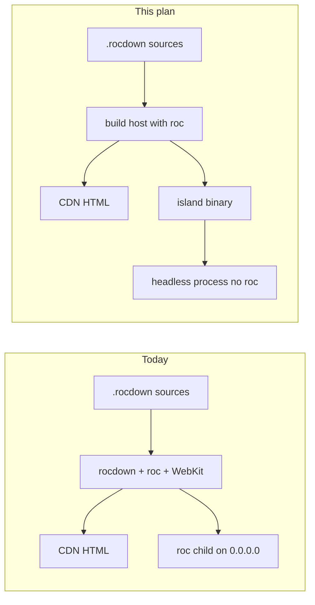

# Hybrid island hosting follow-ons

## Purpose and authority

This plan covers three hosting steps that the local Docker same-origin demo
explicitly deferred. It is exploratory until a human reviewer accepts a
scope. It does not describe shipped production packaging.[^hybrid-plan][^hybrid-guide][^counter-readme]

Do not start a phase until the user asks.

The hybrid v1 contract stays: CDN-static HTML plus a mutation-only island
process, same-origin reverse proxy preferred, server-owned durable
state.[^hybrid-research][^server-owned][^caddyfile]

## Goal

After the local Compose demo:

1. A `--no-window` Linux `rocdown` / `rocci` binary can run without WebKitGTK.
2. An islands container can start a precompiled island binary without `roc`
   on `PATH`.
3. A documented cross-origin `service_origin` deploy has CORS and cookie
   rules, still opt-in.

## Constraints that do not move

| Keep | Meaning |
| --- | --- |
| Two artifacts | CDN tree and island process stay separate. Do not fold Caddy into the Ubuntu image as the default. |
| Same-origin default | Empty `service_origin`, relative `/actions/`, CSP `connect-src 'self'`. |
| `--no-window` still serves HTTP | Headless is a link-time option, not a different product CLI. |
| `roc` at **build** time | Precompiled islands remove `roc` from the **runtime** image only. |
| Loopback default | Unset `ROC_BASIC_WEBSERVER_HOST` stays `127.0.0.1`. Do not change `rocci.toml` `http.host` loopback validation; that is the desktop config, not generated `with_listen`.[^core-config][^serve-rs] |
| No `@island` grammar | Hosting follow-ons do not add template syntax. |

## Current evidence

`rocdown`, `rocci`, and `rocci-okf` all depend on `rocci-desktop`, which
unconditionally links `tao` and `wry`. Linux CI therefore installs
WebKitGTK even for tests that never open a window. The Docker runtime image
installs the matching shared libraries for the same reason.[^cli-cargo][^rocdown-cli-cargo][^okf-cargo][^desktop-cargo][^ci-yml][^runtime-dockerfile]

`serve-islands` plans colocated `@on` handlers, writes generated `main.roc`,
and `roc` compiles that app at start. The child listens using generated
`listen_host!` / `listen_port!` helpers.[^service-rs][^driver-rs][^dispatch-rs][^serve-rs]

`[http].service_origin` already prefixes action URLs and sets
`connect-src` to that origin when non-empty. CORS headers and cookie
credentials are not emitted. The public guide tells operators to prefer the
same-origin proxy.[^service-rs][^config-rs][^plan-rs][^hybrid-guide]



## Phase 1 — Headless CLI without WebKit

**Bound:** `--no-window` Linux binaries do not link wry. Preview window
builds keep the current desktop crate.

**Does:**

- Add a Cargo feature on `rocci-desktop` (for example `preview`) that owns
  `tao` / `wry` / `muda`. Default-on for local `cargo run`.
- Gate `rocci-cli`, `rocci-rocdown-cli`, and `rocci-okf` desktop imports
  behind that feature. `--no-window` paths already skip `preview()`; they
  must compile when the feature is off.[^serve-rs]
- Document `cargo build --release -p rocci-rocdown-cli --no-default-features`
  (or the chosen flag) for Docker. Drop WebKitGTK from the runtime image
  apt list when the binary is headless.[^runtime-dockerfile][^ci-yml]
- Keep CI's full desktop build on Ubuntu so the preview window still links.

**Does not:** remove the preview window; split `rocdown` into two binaries;
change island HTTP behavior.

**Exit:** `ldd` on a Linux headless `rocdown` has no `libwebkit`.
`cargo test -p rocci-cli` and `cargo test -p rocci-rocdown-cli` with desktop
features still pass. `docker compose` islands image no longer installs
WebKitGTK.

## Phase 2 — Precompiled island binary

**Bound:** `serve-islands` can exec a cached native binary instead of
invoking `roc` at container start.

**Does:**

- After generating `main.roc`, compile once during `rocdown build` (or a
  dedicated `rocdown build --islands-bin`) into a content-addressed cache,
  same idea as apply-host renderer caching.[^driver-rs][^service-rs]
- Runtime: if the binary matches the site fingerprint, exec it with
  `ROC_BASIC_WEBSERVER_HOST` / `PORT` / `DB_PATH`. If missing, keep today's
  `roc` compile path for local `cargo run`.
- Docker runtime stage copies the binary and site sources needed for
  SQLite paths; omit `/opt/roc` from the islands image.[^runtime-dockerfile][^compose]

**Does not:** ship a new island protocol; compile islands to Wasm for v1 of
this phase; remove `roc` from the **builder** image.

**Exit:** `rocdown serve-islands --no-window` in a container without `roc`
on `PATH` answers `GET /health` and `POST /actions/counter/increment`.
Cold start is dominated by process exec, not Roc compile.

## Phase 3 — Cross-origin CORS and cookies

**Bound:** when `service_origin` is a different origin from the CDN page,
the island process answers browser CORS for mutation routes. Same-origin
stays the documented default.

**Does:**

- Define allowed CDN origins (config list or derive from `service_origin`
  plus an explicit `[http].cdn_origin`). Reject `*` when credentials are
  used.
- OPTIONS preflight and `Access-Control-Allow-Origin` /
  `Allow-Methods` / `Allow-Headers` on `/actions/` and `/health` only.
  Do not CORS the whole URL space.
- Cookie policy: document Datastar POSTs as credentialed or not. If
  cookies are in scope, set `SameSite` and `Secure` rules; if not, say so
  in the hybrid guide and skip `Allow-Credentials`.
- Tests: prefix_action_urls already absolute; add HTTP tests for OPTIONS
  and a cross-origin POST. Update the hybrid guide's "CORS and cookies
  are not shipped" sentence only when this phase lands.[^service-rs][^hybrid-guide]

**Does not:** make cross-origin the default; put CORS on static Caddy
routes; invent a CDN plugin.

**Exit:** a documented two-origin smoke: CDN origin loads the snapshot,
POSTs to `service_origin`, patch morphs `#counter`. Same-origin Compose
demo still works with empty `service_origin`.

## Suggested order

1 then 2 then 3. Phase 1 shrinks the runtime image before Phase 2 drops
`roc`. Phase 3 is independent of WebKit but should not land before the
same-origin Docker demo is the documented default.

## Validation

```text
cargo test -p rocci-cli
cargo test -p rocci-rocdown
cargo test -p rocci-rocdown-cli
cargo fmt --all -- --check
```

After Phase 1 image changes:

```text
ROCCI_SITE=/abs/path/to/site docker compose -f docker/compose.yml build
```

After knowledge edits:

```text
cargo run -q -p rocci-okf -- check knowledge --profile rocci --format terminal
```

Do not log a phase complete until CI and Knowledge workflows succeed on
that revision.

## Related plans

Static-first local Docker (official Caddy serving a host-built `dist/`, no
`rocci` in the image) is [efficient publishing](efficient-publishing.md).
This record stays the hybrid runtime follow-on (headless CLI, precompiled
islands, CORS).[^publishing-plan]

## Out of scope

- Publishing images to a registry.
- Using `examples/rocdown/hybrid` as the Docker demonstrator (no SQLite).
- One kitchen-sink image that runs Caddy and `serve-islands` in one
  process.
- Vendor cache-header adapters beyond the generic Caddyfile.

[^hybrid-plan]: Follow-ons listed CORS and cache adapters as not v1.
[^hybrid-research]: CDN plus island service; same-origin preferred.
[^hybrid-guide]: Caddy sketch; CORS not shipped; Docker section for local Compose.
[^counter-readme]: Two-artifact runbook and local Docker smoke curls.
[^compose]: Caddy `cdn` plus Ubuntu `islands`, healthcheck, SQLite volume; site bind-mounted at `/src/site`.
[^runtime-dockerfile]: Ubuntu 24.04, pinned Roc nightly, WebKit runtime libs, `roc` on PATH.
[^caddyfile]: `/actions/` and `/health` reverse_proxy; hashed `/assets/` cache.
[^serve-rs]: `preview()` only when a window is requested; listen helpers.
[^dispatch-rs]: Generated `with_listen` uses `listen_host!` and `listen_port!`.
[^driver-rs]: Writes `main.roc` and spawns `roc`.
[^cli-cargo]: `rocci-desktop` is a required dependency.
[^rocdown-cli-cargo]: `rocdown` links desktop.
[^okf-cargo]: `rocci-okf` links desktop.
[^desktop-cargo]: `tao` and `wry` with no optional feature.
[^ci-yml]: `libwebkit2gtk-4.1-dev` on Ubuntu jobs.
[^service-rs]: `serve_islands`, `live_csp`, `prefix_action_urls`.
[^config-rs]: `service_origin` must be `http://` or `https://`.
[^plan-rs]: `islands.json` records `service_origin`.
[^core-config]: `http.host` in `rocci.toml` must be loopback.
[^server-owned]: Service owns durable state.
[^publishing-plan]: Static-first Caddy-over-dist Docker; this record does not own that path.
