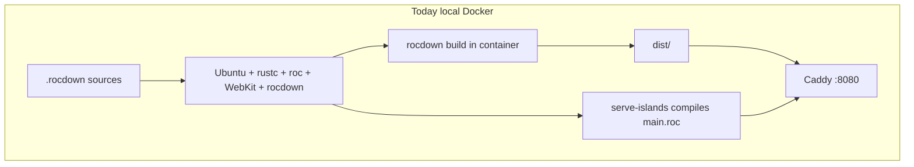
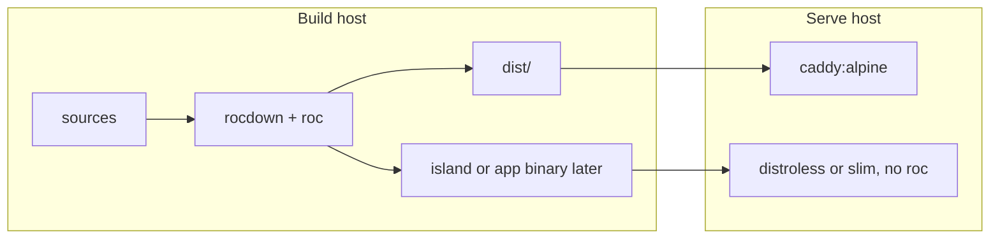

# Efficient publishing of Rocdown sites and Rocci apps

## Question

What should a Rocci publishing workflow compile, what should a local Docker
image contain, and which tooling is missing for sites versus apps? The working
hypothesis is that a finished site does not need `rocci` or `rocdown` at
host time, only compiled artifacts, and that Wasm might make those artifacts
host-agnostic.[^docker-readme][^hybrid-guide]

This record is evidence and synthesis. Delivery steps live in the
[efficient publishing plan](../plans/efficient-publishing.md). Exploratory;
not an approved hosting contract.

## What a finished build actually is

`rocdown build` already produces a complete CDN tree: page HTML, hashed
`/assets/` (theme CSS, and Datastar.js only on `live` pages), discovery
files, and a publish report. `--cdn-only` refuses `live` pages so a
static publish cannot ship action buttons with no service.[^build-rs][^rocdown-cli][^rocdown-readme][^hybrid-guide]

Page kinds after build:

| Kind | At serve time |
| --- | --- |
| `static` | HTML + hashed assets. No Datastar. |
| `hydrate` | Same, with Rocci HTML spliced at build. No Datastar. |
| `live` | CDN snapshot plus a separate island HTTP process. |

`static` and `hydrate` are ordinary files. Hosting them does not require
Roc, Rocci, Rocdown, or Wasm. `docs/` is this shape today.[^hybrid-plan][^hybrid-guide]

`live` is two artifacts: the same CDN tree, plus an island program.
`serve-islands` still reads `.rocdown` sources, generates `main.roc`, and
invokes `roc` at start. Build-time island evaluation only bakes the
snapshot HTML; it does not emit a durable island binary into `dist/`.[^service-rs][^islands-rs][^hosting-follow-ons]

A Rocci **app** is a third shape. `rocci run` compiles generated
`main.roc` for development. `rocci bundle` on macOS already compiles the
Roc server into the `.app` so runtime `PATH` need not contain `roc`.
Linux, Windows, and OCI packaging are absent.[^bundle-rs][^rocci-cli-readme][^desktop-guide]

## What the Docker images contain today

The local Compose demo is a hybrid operator check, not a publish
path. `site-build` runs `rocdown build` inside the image; `islands` runs
`rocdown serve-islands`; Caddy serves `dist/` and reverse-proxies
`/actions/` and `/health`. The site is bind-mounted as sources, not as a
pre-built tree.[^docker-readme][^compose][^caddyfile]

The `runtime` image is slow because it is a toolchain:

- Ubuntu 24.04, WebKitGTK, GTK, SQLite.[^linux-deps][^runtime-dockerfile]
- A pinned Roc nightly under `/opt/roc`.[^install-roc]
- A builder stage that installs rustup and `cargo build --release` of
  `rocci-cli` and `rocci-rocdown-cli`.[^runtime-dockerfile]
- Those two CLIs, which still link the desktop crate, so Linux needs
  WebKit even for `--no-window`.[^hosting-follow-ons]

Image build therefore pays Rust compile, Roc install, and WebKit. First
container boot then pays `rocdown build` and a second Roc compile of
generated island `main.roc`. None of that is required to **host** a
pre-built static tree.[^docker-readme][^service-rs]

The Caddy stage is already close to a publish image: official
`caddy:2-alpine` plus a Caddyfile. It currently assumes an `islands`
backend and a `dist/` that was just built in the sibling
container.[^caddyfile][^compose]

## Wasm versus host-agnostic hosting

Two different embeddings are easy to conflate.[^generation-research][^roc-host-readme]

**Build-time apply (shipped).** `roc build --target wasm32` against the
embedded WASI platform, then Wasmtime, is a renderer host. `--host wasm`
writes the same kind of `dist/` as native apply. The `.wasm` stays on the
build machine. Serving that `dist/` does not load Wasm.[^build-rs][^roc-host-readme]

**Runtime HTTP (not available).** The wasm platform is `main! : {} =>
Result` with no HTTP. `basic-cli` / `basic-webserver` do not support
`wasm32`. Island and app servers cannot be that module.[^wasm-platform][^build-rs][^generation-research]

So:

- Static and hydrate sites are already host-agnostic: HTML, CSS, and
  hashed JS. Wasm does not make them more portable.
- Cross-compiling **apply** to wasm does not remove `roc` from the build
  host; it only changes how HTML is generated.
- Cross-compiling an **island or app** to wasm would make one artifact
  runnable on any Wasmtime/WASI-HTTP host. That needs a new HTTP
  platform, not a flag on today's apply host.
- The realistic Linux-container path for live islands and apps is native
  `roc build` to `x64musl` / `arm64musl` (basic-cli targets already named
  in the wasm-fallback hint), then a slim process image with no
  `roc`.[^build-rs][^hosting-follow-ons]

Playground `--mode wasm` is a browser authoring worker. It is not a
publish format.[^rocci-cli-readme]

## Missing tooling

| Need | Sites | Apps | OKF |
| --- | --- | --- | --- |
| Compile to durable artifacts | `rocdown build` → `dist/` | macOS `.app` only; `run` recompiles | local HTML; no public archive[^publication] |
| Inspect what will publish | `inspect artifacts` | none | inspect concept |
| Package a deployable archive | none | none beyond `.app` | forbidden for now[^publication] |
| Serve a pre-built tree | none (`run` rebuilds) | bundled `.app` only | preview rebuilds |
| Local Docker of artifacts | none (fat hybrid rebuild) | none | none |
| Cross-compile for Linux | not a `build` flag | not a `bundle` flag | n/a |
| OCI / registry | none | none | none |
| Hosting adapters (Pages, Netlify) | none; rocci.dev plan rejects plugin deploy[^rocci-dev-site] | n/a | n/a |
| Product CLI releases | GitHub Releases of `rocdown`, not sites[^release-workflow] | `rocci` binary, not apps | `rocci-okf` binary |

The hybrid public guide already describes the two-artifact production
sketch (upload `dist/`, run `serve-islands`, reverse-proxy). Local Docker
does not follow that sketch: it rebuilds from sources with a toolchain
image.[^hybrid-guide][^docker-readme]

`rocci.dev` (`docs/` → `dist/docs`) is a static tree with no island
service. It is the natural first dogfood for artifact hosting, and it
does not need the current Compose file.[^rocci-dev-site][^hybrid-plan]

## Recommendation

1. **Split build hosts from serve hosts.** Build on the developer machine
   or CI (`rocdown`, `roc`, maybe a fat *builder* image). Serve with
   something that does not contain those tools.
2. **Start with pre-built static Rocdown sites.** Official Caddy (or
   equivalent) mounting a host-built `dist/`. No `rocci`, `rocdown`,
   `roc`, rustc, or WebKit in that image. No image build if the official
   Caddy tag is enough.
3. **Treat `static` and `hydrate` as one publish class.** `--cdn-only` is
   the gate. `live` waits on a precompiled island binary.
4. **Do not use Wasm as the v1 hosting story.** Keep it as an apply host.
   Use musl cross-compile for Linux processes. Revisit WASI-HTTP only
   after native precompiled islands exist.
5. **Add packaging commands, not deploy plugins.** A site archive plus
   `publish.json`, and a way to serve that tree locally, cover the
   missing product surface. CDN and PaaS upload stay operator choice.
6. **Apps follow the same split.** Compile the Roc server once; wrap it
   as `.app`, a Linux binary, or a tiny OCI image. Do not put `rocci` in
   the runtime image. macOS bundle already proves Roc-free run for
   apps.[^desktop-guide][^bundle-rs]
7. **Keep OKF public deploy closed** until the local-first publication
   decision is explicitly reopened.[^publication]

## Open questions for a reviewer

- Is official Caddy the only first-party local host, or should `rocdown
  serve --from-dist` exist for machines without Docker?
- Should a fat builder image remain for reproducible Linux `rocdown
  build`, or is host/CI `cargo run -p rocci-rocdown-cli -- build`
  enough?
- When `live` packaging lands, is musl the only Linux target, or also
  glibc?
- Does `rocci bundle` grow Linux/OCI in this plan, or stay a follow-on
  owned by the desktop guide?

[^docker-readme]: Content-agnostic images; `site-build` runs `rocdown build`; first boot compiles `main.roc`; image build needs BuildKit, Roc nightly, crates.io.
[^runtime-dockerfile]: Builder installs rustup and release `rocci`/`rocdown`; runtime copies those binaries, Roc, and WebKit libs.
[^compose]: `site-build`, `islands`, `cdn`; bind-mount `ROCCI_SITE` at `/src/site`.
[^caddyfile]: `/actions/` and `/health` reverse_proxy to `islands`; `root * /src/site/dist`.
[^linux-deps]: Runtime apt list includes `libwebkit2gtk-4.1-0` and GTK.
[^install-roc]: Downloads pinned `roc_nightly-linux_*` into `/opt/roc`.
[^build-rs]: Apply to `dist/`; `--host wasm` uses `wasm32`; `render_publish`; `--cdn-only`; basic-cli wasm32 hint names musl targets.
[^service-rs]: `serve_islands` loads the site and `execute_app_plan`; no prebuilt-binary exec.
[^islands-rs]: NativeHost evaluates island HTML for the CDN snapshot during build.
[^rocdown-cli]: `build`, `run`, `serve-islands`, `inspect artifacts`; no `package` or serve-from-dist.
[^bundle-rs]: macOS `.app` only; `build_roc_server` into Resources; other OS bail.
[^rocci-cli-readme]: `bundle` is ad-hoc macOS; playground wasm is authoring.
[^rocdown-readme]: `build` emits CDN HTML plus `islands.json` for hybrid; `--cdn-only` errors on live.
[^hybrid-guide]: Two-artifact deploy; local Docker is Compose after host preview; Caddy sketch.
[^desktop-guide]: Bundled app does not need `roc` on PATH; Linux/Windows and production signing absent.
[^roc-host-readme]: Native apply vs wasm32 Wasmtime; two-tier renderer cache.
[^wasm-platform]: `main! : {} => Result`; wasm32 inputs `host.o` and app; no HTTP.
[^generation-research]: Wasmtime is an apply host; `basic-cli` is native; glue/HTTP wasm is later.
[^hosting-follow-ons]: Precompiled island binary and WebKit-free CLI are unstarted; runtime image still has `roc` and WebKit.
[^hybrid-plan]: CDN-only publish vs full hybrid; `docs/` stays static.
[^publication]: No public knowledge deploy or verbatim bundle archive.
[^rocci-dev-site]: One static rocci.dev tree; no deployment adapters or plugin lifecycle.
[^release-workflow]: Releases `rocci`, `rocdown`, `rocci-okf` binaries, not site trees.
