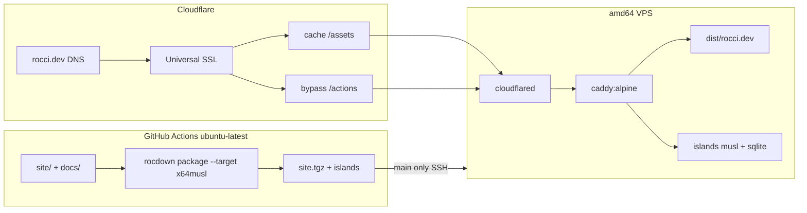

# Publishing rocci.dev with Cloudflare, a small origin, and CI

## Question

`rocci.dev` is acquired and already named as the public site URL. How should
that hostname actually serve traffic once the repository is public open
source: which CDN, how DNS and TLS work on a `.dev` name, where the live
home-page island runs, whether a small VPS is enough, and what CI should
build and deploy?[^site-config][^preview-plan]

This record is evidence and synthesis. Delivery steps live in the
[rocci.dev deploy plan](../plans/rocci-dev-publish.md). Exploratory; not an
approved hosting contract.

This is **project operations** for the first-party site. It does not add a
`rocci deploy` adapter or a Pages/Netlify plugin to the product CLIs.[^cli-plan][^rocci-dev-site][^efficient-plan]

## What is already in the tree

The architecture plan keeps one Rocdown catalog for landing pages, docs,
news, FAQ, and project pages. It leaves visual identity and launch copy to
public-preview work, and it rejects a product deployment-plugin
lifecycle.[^rocci-dev-site][^preview-plan]

`site/rocdown.toml` is the unified public tree (`base_url =
"https://rocci.dev"`, output `../dist/rocci.dev`). It mounts `../docs` at
prefix `docs`. Standalone `docs/rocdown.toml` still builds a documentation
catalog to `../dist/docs`.[^site-config][^docs-config]

The home page is a **live** island: CDN HTML plus SQLite-backed
`/actions/counter/*` handlers. Mounted docs pages stay `static`. `--cdn-only`
therefore cannot publish `site/` (`RD2302`). The worked hybrid path is
`rocdown package` plus Compose Caddy and a slim musl `islands`
binary.[^site-home][^hybrid-guide][^docker-readme][^rocdown-readme]

Local Docker already matches the two-artifact production sketch:

| Path | Role |
| --- | --- |
| `docker/compose.static.yml` | Official `caddy:2-alpine`, bind-mount a `--cdn-only` `dist/` |
| `docker/compose.hybrid.yml` | Same Caddy plus a precompiled island process; `/actions/` and `/health` reverse-proxy |
| `docker/static/Caddyfile` | Hashed `/assets/` immutable; HTML `no-cache`; `try_files` indexes |
| `docker/cdn/Caddyfile` | Same cache headers plus island proxy |

Those four files are the operator surface: static Compose and Caddyfile for
`--cdn-only` trees, hybrid Compose and Caddyfile for `site/`.[^compose-static][^compose-hybrid][^static-caddy][^cdn-caddy][^efficient-research]

CI does **not** yet publish. `fixtures-and-docs` runs `rocdown check docs`
only. It does not install Roc, does not `check site` or `package site`, and
does not upload a tree. The root README still says `build docs` while naming
`dist/rocci.dev`, which is the `site/` output.[^ci-workflow][^ci-local][^root-readme][^install-roc]

Tangled Sites cannot attach a custom domain, so `rocci.dev` stays off that
host. Cloudflare is already the planned DNS and inbound-mail plane for
`oss@rocci.dev`. On 2026-08-19 the domain had no MX and public NS were
still `registrant-verification.com`.[^tangled-plan][^tangled-research][^tangled-pages][^cf-email-routing][^hexonet-verify]
A recursive lookup at `2026-08-20T08:51:56Z` against `1.1.1.1` returned
`A 212.123.41.108` (TTL 0) for `rocci.dev` and `www.rocci.dev`, and empty
answers for NS, SOA, TXT, and MX. That is not a Cloudflare zone and not
mail-ready; Phase 0 is still open.

OKF HTML stays local-first. Do not treat a successful `rocci.dev` launch as
permission to publish `knowledge/`.[^publication]

## What has to be hosted

```text
Browser  →  Cloudflare edge (TLS, cache, DDoS)
              →  Tunnel to VPS
                   →  Caddy :80
                        →  /assets/*, HTML, sitemap  from dist/rocci.dev
                        →  /actions/*, /health       to islands:8001
```

`static` and `hydrate` pages are files. `live` pages are the same files plus
POSTs to a native process, which is the hybrid-islands contract the public
home already uses. Cross-origin `service_origin` is documented but CORS and
cookies for that layout are not shipped, so production should keep the
same-origin proxy.[^hybrid-plan][^hybrid-guide][^hosting-follow-ons][^efficient-research]

The in-browser playground is a static page plus a Wasm worker. It does not
need a second origin. Interactive **apps** (desktop, playground `--mode
local`) are not the public site.[^rocci-dev-site]

## CDN choice

The CDN is the edge in front of an origin. It is not a replacement for the
island process.

| Option | Custom `rocci.dev` | TLS | Serves `site/` live island | Extra vendor | Fit |
| --- | --- | --- | --- | --- | --- |
| **Cloudflare proxied + origin** | Yes | Universal SSL, auto-renew | Yes, if `/actions/` bypasses cache and reaches Caddy | None beyond the origin VPS | **Choose** |
| Cloudflare Pages / GitHub Pages | Yes | Platform TLS | No native musl process | Pages as file host | Reject as primary |
| Tangled Sites | No | n/a | Static only on `*.tngl.sh` | Tangled | Reject |
| Bunny, Fastly, CloudFront | Yes | Extra cert/DNS | Only with a separate origin | Second CDN plus still Cloudflare for mail | Reject |
| Netlify / Vercel | Yes | Platform TLS | Not a Roc `basic-webserver` | PaaS functions | Reject; matches the forbidden product adapter shape |

Cloudflare is the right CDN because it already has to be the DNS and mail
host, Universal SSL is free and automatic on an active zone, hashed `/assets/`
are the cacheable class Rocdown already emits, and a Tunnel can hide the
origin. A second CDN would duplicate DNS and TLS without helping the island
process.[^cf-universal-ssl][^cf-tunnel][^tangled-plan][^static-caddy][^efficient-research]

Do not use Cloudflare Pages (or GitHub Pages) as the **file** origin for
`site/`. Those hosts cannot run the packaged `islands` binary, and splitting
HTML onto Pages while proxying `/actions/` to a VPS reopens the unshipped
CORS path. Pages remains a legitimate operator choice for a `--cdn-only`
catalog such as standalone `docs/`; that is not the public home
tree.[^hybrid-guide][^hosting-follow-ons][^docs-config]

## Domain, DNS, and mail

`.dev` is HTTPS-only in browsers (HSTS preload at the TLD). There is no
plain-HTTP onboarding window. The first public A/AAAA or Tunnel hostname
must already present a trusted certificate.[^get-dev][^tangled-plan]

Recommended zone shape, sharing the Tangled Phase 0 mail path:

1. Finish registrar verification so NS are no longer
   `registrant-verification.com`.[^hexonet-verify][^tangled-plan]
2. Add the zone to Cloudflare on the Free plan and point the registrar NS
   there.[^cf-email-routing]
3. Enable Email Routing for `oss@rocci.dev` and later
   `security@rocci.dev`.[^cf-email-routing][^tangled-plan]
4. Publish the apex through a Cloudflare Tunnel CNAME (or a proxied record
   Cloudflare can flatten). Do not grey-cloud the origin IP.
5. Redirect `www.rocci.dev` to `https://rocci.dev`.
6. Keep `_atproto.rocci.dev` TXT for the Tangled handle; it does not replace
   the site.[^tangled-plan]
7. Always Use HTTPS at Cloudflare. Do not set SSL to Flexible.

## TLS

Two viable origin TLS designs:

**A. Cloudflare Tunnel to HTTP Caddy (preferred).** `cloudflared` makes
outbound-only connections. The VPS need not expose 80/443. Cloudflare
terminates visitor TLS with Universal SSL. Caddy keeps listening on `:80`
inside Compose, matching the current images. No Origin CA, no Let's Encrypt
on the box, no Full (strict) origin handshake.[^cf-tunnel][^cf-universal-ssl][^compose-hybrid]

**B. Public IP, proxied orange-cloud, Full (strict).** Caddy or another
listener on 443 presents a Cloudflare Origin CA certificate (or a public
Let's Encrypt cert). Visitors never see that cert. This works, but it
requires inbound ports and Origin CA rotation discipline for no gain at this
audience size.[^cf-full-strict]

Reject Flexible (Cloudflare-to-origin HTTP while the browser sees HTTPS).
Reject Caddy-only Let's Encrypt on a grey-cloud origin: that skips the CDN,
exposes the VPS, and still has to satisfy `.dev` HSTS.

## Dynamic content

The public site is already hybrid. Production should use the packaged
hybrid path, not `--cdn-only` and not the toolchain Compose demo.[^hybrid-guide][^docker-readme][^site-home]

| Concern | Production choice |
| --- | --- |
| HTML / hashed assets | Caddy `file_server` of `dist/rocci.dev` |
| Mutations | Same-origin `/actions/` → `islands:8001` |
| Health | `/health` proxied, not advertised as a product URL |
| State | Named Docker volume for `DB_PATH`; backup the SQLite file |
| Cache | Origin already sends immutable `/assets/` and `no-cache` HTML; Cloudflare defaults do not cache POST; add an explicit bypass for `/actions/` and `/health`. Those headers live in the static and hybrid Caddyfiles. |
| Abuse | Rate-limit `/actions/` at Cloudflare once the counter is on the public internet |
| Playground | Static |
| Knowledge | Not deployed |

Caddy already emits the asset and HTML cache headers; the hybrid file also
proxies `/actions/` and `/health`.[^static-caddy][^cdn-caddy][^publication]

Do not run `roc`, `rocdown`, or WebKit on the VPS. CI (or a maintainer
laptop) packages `x64musl`; the origin only runs artifacts.[^efficient-research][^docker-readme]

## Is a small VPS enough?

Yes. Expected load is documentation HTML, a few hashed assets, and occasional
counter POSTs. Cloudflare absorbs asset hits and volumetric noise. The origin
runs three light processes: `caddy:2-alpine`, a musl island binary with
SQLite, and `cloudflared`.[^compose-hybrid][^cf-tunnel][^efficient-research]

A shared **amd64** VPS with 2 vCPU and 2–4 GB RAM in an EU region is enough.
Pin amd64 so GitHub `ubuntu-latest` can emit `--target x64musl` without
emulation. An ARM VPS would force `arm64musl` packaging and an extra CI
matrix for no traffic reason.[^docker-readme]

Kubernetes, object-storage HTML, and a multi-node island tier are out of
proportion. Scale the VPS or add a second Tunnel replica only after
measured origin CPU or SQLite lock time says so.

## Which VPS provider

The origin is a boring Linux box that runs Docker. Provider choice should
optimize for **amd64**, an **EU region**, a **2 vCPU / 4 GB** shared plan,
Debian or Ubuntu, and a firewall that can deny inbound 80/443. List prices
move; pick the current SKU in that size class, not a frozen euro
figure.[^docker-readme][^hetzner-cloud][^hetzner-servers]

| Provider | Role | Pick | Do not pick |
| --- | --- | --- | --- |
| **Hetzner Cloud** | **Default** | Cost-Optimized **x86** shared, 2 vCPU / 4 GB (the CX line). Location **Falkenstein (`fsn1`)** or **Nuremberg (`nbg1`)**. Image **Debian 12**. Public IPv6 (free) plus a Primary IPv4 (€0.50/mo excl. VAT) so SSH works before the Tunnel is up. | **CAX / Ampere ARM** (forces `arm64musl` and a second CI matrix). US or Singapore locations (farther from the maintainer; worse traffic deal than EU). Dedicated CCX (overkill). |
| **OVHcloud VPS** | Fine alternative | **VPS-1** (2 vCores / 4 GB / 40 GB NVMe) in **Germany**. Unlimited ingress/egress on EU VPS. | Asia-Pacific SKUs with a traffic cap. |
| DigitalOcean | Only if an account already exists | Frankfurt or Amsterdam droplet with **2 vCPU / 4 GB**. | 1 vCPU / 1–2 GB (tight once Docker, Caddy, islands, and `cloudflared` share the box). |
| AWS, GCP, Azure | Skip | — | Account and egress complexity for this audience. |
| Fly.io, Railway, Render | Skip | — | Not a VPS; does not dogfood the Compose artifacts. |

Hetzner is the recommendation because it is a German operator with
Falkenstein/Nuremberg/Helsinki parks, GDPR-oriented positioning, a
cost-optimized shared tier aimed at low-to-medium CPU apps, Debian images,
and an included firewall. That matches a small EU origin behind Cloudflare.
OVHcloud is the same size class if Hetzner signup is blocked or an OVH
account already exists.[^hetzner-cloud][^hetzner-servers][^ovh-vps][^ovh-de][^cf-tunnel]

With a Tunnel, inbound 80/443 stay closed. Keep IPv4 for bootstrap SSH
anyway; restrict port 22 in the provider firewall to the maintainer network,
then prefer SSH over the Tunnel once `cloudflared` is healthy.[^hetzner-servers][^cf-tunnel]

## CI while the repo is still GitHub, then open source

GitHub Actions remains the build host until Tangled spindle owns Linux
jobs. Fork pull requests must never see deploy secrets; that is GitHub's
default for `pull_request` from forks, and it must stay that
way.[^ci-workflow][^tangled-plan][^preview-plan]

Needed jobs, not present today:

1. **Validate** `rocdown check site` (keep `check docs` for the mounted
   catalog).
2. **Package** on `ubuntu-latest`: install the pinned Roc nightly, `rocdown
   package site --target x64musl`, upload `dist/` / `site.tgz` and the
   `islands` binary as Actions artifacts. Roc is required here; current CI
   never installs it.[^install-roc][^rocdown-readme][^ci-workflow]
3. **Deploy** only from `staging` or `production` (and later `v*` if
   wanted), using a GitHub Environment named after the branch so the SSH
   key is not available to ordinary jobs. `main` lands pull requests and
   does not publish. Rsync or `scp` into a new directory on the VPS, flip
   a symlink, `compose up -d`. Failed package must not swap the live tree.
4. **Smoke** `https://rocci.dev/health` and one counter POST after deploy.

Do not fold this into `release.yml`. Binary GitHub Releases and the website
are different artifacts and different failure domains.

After Tangled Phases 2–4, Linux packaging can move to spindle. The VPS and
Cloudflare zone do not move. Deploy can keep running on the GitHub mirror
of canonical `main`, or a spindle step can SSH with the same key. Do not
wait on Tangled Sites.[^tangled-plan]

## Recommendation

1. **CDN: Cloudflare.** DNS, Universal SSL, cache, DDoS, Email Routing, and
   Tunnel in one Free-plan zone.
2. **Origin: Hetzner Cloud Cost-Optimized x86, 2 vCPU / 4 GB, Falkenstein
   or Nuremberg**, running the existing hybrid Compose. OVHcloud VPS-1 in
   Germany is the fallback. Not Pages and not the fat toolchain image.
3. **TLS: Tunnel + Universal SSL.** Caddy stays HTTP on the private side.
4. **Dynamic: same-origin island process** with persistent SQLite. Do not
   split `islands.rocci.dev` until CORS ships.
5. **CI: GitHub Actions packages `site/` and deploys from `staging` or
   `production`.** Check both `docs/` and `site/`. No product deploy command.
6. **Keep OKF unpublished** and keep Tangled as the future git host, not the
   website host.



## Open questions for a reviewer

- Is registrar verification finished? The 2026-08-20 probe still shows no
  NS/SOA/MX at `1.1.1.1`, only a TTL-0 A record at `212.123.41.108`.
- Is `staging.rocci.dev` worth a second Tunnel hostname before the first
  public push, or is `main`-only enough at this audience?
- Should the public home keep the shared counter once bots can POST, or
  should launch strip that island and use `--cdn-only` until rate limits
  exist?

[^site-config]: `base_url` https://rocci.dev; output `../dist/rocci.dev`; mounts `../docs`.
[^docs-config]: Standalone docs catalog; output `../dist/docs`; same `base_url`.
[^site-home]: Home `@render` of `counterCard` plus documented `/actions/counter/increment`.
[^docker-readme]: Static Caddy vs pre-built hybrid; `--target` matches container CPU; no toolchain in hosting images.
[^compose-static]: `caddy:2-alpine`, `ROCCI_DIST` → `/srv`.
[^compose-hybrid]: Islands image plus Caddy; healthcheck on `:8001`.
[^static-caddy]: Immutable `/assets/`; HTML `no-cache`; `try_files`.
[^cdn-caddy]: `/actions/` and `/health` reverse_proxy to `islands:8001`.
[^hybrid-guide]: Two-artifact deploy; same-origin proxy; CORS unshipped; `site/` hybrid, `docs/` static.
[^ci-workflow]: `fixtures-and-docs` checks `docs` only; no Roc install; `contents: read`.
[^ci-local]: Same `check docs` job body.
[^install-roc]: Pinned Linux Roc nightly into `/opt/roc`.
[^root-readme]: Documents `build docs` and `dist/rocci.dev` together.
[^rocdown-readme]: `package` writes `publish.json` / `site.tgz`; hybrid compiles `islands` unless `--cdn-only`.
[^efficient-research]: Build host vs serve host; Cloudflare/Pages stay operator choice.
[^efficient-plan]: No product CDN adapters; OKF stays local; two artifacts stay two.
[^rocci-dev-site]: One static-capable site; no deploy-plugin product; playground as a sidecar app.
[^tangled-plan]: Cloudflare Email Routing; `.dev` HSTS; Tangled Sites out of scope for `rocci.dev`.
[^tangled-research]: Custom domains unimplemented on Tangled Pages.
[^publication]: No public knowledge deploy.
[^preview-plan]: Near-term public open source; Phase 0 is the publication gate.
[^cli-plan]: Three CLIs; no plugin host.
[^hybrid-plan]: CDN tree plus island service.
[^hosting-follow-ons]: Cross-origin CORS not shipped.
[^tangled-pages]: Static sites without custom domains.
[^cf-universal-ssl]: Free DV certs for apex and first-level subdomains; auto-renew.
[^cf-full-strict]: Origin cert must be public CA or Origin CA if visitors hit Cloudflare over HTTPS to a public origin.
[^cf-tunnel]: Outbound-only origin; no publicly routable IP required.
[^cf-email-routing]: Free inbound forwarding requires Cloudflare DNS.
[^hexonet-verify]: Unverified registrant email replaces NS and the domain stops resolving.
[^get-dev]: `.dev` names require HTTPS.
[^hetzner-cloud]: German/Finnish parks (Falkenstein, Nuremberg, Helsinki); cost-optimized shared for low-to-medium CPU; GDPR positioning.
[^hetzner-servers]: Shared vs dedicated; Debian/Ubuntu images; IPv6 free; IPv4 Primary IP extra €0.50/mo excl. VAT; included firewall.
[^ovh-vps]: VPS-1 is 2 vCores / 4 GB / 40 GB NVMe; unlimited traffic outside Asia-Pacific.
[^ovh-de]: VPS offered in a German datacentre.
